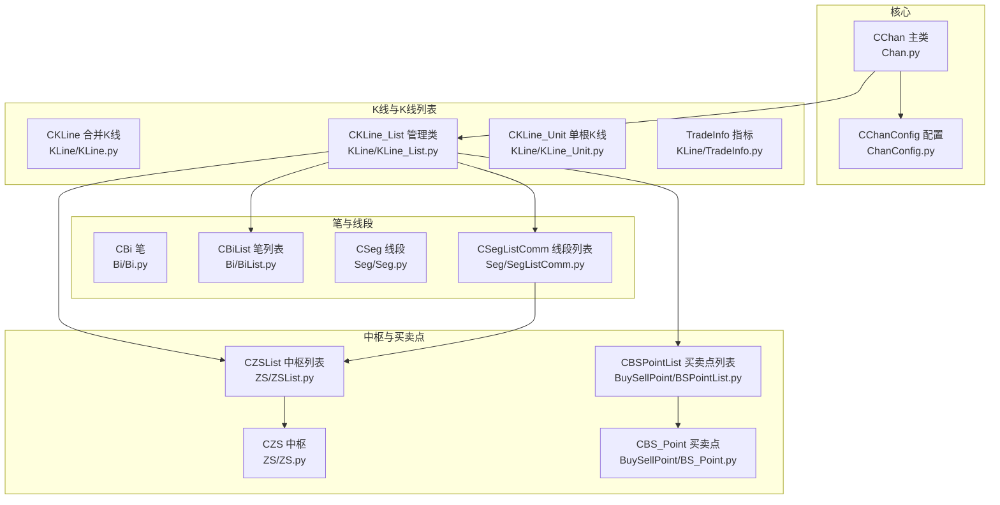
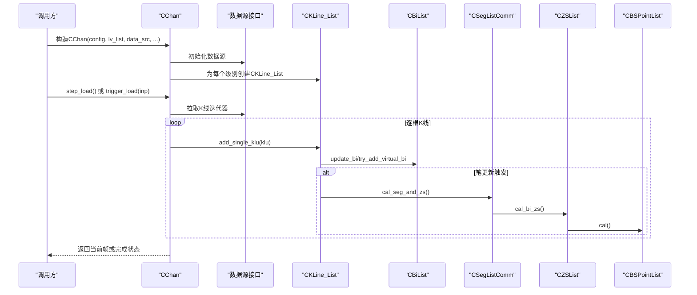
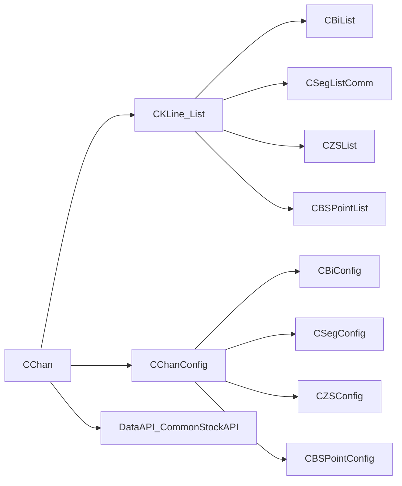

# API参考

<cite>
**本文档引用的文件**
- [Chan.py](file://Chan.py)
- [ChanConfig.py](file://ChanConfig.py)
- [KLine_List.py](file://KLine/KLine_List.py)
- [BiList.py](file://Bi/BiList.py)
- [SegListComm.py](file://Seg/SegListComm.py)
- [ZSList.py](file://ZS/ZSList.py)
- [BSPointList.py](file://BuySellPoint/BSPointList.py)
- [README.md](file://README.md)
- [quick_guide.md](file://quick_guide.md)
</cite>

## 目录
1. [简介](#简介)
2. [项目结构](#项目结构)
3. [核心组件](#核心组件)
4. [架构总览](#架构总览)
5. [详细组件分析](#详细组件分析)
6. [依赖关系分析](#依赖关系分析)
7. [性能考量](#性能考量)
8. [故障排查指南](#故障排查指南)
9. [结论](#结论)

## 简介
本文件为chan.py项目的API参考手册，聚焦于以下目标：
- 为CChan主类提供完整的API文档，包括构造函数参数、step_load（逐步加载）、trigger_load（触发加载）和get_latest_bsp（获取买卖点）等核心方法的签名、参数、返回值与使用要点。
- 为CChanConfig类提供所有配置参数的详细说明与作用域。
- 为CKLine_List、CBiList、CSegListComm、CZSList和CBSPointList等管理类提供属性与方法参考。
- 文档严格依据仓库现有实现，确保开发者查询接口时的权威性与准确性。

## 项目结构
本项目采用按领域分层的模块组织方式，核心缠论计算围绕CChan主类展开，配合K线、笔、线段、中枢、买卖点等子模块协同工作。关键文件与职责概览：
- 主类与配置：Chan.py、ChanConfig.py
- K线与K线列表：KLine/KLine.py、KLine/KLine_List.py、KLine/KLine_Unit.py、KLine/TradeInfo.py
- 笔与笔列表：Bi/Bi.py、Bi/BiList.py、Bi/BiConfig.py
- 线段与线段列表：Seg/Seg.py、Seg/SegListComm.py、Seg/SegListChan.py、Seg/SegListDYH.py、Seg/SegListDef.py、Seg/SegConfig.py、Seg/Eigen.py、Seg/EigenFX.py
- 中枢与中枢列表：ZS/ZS.py、ZS/ZSList.py、ZS/ZSConfig.py
- 买卖点与买卖点列表：BuySellPoint/BS_Point.py、BuySellPoint/BSPointList.py、BuySellPoint/BSPointConfig.py
- 通用工具与异常：Common/CEnum.py、Common/ChanException.py、Common/CTime.py、Common/func_util.py、Common/cache.py
- 数据源接口：DataAPI/CommonStockAPI.py、DataAPI/BaoStockAPI.py、DataAPI/ccxt.py、DataAPI/csvAPI.py

图表来源
- [Chan.py](file://Chan.py#L1-L377)
- [ChanConfig.py](file://ChanConfig.py#L1-L184)
- [KLine_List.py](file://KLine/KLine_List.py#L1-L205)
- [BiList.py](file://Bi/BiList.py#L1-L236)
- [SegListComm.py](file://Seg/SegListComm.py#L1-L175)
- [ZSList.py](file://ZS/ZSList.py#L1-L162)
- [BSPointList.py](file://BuySellPoint/BSPointList.py#L1-L414)

章节来源
- [Chan.py](file://Chan.py#L1-L377)
- [ChanConfig.py](file://ChanConfig.py#L1-L184)
- [KLine_List.py](file://KLine/KLine_List.py#L1-L205)
- [BiList.py](file://Bi/BiList.py#L1-L236)
- [SegListComm.py](file://Seg/SegListComm.py#L1-L175)
- [ZSList.py](file://ZS/ZSList.py#L1-L162)
- [BSPointList.py](file://BuySellPoint/BSPointList.py#L1-L414)

## 核心组件
本节对CChan主类、CChanConfig配置类及其关键管理类进行API级梳理，便于快速定位接口与行为。

- CChan主类
  - 构造函数参数
    - code：标的代码（字符串或符合数据源约定的标识）
    - begin_time：开始时间（可为None，具体语义由数据源决定）
    - end_time：结束时间（可为None，具体语义由数据源决定）
    - data_src：数据源类型（DATA_SRC枚举或自定义字符串）
    - lv_list：级别列表（从大到小），默认[K_DAY, K_60M]
    - config：CChanConfig实例，若为None则使用默认配置
    - autype：复权类型（AUTYPE枚举）
  - 关键方法
    - step_load()：逐步加载模式下的迭代器，返回当前帧的CChan对象
    - trigger_load(inp)：外部喂K线触发计算，inp为字典，键为KL_TYPE，值为CKLine_Unit列表
    - get_latest_bsp(idx=None, number=1)：获取最新买卖点列表，支持按级别索引与数量限制
    - 其他：load/load_iterator等内部流程方法，pickle序列化/反序列化方法
  - 属性访问
    - 通过索引访问各级别的CKLine_List（如chan[KL_TYPE]或chan[0]）

- CChanConfig配置类
  - 笔配置：bi_conf（CBiConfig）
  - 线段配置：seg_conf（CSegConfig）
  - 中枢配置：zs_conf（CZSConfig）
  - 买卖点配置：bs_point_conf（CBSPointConfig）、seg_bs_point_conf（CBSPointConfig）
  - 指标与模型：mean_metrics、trend_metrics、macd_config、cal_demark、cal_rsi、cal_kdj、rsi_cycle、kdj_cycle、boll_n
  - 数据检查与回放：trigger_step、skip_step、kl_data_check、max_kl_misalgin_cnt、max_kl_inconsistent_cnt、auto_skip_illegal_sub_lv、print_warning、print_err_time
  - 方法：GetMetricModel()、set_bsp_config()

- 管理类
  - CKLine_List：持有并管理K线、笔、线段、中枢、买卖点等集合，提供add_single_klu、cal_seg_and_zs、klu_iter等
  - CBiList：笔列表，提供update_bi、try_add_virtual_bi、add_new_bi等
  - CSegListComm：线段列表通用框架，提供update、collect_left_as_seg、try_add_new_seg等
  - CZSList：中枢列表，提供cal_bi_zs、try_combine、update_overseg_zs等
  - CBSPointList：买卖点列表，提供cal、get_latest_bsp等

章节来源
- [Chan.py](file://Chan.py#L19-L377)
- [ChanConfig.py](file://ChanConfig.py#L1-L184)
- [KLine_List.py](file://KLine/KLine_List.py#L1-L205)
- [BiList.py](file://Bi/BiList.py#L1-L236)
- [SegListComm.py](file://Seg/SegListComm.py#L1-L175)
- [ZSList.py](file://ZS/ZSList.py#L1-L162)
- [BSPointList.py](file://BuySellPoint/BSPointList.py#L1-L414)

## 架构总览
CChan主类负责多级别K线数据的采集、对齐与计算驱动，内部通过CKLine_List承载各级别K线与衍生元素（笔、线段、中枢、买卖点）。CChanConfig贯穿配置笔、线段、中枢、买卖点与指标模型的参数，CBSPointList在计算完成后产出买卖点序列。

图表来源
- [Chan.py](file://Chan.py#L120-L210)
- [KLine_List.py](file://KLine/KLine_List.py#L104-L136)
- [BiList.py](file://Bi/BiList.py#L48-L141)
- [SegListComm.py](file://Seg/SegListComm.py#L128-L155)
- [ZSList.py](file://ZS/ZSList.py#L91-L131)
- [BSPointList.py](file://BuySellPoint/BSPointList.py#L100-L108)

## 详细组件分析

### CChan 主类 API
- 构造函数
  - 参数
    - code、begin_time、end_time、data_src、lv_list、config、autype
  - 行为
    - 校验lv_list顺序（从大到小）
    - 初始化各级别CKLine_List
    - 若非逐步模式，立即启动load流程
  - 返回
    - 无（构造完成）
  - 示例参考
    - [README.md 使用示例](file://README.md#L444-L517)
    - [quick_guide.md 基础用法](file://quick_guide.md#L223-L247)

- step_load()
  - 签名
    - step_load() -> Generator[CChan, None, None]
  - 行为
    - 断言配置开启逐步模式
    - 清空历史数据并初始化
    - 每次迭代返回当前帧的CChan对象
    - 支持跳过前若干帧（skip_step）
  - 返回
    - 生成器，每次产出当前帧的CChan
  - 使用要点
    - 适用于回放/动画/实时策略
    - 每帧仅重算不确定部分，性能较好
  - 示例参考
    - [quick_guide.md 策略实现与回测](file://quick_guide.md#L446-L466)

- trigger_load(inp)
  - 签名
    - trigger_load(inp: Dict[KL_TYPE, List[CKLine_Unit]]) -> None
  - 参数
    - inp：键为KL_TYPE，值为CKLine_Unit列表
  - 行为
    - 为最高级别必需提供数据，否则抛出异常
    - 将各级别的K线迭代器加入内部队列
    - 触发load_iterator，按父子级别关系推进计算
    - 非逐步模式下，结束后统一计算中枢与线段
  - 返回
    - 无
  - 使用要点
    - 外部喂K线时，可一次性喂入多级别K线，框架自动对齐
    - 多级别场景建议首次喂入所有次级别K线，后续仅喂最大级别
  - 示例参考
    - [quick_guide.md 外部喂K线](file://quick_guide.md#L458-L466)
    - [quick_guide.md 多级别触发对齐示例](file://quick_guide.md#L466-L500)

- get_latest_bsp(idx=None, number=1)
  - 签名
    - get_latest_bsp(idx=None, number=1) -> List[CBS_Point]
  - 参数
    - idx：可选，级别索引或KL_TYPE
    - number：返回数量，0表示全部，从最新到最旧
  - 行为
    - 若idx为None且仅有一个级别，直接从最高级别获取
    - 否则按idx定位级别，调用对应级别CBSPointList的get_latest_bsp
  - 返回
    - 买卖点列表（按时间从新到旧排序）
  - 使用要点
    - 与get_bsp相比，get_latest_bsp支持number参数，更灵活
  - 示例参考
    - [BSPointList.py get_latest_bsp](file://BuySellPoint/BSPointList.py#L379-L385)

- 其他常用属性与方法
  - __getitem__(n)：按KL_TYPE或索引访问级别
  - load(step=False)：批量加载与计算
  - load_iterator(lv_idx, parent_klu, step)：内部递归推进计算
  - check_kl_consitent/check_kl_align：K线一致性与对齐检查
  - pickle相关：chan_dump_pickle/chan_load_pickle/chan_pickle_restore
  - 逐步回放：trigger_step/skip_step

章节来源
- [Chan.py](file://Chan.py#L19-L377)
- [quick_guide.md](file://quick_guide.md#L446-L500)
- [BSPointList.py](file://BuySellPoint/BSPointList.py#L379-L385)

### CChanConfig 配置类 API
- 构造函数
  - 参数
    - conf：字典，键为配置项，值为对应参数
  - 行为
    - 解析并构造bi_conf、seg_conf、zs_conf
    - 设置指标与模型参数（mean_metrics、trend_metrics、macd_config、cal_demark、cal_rsi、cal_kdj、rsi_cycle、kdj_cycle、boll_n）
    - 设置买卖点配置（bs_point_conf、seg_bs_point_conf），支持按“-buy/-sell/-segbuy/-segsell/-seg”后缀差异化配置
    - 数据检查与回放参数（trigger_step、skip_step、kl_data_check、max_kl_misalgin_cnt、max_kl_inconsistent_cnt、auto_skip_illegal_sub_lv、print_warning、print_err_time）
  - 返回
    - 无（构造完成）

- 方法
  - GetMetricModel()：返回指标模型列表（MACD、均线、趋势、布林、Demark、RSI、KDJ等）
  - set_bsp_config(conf)：解析买卖点配置，支持通配与差异化后缀

- 配置项概览（节选）
  - 笔：bi_algo、bi_strict、bi_fx_check、gap_as_kl、bi_end_is_peak、bi_allow_sub_peak
  - 线段：seg_algo、left_seg_method
  - 中枢：zs_combine、zs_combine_mode、one_bi_zs、zs_algo
  - 指标：mean_metrics、trend_metrics、boll_n、macd、cal_demark、cal_rsi、cal_kdj、rsi_cycle、kdj_cycle
  - 数据检查：trigger_step、skip_step、kl_data_check、max_kl_misalgin_cnt、max_kl_inconsistent_cnt、auto_skip_illegal_sub_lv、print_warning、print_err_time
  - 买卖点：divergence_rate、min_zs_cnt、bsp1_only_multibi_zs、max_bs2_rate、bs1_peak、macd_algo、bs_type、bsp2_follow_1、bsp3_follow_1、bsp3_peak、bsp3a_max_zs_cnt、bsp2s_follow_2、max_bsp2s_lv、strict_bsp3
  - 自定义策略：cbsp_strategy、strategy_para、only_judge_last、cal_cover、cbsp_check_active、print_inactive_reason、stock_no_active_day、stock_no_active_thred、stock_distinct_price_thred

章节来源
- [ChanConfig.py](file://ChanConfig.py#L1-L184)
- [README.md](file://README.md#L561-L719)
- [quick_guide.md](file://quick_guide.md#L238-L247)

### CKLine_List 管理类 API
- 构造函数
  - 参数
    - kl_type：级别类型
    - conf：CChanConfig实例
  - 行为
    - 初始化lst（K线列表）、bi_list、seg_list、segseg_list、zs_list、segzs_list、bs_point_lst、seg_bs_point_lst
    - 初始化指标模型列表（conf.GetMetricModel）
    - 标记是否需要逐步计算（need_cal_step_by_step）

- 属性
  - lst：CKLine列表
  - bi_list：CBiList
  - seg_list：CSegListComm[CBi]
  - segseg_list：CSegListComm[CSeg[CBi]]
  - zs_list：CZSList
  - segzs_list：CZSList
  - bs_point_lst：CBSPointList[CBi, CBiList]
  - seg_bs_point_lst：CBSPointList[CSeg, CSegListComm]
  - metric_model_lst：指标模型列表
  - step_calculation：是否逐步计算
  - last_sure_seg_start_bi_idx、last_sure_segseg_start_bi_idx：确定线段起始笔索引

- 方法
  - __getitem__(index)：支持切片与整数索引
  - __len__()：返回lst长度
  - cal_seg_and_zs()：计算线段、中枢，并计算买卖点
  - need_cal_step_by_step()：根据配置判断是否逐步计算
  - add_single_klu(klu)：添加单根K线单元，更新笔、必要时触发线段与中枢计算
  - klu_iter(klc_begin_idx=0)：按合并K线起始索引迭代CKLine_Unit

章节来源
- [KLine_List.py](file://KLine/KLine_List.py#L1-L205)

### CBiList 管理类 API
- 构造函数
  - 参数
    - bi_conf：CBiConfig实例
  - 行为
    - 初始化bi_list、last_end、config、free_klc_lst

- 属性
  - bi_list：CBi列表
  - last_end：最后一笔的尾部
  - config：CBiConfig

- 方法
  - __str__()、__iter__()、__getitem__(index)、__len__()
  - try_create_first_bi(klc)：尝试创建第一笔
  - update_bi(klc, last_klc, cal_virtual)：更新笔（含虚拟笔）
  - update_bi_sure(klc)：确定性更新
  - delete_virtual_bi()：删除虚拟笔
  - try_add_virtual_bi(klc, need_del_end=False)：追加虚拟笔
  - add_new_bi(pre_klc, cur_klc, is_sure=True)：新增笔
  - can_make_bi(klc, last_end, for_virtual=False)：是否可构成新笔
  - try_update_end(klc, for_virtual=False)：更新末端
  - get_last_klu_of_last_bi()：获取最后一笔末端K线索引

章节来源
- [BiList.py](file://Bi/BiList.py#L1-L236)

### CSegListComm 管理类 API
- 构造函数
  - 参数
    - seg_config：CSegConfig实例
    - lv：级别类型（SEG_TYPE）
  - 行为
    - 初始化lst、lv、config，并清空列表

- 属性
  - lst：CSeg列表
  - lv：级别类型
  - config：CSegConfig

- 方法
  - __iter__()、__getitem__(index)、__len__()
  - do_init()：清空列表
  - left_bi_break(bi_lst)：判断最后确定线段之后的笔是否突破
  - collect_first_seg(bi_lst)：收集第一条线段
  - collect_left_seg(bi_lst)：收集剩余线段
  - collect_left_as_seg(bi_lst)：按峰值或全部方式收集
  - try_add_new_seg(...)：尝试新增线段
  - add_new_seg(...)：新增线段（封装try_add_new_seg）
  - update(bi_lst)：抽象方法（由子类实现）
  - exist_sure_seg()：是否存在确定线段

章节来源
- [SegListComm.py](file://Seg/SegListComm.py#L1-L175)

### CZSList 中枢列表 API
- 构造函数
  - 参数
    - zs_config：CZSConfig实例
  - 行为
    - 初始化zs_lst、config、free_item_lst、last_sure_pos、last_seg_idx

- 属性
  - zs_lst：CZS列表
  - config：CZSConfig
  - free_item_lst：自由项列表
  - last_sure_pos、last_seg_idx：确定中枢位置与索引

- 方法
  - update_last_pos(seg_list)：更新最后确定位置
  - seg_need_cal(seg)：是否需要计算该线段
  - add_to_free_lst(item, is_sure, zs_algo)：加入自由项并尝试构造中枢
  - clear_free_lst()：清空自由项
  - update(bi, is_sure=True)：更新中枢
  - try_add_to_end(bi)：尝试追加到末尾
  - add_zs_from_bi_range(seg_bi_lst, seg_dir, seg_is_sure)：按线段笔范围添加中枢
  - try_construct_zs(lst, is_sure, zs_algo)：尝试构造中枢
  - cal_bi_zs(bi_lst, seg_lst)：按笔或线段计算中枢
  - update_overseg_zs(bi)：跨段中枢更新
  - try_combine()：中枢合并

章节来源
- [ZSList.py](file://ZS/ZSList.py#L1-L162)

### CBSPointList 买卖点列表 API
- 构造函数
  - 参数
    - bs_point_config：CBSPointConfig实例
  - 行为
    - 初始化bsp_store_dict、bsp_store_flat_dict、bsp1_list、bsp1_dict、config、last_sure_pos、last_sure_seg_idx

- 属性
  - bsp_store_dict、bsp_store_flat_dict、bsp1_list、bsp1_dict
  - config：CBSPointConfig
  - last_sure_pos、last_sure_seg_idx

- 方法
  - store_add_bsp(bsp_type, bsp)：存储买卖点
  - add_bsp1(bsp)：添加1类买卖点
  - clear_store_end()：清理失效买卖点
  - clear_bsp1_end()：清理失效1类买卖点
  - bsp_iter()、bsp_iter_v2()：迭代买卖点（按时间从新到旧）
  - __len__()
  - cal(bi_list, seg_list)：计算买卖点（1/2/3类）
  - update_last_pos(seg_list)：更新最后确定位置
  - seg_need_cal(seg)：是否需要计算该线段
  - add_bs(...)：添加买卖点（内部使用）
  - cal_seg_bs1point(...)、cal_seg_bs2point(...)、cal_seg_bs3point(...)：分别计算1/2/3类买卖点
  - getSortedBspList()：按笔索引排序
  - get_latest_bsp(number)：获取最新买卖点（从新到旧）

章节来源
- [BSPointList.py](file://BuySellPoint/BSPointList.py#L1-L414)

## 依赖关系分析
- CChan依赖
  - 数据源接口：DataAPI.CommonStockAPI
  - K线与K线单元：KLine.KLine_List、KLine.KLine_Unit
  - 买卖点：BuySellPoint.BS_Point
  - 配置：ChanConfig
  - 通用枚举与异常：Common.CEnum、Common.ChanException、Common.CTime、Common.func_util

- CKLine_List依赖
  - 笔：Bi.Bi、Bi.BiList
  - 线段：Seg.Seg、Seg.SegListComm
  - 中枢：ZS.ZS、ZS.ZSList
  - 买卖点：BuySellPoint.BSPointList
  - 配置：ChanConfig.CChanConfig

- 配置类依赖
  - Bi.BiConfig、Seg.SegConfig、ZS.ZSConfig、BuySellPoint.BSPointConfig

图表来源
- [Chan.py](file://Chan.py#L1-L120)
- [KLine_List.py](file://KLine/KLine_List.py#L1-L60)
- [ChanConfig.py](file://ChanConfig.py#L1-L60)

章节来源
- [Chan.py](file://Chan.py#L1-L120)
- [KLine_List.py](file://KLine/KLine_List.py#L1-L60)
- [ChanConfig.py](file://ChanConfig.py#L1-L60)

## 性能考量
- 逐步计算（trigger_step）
  - 通过step_load或trigger_load启用，每新增一根K线仅重算不确定部分，显著降低重复计算成本
  - 适合回放、动画与实时策略
- 指标模型
  - GetMetricModel集中创建指标实例，减少重复初始化
  - 指标计算尽量采用增量方式，避免全量重算
- K线对齐与检查
  - kl_data_check可检测时间乱序与次级别缺失，但开启会引入额外检查成本
- Pickle序列化
  - 提供chan_dump_pickle/chan_load_pickle，便于离线缓存与恢复

[本节为通用指导，无需列出具体文件来源]

## 故障排查指南
- K线时间不一致/缺失
  - 现象：出现“父级别时间是...，次级别时间却是...”警告或异常
  - 处理：检查kl_data_check、max_kl_inconsistent_cnt、max_kl_misalgin_cnt配置；确认数据源时间连续性
  - 参考
    - [Chan.py check_kl_consitent/check_kl_align](file://Chan.py#L270-L287)
    - [ChanConfig.py 配置项](file://ChanConfig.py#L45-L51)

- 最高级别数据缺失
  - 现象：trigger_load最高级别未提供数据时报错
  - 处理：确保最高级别K线必传；多级别场景首次喂入所有次级别K线
  - 参考
    - [Chan.py trigger_load](file://Chan.py#L132-L151)
    - [quick_guide.md 外部喂K线](file://quick_guide.md#L458-L466)

- 逐步模式未启用
  - 现象：调用step_load时报错
  - 处理：在CChanConfig中开启trigger_step
  - 参考
    - [Chan.py step_load](file://Chan.py#L120-L131)
    - [ChanConfig.py 配置项](file://ChanConfig.py#L42-L44)

- 买卖点为空
  - 现象：get_latest_bsp返回空列表
  - 处理：确认lv_list仅有一个级别或正确传入idx；检查bs_type与min_zs_cnt等配置
  - 参考
    - [BSPointList.py get_latest_bsp](file://BuySellPoint/BSPointList.py#L379-L385)
    - [README.md 买卖点配置](file://README.md#L633-L685)

章节来源
- [Chan.py](file://Chan.py#L120-L151)
- [ChanConfig.py](file://ChanConfig.py#L42-L51)
- [BSPointList.py](file://BuySellPoint/BSPointList.py#L379-L385)
- [quick_guide.md](file://quick_guide.md#L458-L466)

## 结论
本API参考手册基于仓库现有实现，系统梳理了CChan主类、CChanConfig配置类与关键管理类的接口与行为，明确了逐步加载、触发加载与买卖点获取的使用方式与注意事项。建议在实际使用中结合README与quick_guide中的示例与配置说明，以获得最佳实践效果。