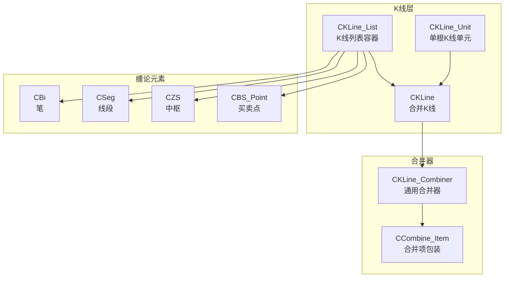
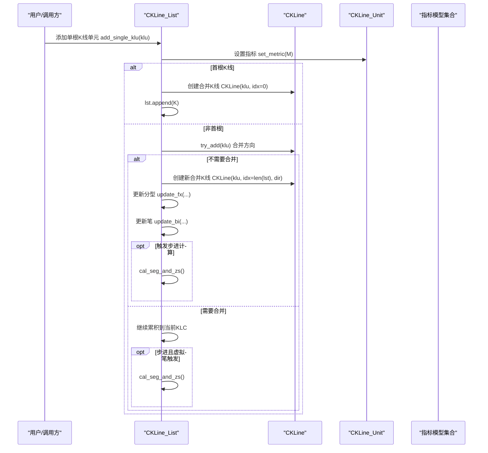
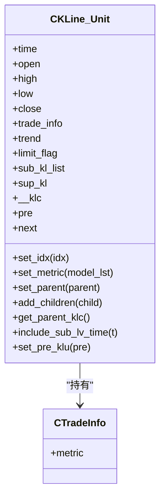
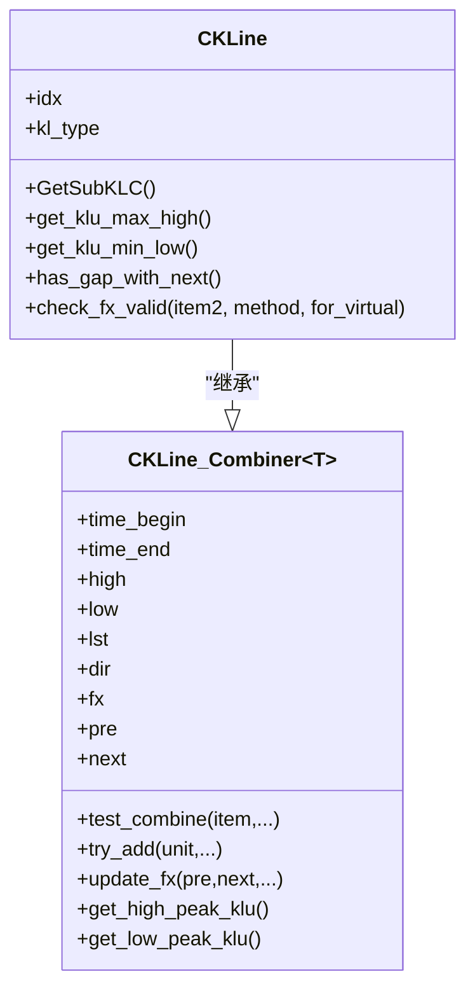
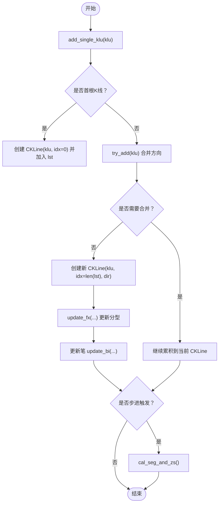
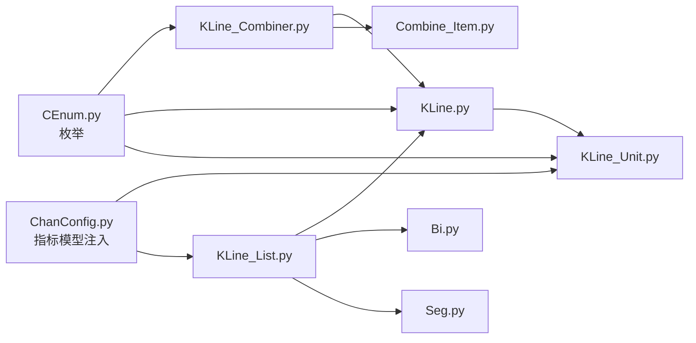

# K线模块

<cite>
**本文引用的文件**
- [KLine_Unit.py](file://KLine/KLine_Unit.py)
- [KLine.py](file://KLine/KLine.py)
- [KLine_List.py](file://KLine/KLine_List.py)
- [TradeInfo.py](file://KLine/TradeInfo.py)
- [KLine_Combiner.py](file://Combiner/KLine_Combiner.py)
- [Combine_Item.py](file://Combiner/Combine_Item.py)
- [CEnum.py](file://Common/CEnum.py)
- [ChanConfig.py](file://ChanConfig.py)
- [Bi.py](file://Bi/Bi.py)
- [Seg.py](file://Seg/Seg.py)
</cite>

## 目录
1. [简介](#简介)
2. [项目结构](#项目结构)
3. [核心组件](#核心组件)
4. [架构总览](#架构总览)
5. [详细组件分析](#详细组件分析)
6. [依赖关系分析](#依赖关系分析)
7. [性能考量](#性能考量)
8. [故障排查指南](#故障排查指南)
9. [结论](#结论)
10. [附录](#附录)

## 简介
本篇文档聚焦于K线模块，系统阐述三类核心对象：单根K线单元 CKLine_Unit、合并K线 CKLine 与 K线列表 CKLine_List 的职责划分与协作关系；详解 CKLine_Unit 的关键属性（时间、开盘、最高、最低、收盘、交易指标、趋势指标、涨跌停标记、前后指针、父子层级等），并说明其与次级别K线列表 sub_kl_list 和父级别 K 线 sup_kl 的层级关系；同时说明 CKLine_List 作为核心数据容器，如何管理笔、线段、中枢与买卖点列表，并给出遍历K线与访问缠论元素的实践路径。

## 项目结构
K线模块位于 KLine 目录，配合 Combiner 合并器、Bi/Seg 中枢与买卖点模块协同工作。整体采用“单元K线 → 合并K线 → 列表容器”的分层设计，列表容器负责驱动笔/线段/中枢/买卖点的计算与维护。

图表来源
- [KLine_Unit.py](file://KLine/KLine_Unit.py#L1-L155)
- [KLine.py](file://KLine/KLine.py#L1-L98)
- [KLine_List.py](file://KLine/KLine_List.py#L1-L205)
- [KLine_Combiner.py](file://Combiner/KLine_Combiner.py#L1-L172)
- [Combine_Item.py](file://Combiner/Combine_Item.py#L1-L26)
- [Bi.py](file://Bi/Bi.py#L1-L200)
- [Seg.py](file://Seg/Seg.py#L1-L157)

章节来源
- [KLine_Unit.py](file://KLine/KLine_Unit.py#L1-L155)
- [KLine.py](file://KLine/KLine.py#L1-L98)
- [KLine_List.py](file://KLine/KLine_List.py#L1-L205)
- [KLine_Combiner.py](file://Combiner/KLine_Combiner.py#L1-L172)
- [Combine_Item.py](file://Combiner/Combine_Item.py#L1-L26)
- [Bi.py](file://Bi/Bi.py#L1-L200)
- [Seg.py](file://Seg/Seg.py#L1-L157)

## 核心组件
- CKLine_Unit：承载单根K线的原始字段与衍生指标，维护与次级别K线的父子层级关系，支持指标计算与链式前后指针。
- CKLine：继承自通用合并器，封装多根单位K线的合并结果，提供分型、合并方向、极值K线定位、与子K线的映射等能力。
- CKLine_List：核心容器，管理K线序列、笔、线段、中枢、买卖点列表，按配置驱动指标模型与计算流程。

章节来源
- [KLine_Unit.py](file://KLine/KLine_Unit.py#L1-L155)
- [KLine.py](file://KLine/KLine.py#L1-L98)
- [KLine_List.py](file://KLine/KLine_List.py#L1-L205)

## 架构总览
K线数据从原始字典进入 CKLine_Unit，随后由 CKLine_List 驱动 CKLine 合并器进行合并，形成 CKLine 序列；在此过程中，CKLine_Unit 会注入指标（MACD、布林、RSI、KDJ、趋势模型、Demark 等），并与次级别K线建立父子关系；最终由 CKLine_List 统一调度笔/线段/中枢/买卖点的计算与维护。

图表来源
- [KLine_List.py](file://KLine/KLine_List.py#L122-L136)
- [KLine.py](file://KLine/KLine.py#L1-L98)
- [KLine_Unit.py](file://KLine/KLine_Unit.py#L1-L155)
- [ChanConfig.py](file://ChanConfig.py#L75-L103)

章节来源
- [KLine_List.py](file://KLine/KLine_List.py#L122-L136)
- [KLine.py](file://KLine/KLine.py#L1-L98)
- [KLine_Unit.py](file://KLine/KLine_Unit.py#L1-L155)
- [ChanConfig.py](file://ChanConfig.py#L75-L103)

## 详细组件分析

### CKLine_Unit（单根K线）
- 关键属性与职责
  - 原始字段：时间、开盘、最高、最低、收盘
  - 交易信息：成交量、成交额、换手率等，封装在 CTradeInfo 中
  - 指标缓存：MACD、布林、RSI、KDJ、趋势模型、Demark 等
  - 层级关系：
    - 子级别K线列表：sub_kl_list（用于记录更低级别K线单元）
    - 父级别K线：sup_kl（指向更高一级的 CKLine）
    - 所属合并K线：klc（指向当前所在的 CKLine）
  - 链式指针：pre、next，用于构建K线序列的双向链
  - 辅助状态：limit_flag（涨跌停标记）、idx（索引）、kl_type（K线类型）

- 指标注入与校验
  - set_metric 接受指标模型列表，按类型分别计算并缓存
  - check 支持自动修复或抛出异常，确保价格区间一致性

- 层级关系方法
  - add_children、set_parent、get_children、get_parent_klc、include_sub_lv_time
  - set_pre_klu 建立双向链

- 示例路径（不展示具体代码）
  - [构造与指标注入](file://KLine/KLine_Unit.py#L18-L31)
  - [指标设置与类型判断](file://KLine/KLine_Unit.py#L119-L135)
  - [层级关系与父子指针](file://KLine/KLine_Unit.py#L104-L155)
  - [价格区间校验](file://KLine/KLine_Unit.py#L92-L103)

图表来源
- [KLine_Unit.py](file://KLine/KLine_Unit.py#L1-L155)
- [TradeInfo.py](file://KLine/TradeInfo.py#L1-L14)

章节来源
- [KLine_Unit.py](file://KLine/KLine_Unit.py#L1-L155)
- [TradeInfo.py](file://KLine/TradeInfo.py#L1-L14)

### CKLine（合并K线）
- 继承自通用合并器 CKLine_Combiner，管理一组 CKLine_Unit 的合并结果
- 关键能力
  - 分型判定：update_fx
  - 合并方向：try_add 返回 UP/DOWN/COMBINE/INCLUDED
  - 极值定位：get_high_peak_klu/get_low_peak_klu
  - 子K线映射：GetSubKLC 提取子KLC（注意可能跨边界重复）
  - 区间比较：has_gap_with_next、check_fx_valid

- 示例路径（不展示具体代码）
  - [合并器基类接口](file://Combiner/KLine_Combiner.py#L84-L108)
  - [分型与方向更新](file://Combiner/KLine_Combiner.py#L127-L145)
  - [子K线映射](file://KLine/KLine.py#L24-L33)
  - [区间比较与有效性检查](file://KLine/KLine.py#L40-L98)

图表来源
- [KLine_Combiner.py](file://Combiner/KLine_Combiner.py#L1-L172)
- [KLine.py](file://KLine/KLine.py#L1-L98)

章节来源
- [KLine_Combiner.py](file://Combiner/KLine_Combiner.py#L1-L172)
- [KLine.py](file://KLine/KLine.py#L1-L98)

### CKLine_List（K线列表容器）
- 职责
  - 管理 CKLine 列表（可递归）
  - 维护笔、线段、中枢、买卖点列表
  - 注入指标模型，驱动步进式计算
  - 提供迭代器 klu_iter，遍历所有单位K线

- 关键流程
  - add_single_klu：添加单根K线单元，自动合并并更新分型与笔
  - cal_seg_and_zs：统一计算线段、中枢与买卖点
  - klu_iter：遍历单位K线，便于外部访问

- 示例路径（不展示具体代码）
  - [初始化与容器成员](file://KLine/KLine_List.py#L35-L49)
  - [指标模型注入](file://KLine/KLine_List.py#L122-L124)
  - [步进与合并逻辑](file://KLine/KLine_List.py#L122-L136)
  - [统一计算中枢与买卖点](file://KLine/KLine_List.py#L104-L118)
  - [单位K线遍历](file://KLine/KLine_List.py#L137-L140)

图表来源
- [KLine_List.py](file://KLine/KLine_List.py#L122-L136)
- [KLine.py](file://KLine/KLine.py#L1-L98)

章节来源
- [KLine_List.py](file://KLine/KLine_List.py#L1-L205)

### 缠论元素与K线的关联
- CKLine_Unit 与 CKLine 的关系
  - CKLine_Unit 通过 set_klc 指向所属 CKLine
  - CKLine 通过 lst 持有多个 CKLine_Unit
  - CKLine 提供 get_high_peak_klu/get_low_peak_klu 定位极值对应的 CKLine_Unit
- 层级关系
  - CKLine_Unit 可拥有多个子级别 K 线（sub_kl_list），并通过 set_parent/sup_kl 建立父子关系
  - CKLine_Unit 可通过 get_parent_klc 获取父级别 CKLine
- 与笔/线段/中枢/买卖点的衔接
  - CKLine_List 在合并完成后，驱动笔/线段/中枢/买卖点的计算与维护
  - CBi/CSeg 等对象通过 begin_klc/end_klc 与 CKLine/CKLine_Unit 建立引用

章节来源
- [KLine_Unit.py](file://KLine/KLine_Unit.py#L74-L88)
- [KLine.py](file://KLine/KLine.py#L1-L98)
- [KLine_List.py](file://KLine/KLine_List.py#L104-L118)
- [Bi.py](file://Bi/Bi.py#L1-L200)
- [Seg.py](file://Seg/Seg.py#L1-L157)

## 依赖关系分析
- 类型与枚举
  - KLINE_DIR、FX_TYPE、DATA_FIELD 等枚举贯穿合并器与K线模块
- 指标模型
  - 通过 CChanConfig.GetMetricModel 注入 MACD、布林、RSI、KDJ、趋势模型、Demark 等
- 合并器
  - CKLine_Combiner 为通用合并器，CKLine 继承之；CCombine_Item 为不同对象（K线单元、笔、线段）提供统一的合并项视图

图表来源
- [CEnum.py](file://Common/CEnum.py#L1-L130)
- [ChanConfig.py](file://ChanConfig.py#L75-L103)
- [KLine_Combiner.py](file://Combiner/KLine_Combiner.py#L1-L172)
- [Combine_Item.py](file://Combiner/Combine_Item.py#L1-L26)
- [KLine.py](file://KLine/KLine.py#L1-L98)
- [KLine_Unit.py](file://KLine/KLine_Unit.py#L1-L155)
- [KLine_List.py](file://KLine/KLine_List.py#L1-L205)
- [Bi.py](file://Bi/Bi.py#L1-L200)
- [Seg.py](file://Seg/Seg.py#L1-L157)

章节来源
- [CEnum.py](file://Common/CEnum.py#L1-L130)
- [ChanConfig.py](file://ChanConfig.py#L75-L103)
- [KLine_Combiner.py](file://Combiner/KLine_Combiner.py#L1-L172)
- [Combine_Item.py](file://Combiner/Combine_Item.py#L1-L26)
- [KLine.py](file://KLine/KLine.py#L1-L98)
- [KLine_Unit.py](file://KLine/KLine_Unit.py#L1-L155)
- [KLine_List.py](file://KLine/KLine_List.py#L1-L205)
- [Bi.py](file://Bi/Bi.py#L1-L200)
- [Seg.py](file://Seg/Seg.py#L1-L157)

## 性能考量
- 合并器缓存
  - CKLine_Combiner 使用缓存装饰器 make_cache 对极值定位等查询进行缓存，减少重复计算
- 指标模型
  - 指标模型按需启用（MACD、布林、RSI、KDJ、Demark、趋势模型），可通过配置控制，避免不必要的计算
- 步进式计算
  - 当 trigger_step 开启时，逐根K线推进，降低一次性计算压力，但增加调用频次
- 遍历效率
  - klu_iter 通过 CKLine.lst 迭代单位K线，避免对整条K线链的重复扫描

章节来源
- [KLine_Combiner.py](file://Combiner/KLine_Combiner.py#L113-L126)
- [ChanConfig.py](file://ChanConfig.py#L75-L103)
- [KLine_List.py](file://KLine/KLine_List.py#L119-L136)

## 故障排查指南
- 数据合法性
  - CKLine_Unit.check 在价格区间不合法时抛出异常，建议开启数据检查或在上游清洗数据
- 合并方向异常
  - CKLine_Combiner.test_combine 返回未知方向时抛出异常，检查输入K线是否跨周期或存在异常波动
- 分型有效性
  - CKLine.check_fx_valid 对分型有效性进行严格校验，若失败需调整分型检测方法（HALF/LOSS/STRICT/TOTALLY）
- 指标模型配置
  - CChanConfig.GetMetricModel 返回的指标模型列表需与实际启用开关一致，避免遗漏或冗余

章节来源
- [KLine_Unit.py](file://KLine/KLine_Unit.py#L92-L103)
- [KLine_Combiner.py](file://Combiner/KLine_Combiner.py#L64-L79)
- [KLine.py](file://KLine/KLine.py#L45-L98)
- [ChanConfig.py](file://ChanConfig.py#L75-L103)

## 结论
K线模块通过 CKLine_Unit、CKLine 与 CKLine_List 的分层设计，实现了从原始K线到合并K线再到缠论元素的完整链路。CKLine_Unit 负责单根K线的属性与指标，CKLine 负责合并与分型，CKLine_List 负责整体编排与步进式计算。借助通用合并器与指标模型注入，系统具备良好的扩展性与可维护性。

## 附录

### 遍历K线与访问缠论元素的实践路径
- 遍历单位K线
  - 使用 CKLine_List.klu_iter(klc_begin_idx) 获取单位K线迭代器
  - 示例路径：[单位K线遍历](file://KLine/KLine_List.py#L137-L140)
- 访问合并K线
  - 通过 CKLine_Unit.klc 获取所属合并K线
  - 示例路径：[设置与获取合并K线](file://KLine/KLine_Unit.py#L74-L88)
- 访问父子层级
  - 通过 CKLine_Unit.set_parent/set_children 建立层级关系
  - 通过 CKLine_Unit.get_parent_klc 获取父级别合并K线
  - 示例路径：[层级关系方法](file://KLine/KLine_Unit.py#L104-L139)
- 访问极值K线
  - 通过 CKLine.get_high_peak_klu/get_low_peak_klu 获取极值对应的单位K线
  - 示例路径：[极值定位](file://Combiner/KLine_Combiner.py#L113-L126)
- 访问笔/线段/中枢/买卖点
  - 通过 CKLine_List 的 bi_list、seg_list、segseg_list、zs_list、bs_point_lst、seg_bs_point_lst 获取
  - 示例路径：[容器成员与计算](file://KLine/KLine_List.py#L35-L49)
  - 示例路径：[统一计算中枢与买卖点](file://KLine/KLine_List.py#L104-L118)