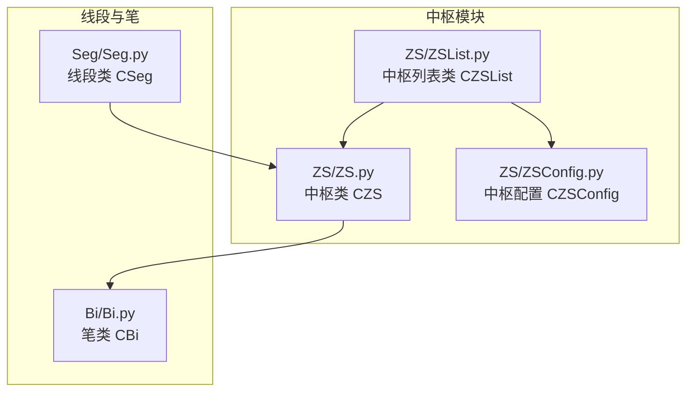
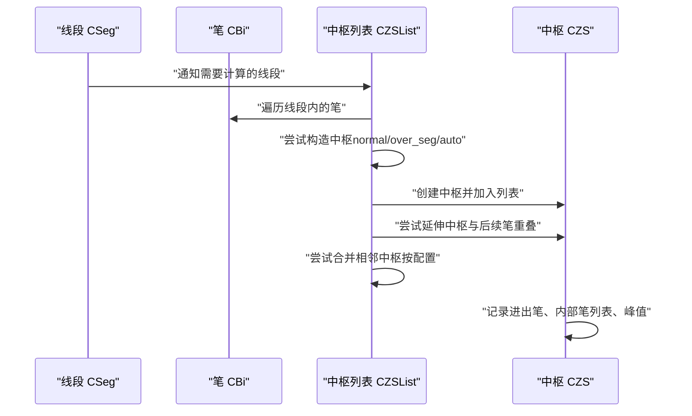
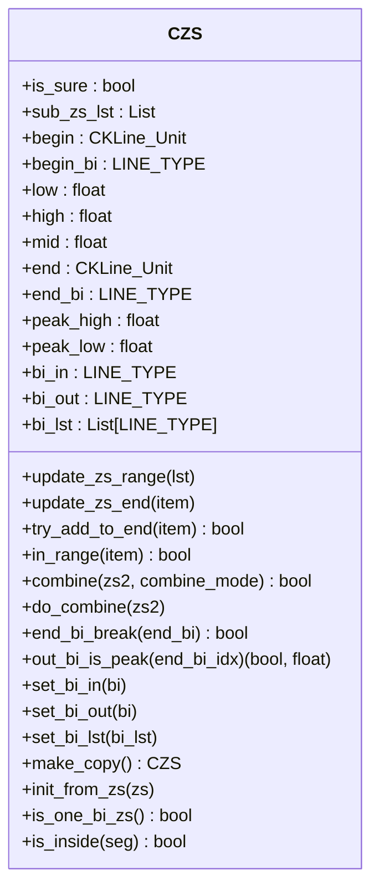
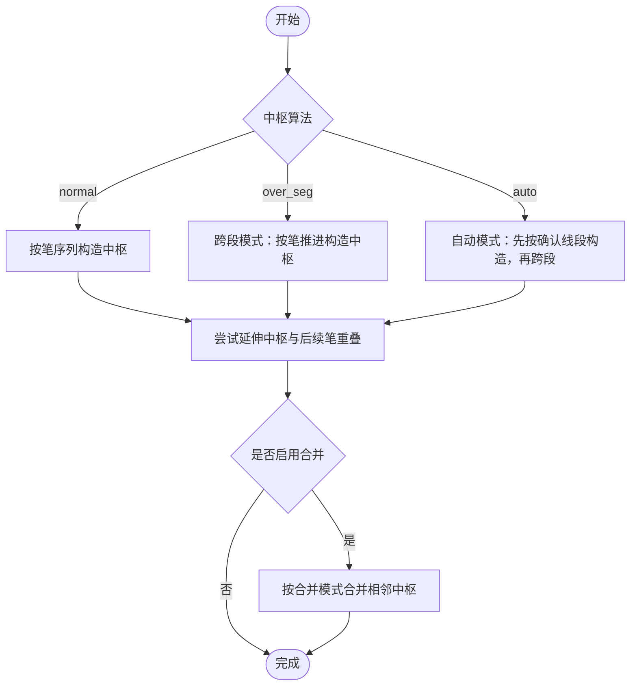
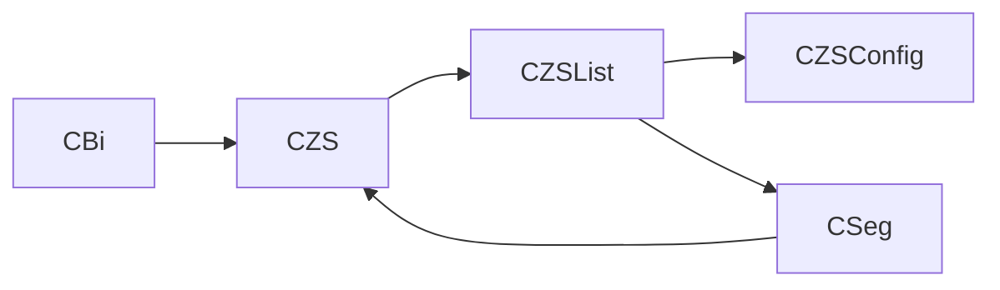

# 中枢模块

<cite>
**本文引用的文件**
- [ZS/ZS.py](file://ZS/ZS.py)
- [ZS/ZSList.py](file://ZS/ZSList.py)
- [ZS/ZSConfig.py](file://ZS/ZSConfig.py)
- [Seg/Seg.py](file://Seg/Seg.py)
- [Bi/Bi.py](file://Bi/Bi.py)
- [README.md](file://README.md)
</cite>

## 目录
1. [简介](#简介)
2. [项目结构](#项目结构)
3. [核心组件](#核心组件)
4. [架构总览](#架构总览)
5. [详细组件分析](#详细组件分析)
6. [依赖分析](#依赖分析)
7. [性能考量](#性能考量)
8. [故障排查指南](#故障排查指南)
9. [结论](#结论)

## 简介
中枢模块是缠论分析的核心之一，负责识别、维护和合并中枢。中枢由连续的笔构成，其高低点、起止K线、进出笔、内部笔列表以及子中枢（合并后）共同描述中枢的形态与演化。本模块还提供中枢配置项，包括是否合并、合并模式（按区间重叠或按峰值重叠）、是否计算单笔中枢以及中枢算法（段内/跨段/自动）等，这些配置直接影响中枢的生成与合并策略。

## 项目结构
中枢模块位于 ZS 目录，主要文件如下：
- ZS/ZS.py：中枢类 CZS 的实现，包含中枢范围、起止K线、进出笔、内部笔列表、子中枢合并等逻辑
- ZS/ZSList.py：中枢列表类 CZSList，负责中枢的构建、合并、遍历与查询
- ZS/ZSConfig.py：中枢配置类 CZSConfig，定义中枢合并开关、合并模式、是否允许单笔中枢、中枢算法等
- Seg/Seg.py：线段类 CSeg，中枢与线段存在关联，中枢属于某一线段内部
- Bi/Bi.py：笔类 CBi，中枢由笔组成，中枢范围与进出笔均基于笔的高低点与K线单元
- README.md：包含中枢算法与行为的说明，涵盖段内/跨段中枢、合并规则等

图表来源
- [ZS/ZS.py](file://ZS/ZS.py#L1-L235)
- [ZS/ZSList.py](file://ZS/ZSList.py#L1-L162)
- [ZS/ZSConfig.py](file://ZS/ZSConfig.py#L1-L7)
- [Seg/Seg.py](file://Seg/Seg.py#L1-L157)
- [Bi/Bi.py](file://Bi/Bi.py#L1-L327)

章节来源
- [ZS/ZS.py](file://ZS/ZS.py#L1-L235)
- [ZS/ZSList.py](file://ZS/ZSList.py#L1-L162)
- [ZS/ZSConfig.py](file://ZS/ZSConfig.py#L1-L7)
- [Seg/Seg.py](file://Seg/Seg.py#L1-L157)
- [Bi/Bi.py](file://Bi/Bi.py#L1-L327)

## 核心组件
- 中枢类 CZS：封装中枢的范围（low、high、mid）、起止K线与笔、进出笔、内部笔列表、峰值（peak_low、peak_high）、子中枢列表（合并后）以及合并与延伸逻辑
- 中枢列表类 CZSList：维护中枢列表，负责中枢的构造、合并、按线段更新中枢、跨段中枢处理、以及与线段确认性的联动
- 中枢配置类 CZSConfig：提供中枢合并开关、合并模式（区间重叠 vs 峰值重叠）、是否允许单笔中枢、中枢算法（normal/over_seg/auto）

章节来源
- [ZS/ZS.py](file://ZS/ZS.py#L13-L235)
- [ZS/ZSList.py](file://ZS/ZSList.py#L13-L162)
- [ZS/ZSConfig.py](file://ZS/ZSConfig.py#L1-L7)

## 架构总览
中枢模块围绕“笔—线段—中枢”的层次展开：
- 笔（CBi）是中枢的基本组成单元，提供高低点、K线单元等基础信息
- 线段（CSeg）承载中枢，中枢属于某一线段内部，且中枢不跨段（正常情况下）
- 中枢列表（CZSList）根据线段确认性与中枢算法，逐笔推进生成中枢，并在合适时机进行合并
- 中枢（CZS）负责计算中枢范围、更新末端、判断延伸、合并与背驰判定

图表来源
- [Seg/Seg.py](file://Seg/Seg.py#L1-L157)
- [Bi/Bi.py](file://Bi/Bi.py#L1-L327)
- [ZS/ZSList.py](file://ZS/ZSList.py#L1-L162)
- [ZS/ZS.py](file://ZS/ZS.py#L1-L235)

## 详细组件分析

### 中枢类 CZS
CZS 是中枢的核心对象，负责：
- 初始化与范围计算：根据内部笔集合计算中枢的 low、high、mid，并清理缓存
- 起止K线与笔：记录 begin/end 对应的 K 线单元与起止笔
- 峰值追踪：跟踪中枢涉及笔的最低/最高值（peak_low、peak_high）
- 延伸与合并：尝试将后续笔纳入中枢，以及与相邻中枢进行合并
- 进出笔与内部笔列表：记录进入中枢的笔、离开中枢的笔以及中间的内部笔列表
- 背驰与突破：判断末笔是否突破中枢，用于买卖点背驰判断

图表来源
- [ZS/ZS.py](file://ZS/ZS.py#L13-L235)

章节来源
- [ZS/ZS.py](file://ZS/ZS.py#L13-L235)

### 中枢列表类 CZSList
CZSList 负责中枢的构建与维护：
- 中枢构造：根据配置的中枢算法（normal/over_seg/auto）逐笔推进，尝试构造中枢
- 延伸中枢：若当前笔与中枢区间重叠，则尝试将其纳入中枢
- 合并中枢：根据配置的合并模式（区间重叠或峰值重叠）合并相邻中枢
- 与线段确认性联动：仅对确认线段之后的笔进行中枢计算，避免提前合并
- 跨段中枢：在 over_seg/auto 模式下，允许中枢跨越线段边界

图表来源
- [ZS/ZSList.py](file://ZS/ZSList.py#L1-L162)

章节来源
- [ZS/ZSList.py](file://ZS/ZSList.py#L1-L162)

### 中枢配置类 CZSConfig
CZSConfig 提供中枢计算的关键配置：
- need_combine：是否启用中枢合并
- zs_combine_mode：合并模式
  - "zs"：两中枢区间重叠才合并
  - "peak"：两中枢峰值区间重叠即合并
- one_bi_zs：是否允许单笔中枢（用于趋势分析）
- zs_algo：中枢算法
  - "normal"：按线段内笔序列构造中枢
  - "over_seg"：跨段构造中枢
  - "auto"：自动模式，先按确认线段构造，再跨段

章节来源
- [ZS/ZSConfig.py](file://ZS/ZSConfig.py#L1-L7)
- [README.md](file://README.md#L563-L571)

### 中枢在缠论分析中的核心作用
- 形态识别：中枢由连续笔构成，其高低区间刻画震荡区域
- 延伸与合并：中枢随笔的加入而延伸，相邻中枢在合适条件下合并，形成更大尺度的震荡区间
- 背驰与突破：中枢的突破与背驰是买卖点判断的重要依据
- 线段归属：中枢属于某一线段内部，中枢不跨段（正常情况下），这有助于界定中枢的生命周期与边界

章节来源
- [README.md](file://README.md#L960-L975)

## 依赖分析
- CZS 依赖 CBi（笔）与 CKLine_Unit（K线单元），用于计算中枢范围与延伸
- CZSList 依赖 CZSConfig（配置）、CSeg（线段）、CBi（笔），用于中枢构造、合并与跨段处理
- CSeg 与 CZS 存在双向关联：线段持有中枢列表，中枢记录所属线段
- CZSList 与 CZS 的交互体现了中枢的动态演进与合并

图表来源
- [ZS/ZS.py](file://ZS/ZS.py#L1-L235)
- [ZS/ZSList.py](file://ZS/ZSList.py#L1-L162)
- [Seg/Seg.py](file://Seg/Seg.py#L1-L157)
- [Bi/Bi.py](file://Bi/Bi.py#L1-L327)

章节来源
- [ZS/ZS.py](file://ZS/ZS.py#L1-L235)
- [ZS/ZSList.py](file://ZS/ZSList.py#L1-L162)
- [Seg/Seg.py](file://Seg/Seg.py#L1-L157)
- [Bi/Bi.py](file://Bi/Bi.py#L1-L327)

## 性能考量
- 中枢合并的复杂度与中枢数量呈线性关系，建议在中枢数量较多时谨慎开启合并
- 合并模式选择会影响合并触发频率，"peak" 模式较易触发合并，可能增加合并成本
- 跨段中枢算法（over_seg/auto）会遍历更多笔，建议在确认线段之后再启用，以减少无效计算
- CZSList 在更新中枢时会清理缓存，频繁更新可能导致多次计算，建议批量推进或按确认线段更新

## 故障排查指南
- 中枢未生成或合并异常
  - 检查配置项 need_combine 与 zs_combine_mode 是否符合预期
  - 确认 one_bi_zs 设置是否允许单笔中枢
  - 若使用跨段算法，确认线段确认性与 last_sure_pos 的更新逻辑
- 延伸失败
  - 检查笔与中枢区间重叠判断逻辑，确保 in_range 正确
  - 确认笔的方向与中枢方向一致，避免误判
- 背驰判断问题
  - 检查末笔突破中枢的判断逻辑，确保 end_bi_break 正确
  - 确认 MACD 指标算法与配置一致

章节来源
- [ZS/ZS.py](file://ZS/ZS.py#L95-L175)
- [ZS/ZSList.py](file://ZS/ZSList.py#L35-L90)

## 结论
中枢模块通过 CZS、CZSList 与 CZSConfig 的协同，实现了中枢的识别、延伸、合并与跨段处理。合理的配置能够平衡中枢的稳定性与灵敏度，从而提升买卖点判断的准确性。在实际应用中，应结合线段确认性与中枢算法选择，合理设置合并模式与单笔中枢策略，以获得更稳健的中枢分析结果。