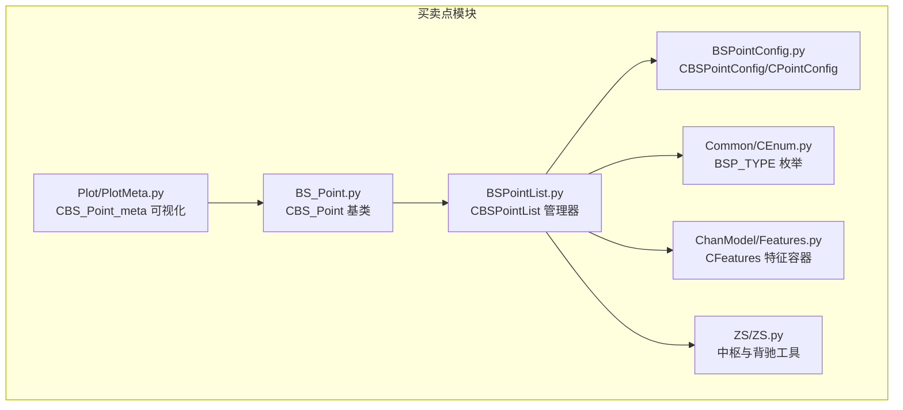
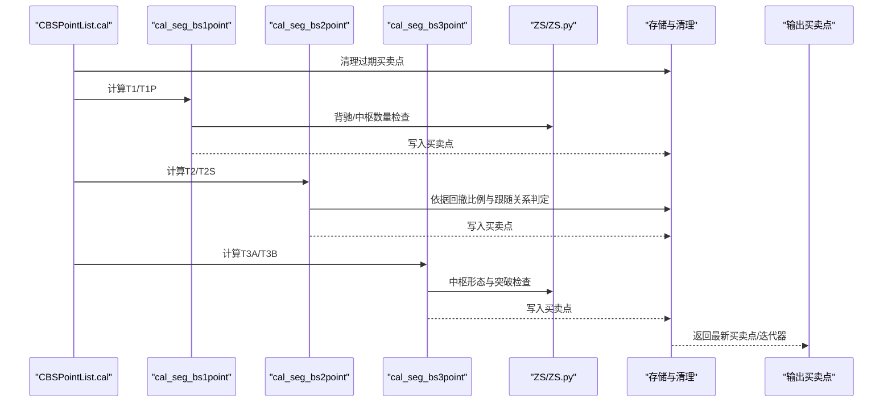
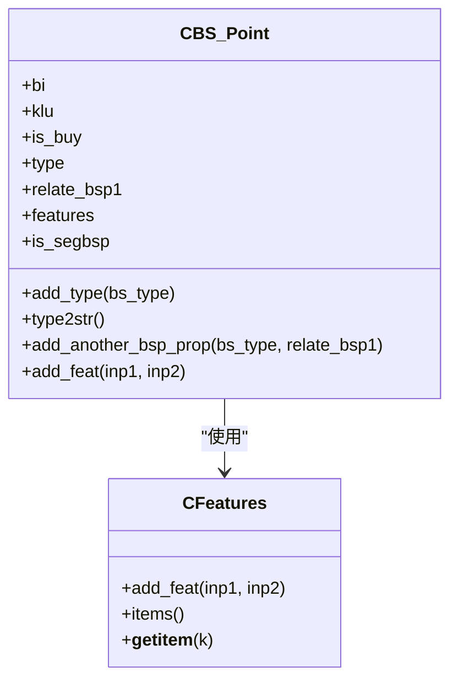
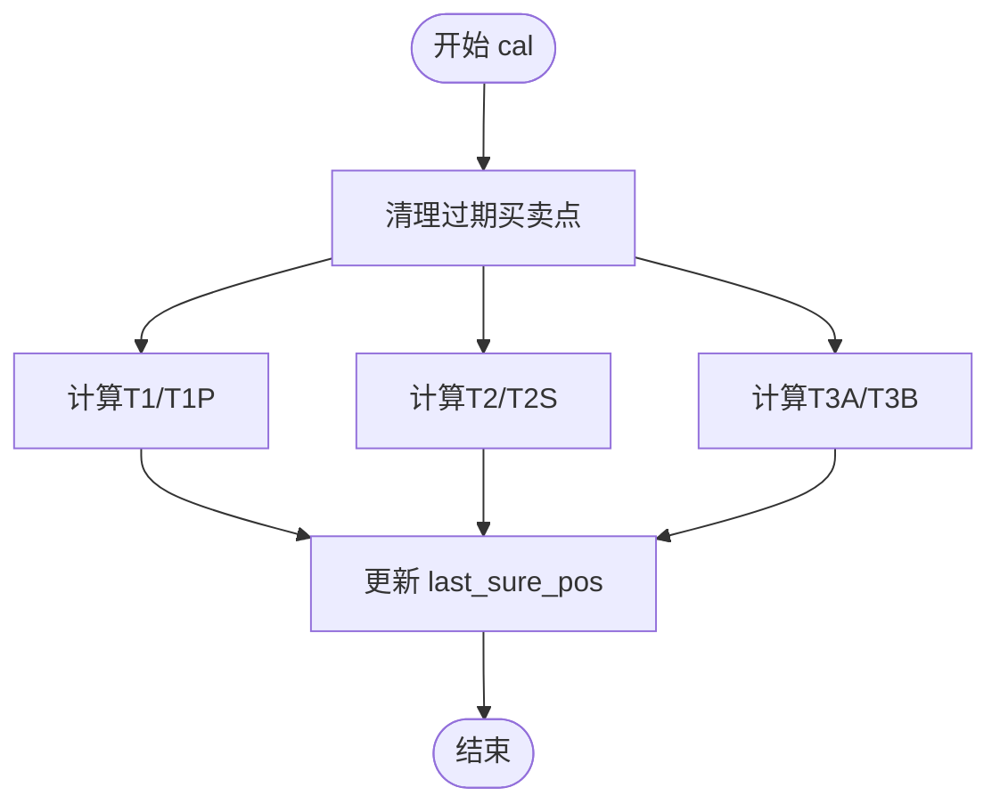
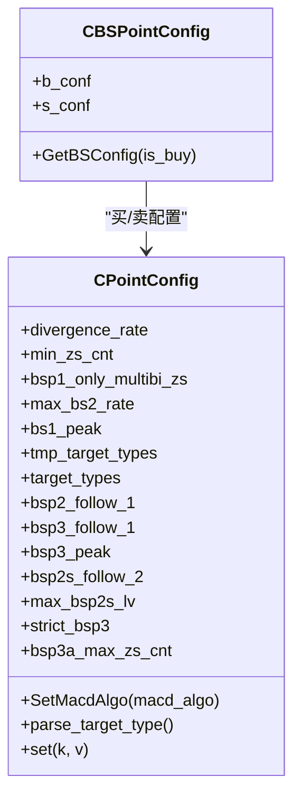
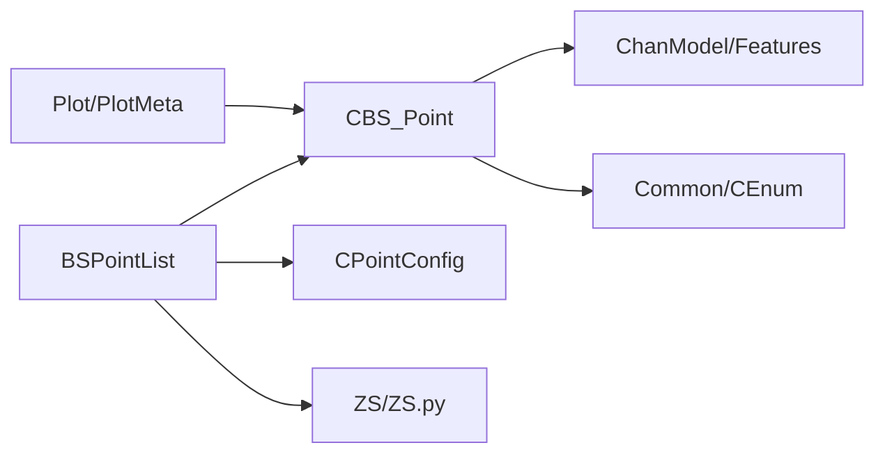

# 买卖点模块

<cite>
**本文引用的文件**
- [BuySellPoint/BS_Point.py](file://BuySellPoint/BS_Point.py)
- [BuySellPoint/BSPointList.py](file://BuySellPoint/BSPointList.py)
- [BuySellPoint/BSPointConfig.py](file://BuySellPoint/BSPointConfig.py)
- [Common/CEnum.py](file://Common/CEnum.py)
- [ChanModel/Features.py](file://ChanModel/Features.py)
- [Plot/PlotMeta.py](file://Plot/PlotMeta.py)
- [ZS/ZS.py](file://ZS/ZS.py)
- [README.md](file://README.md)
- [Debug/strategy_demo.py](file://Debug/strategy_demo.py)
</cite>

## 目录
1. [简介](#简介)
2. [项目结构](#项目结构)
3. [核心组件](#核心组件)
4. [架构总览](#架构总览)
5. [详细组件分析](#详细组件分析)
6. [依赖关系分析](#依赖关系分析)
7. [性能考量](#性能考量)
8. [故障排查指南](#故障排查指南)
9. [结论](#结论)
10. [附录](#附录)

## 简介
本文件系统化梳理“买卖点模块”的实现与使用，重点围绕以下目标展开：
- 解释 CBS_Point（买卖点）类的实现，包括其所属的笔/线段、类型（T1/T1P/T2/T2S/T3A/T3B）、是否为买点以及特征存储。
- 描述 CBSPointList 如何管理买卖点列表，包括存储结构、迭代与清理机制、按类型与时间的筛选。
- 详解 CBSPointConfig 中的关键配置项：divergence_rate（背驰比例）、min_zs_cnt（最小中枢数）、max_bs2_rate（二类回撤比例）、bs_type（关注的买卖点类型），以及它们如何影响买卖点生成规则。
- 区分形态学买卖点（bsp）与自定义买卖点（cbsp）的概念与实现路径。

## 项目结构
买卖点模块位于 BuySellPoint 目录，核心文件如下：
- BS_Point.py：定义 CBS_Point 基础类，承载买卖点的类型、方向、关联笔/线段、特征等。
- BSPointList.py：管理买卖点集合，负责计算与维护各类买卖点（T1/T1P/T2/T2S/T3A/T3B），并提供迭代、清理、查询等能力。
- BSPointConfig.py：定义买卖点配置对象 CBSPointConfig 与 CPointConfig，集中管理各类买卖点的参数与目标类型。
- Plot/PlotMeta.py：可视化层对 CBS_Point 的元数据封装，便于绘图标注。
- ZS/ZS.py：中枢相关工具，用于背驰判断与中枢特征提取，买卖点计算中广泛使用。
- Common/CEnum.py：买卖点类型枚举 BSP_TYPE（T1/T1P/T2/T2S/T3A/T3B）等。
- ChanModel/Features.py：特征容器，用于保存买卖点的衍生指标（如背驰比例）。
- README.md：形态学买卖点扩展开发指引。
- Debug/strategy_demo.py：实战示例，展示如何基于最新买卖点执行交易动作。

图表来源
- [BuySellPoint/BS_Point.py](file://BuySellPoint/BS_Point.py#L1-L39)
- [BuySellPoint/BSPointList.py](file://BuySellPoint/BSPointList.py#L1-L120)
- [BuySellPoint/BSPointConfig.py](file://BuySellPoint/BSPointConfig.py#L1-L82)
- [Common/CEnum.py](file://Common/CEnum.py#L54-L67)
- [ChanModel/Features.py](file://ChanModel/Features.py#L1-L19)
- [Plot/PlotMeta.py](file://Plot/PlotMeta.py#L104-L115)
- [ZS/ZS.py](file://ZS/ZS.py#L171-L175)

章节来源
- [BuySellPoint/BS_Point.py](file://BuySellPoint/BS_Point.py#L1-L39)
- [BuySellPoint/BSPointList.py](file://BuySellPoint/BSPointList.py#L1-L120)
- [BuySellPoint/BSPointConfig.py](file://BuySellPoint/BSPointConfig.py#L1-L82)
- [Common/CEnum.py](file://Common/CEnum.py#L54-L67)
- [ChanModel/Features.py](file://ChanModel/Features.py#L1-L19)
- [Plot/PlotMeta.py](file://Plot/PlotMeta.py#L104-L115)
- [ZS/ZS.py](file://ZS/ZS.py#L171-L175)

## 核心组件
- CBS_Point（买卖点基类）
  - 关联对象：所属笔/线段（bi），结束K线单元（klu），是否为买点（is_buy），类型列表（type），关联的前序买卖点（relate_bsp1）。
  - 特征：通过 CFeatures 存储量化指标（如背驰比例）。
  - 方法：add_type、type2str、add_another_bsp_prop、add_feat。
- CBSPointList（买卖点管理器）
  - 存储结构：按买卖方向与类型分组的二维列表；同时维护扁平索引（bsp_store_flat_dict）以便快速定位。
  - 生命周期：维护 last_sure_pos/last_sure_seg_idx，按“确定性线段”边界清理过期买卖点。
  - 计算入口：cal，依次调用 cal_seg_bs1point、cal_seg_bs2point、cal_seg_bs3point。
  - 查询：getSortedBspList、get_latest_bsp、迭代器 bsp_iter/bsp_iter_v2。
- CBSPointConfig/CPointConfig（买卖点配置）
  - 买卖方向独立配置：b_conf（买方）、s_conf（卖方）。
  - 关键参数：divergence_rate、min_zs_cnt、bsp1_only_multibi_zs、max_bs2_rate、macd_algo、bs1_peak、bs_type、bsp2_follow_1、bsp3_follow_1、bsp3_peak、bsp2s_follow_2、max_bsp2s_lv、strict_bsp3、bsp3a_max_zs_cnt。
  - 目标类型解析：parse_target_type 将字符串类型映射为枚举集合。

章节来源
- [BuySellPoint/BS_Point.py](file://BuySellPoint/BS_Point.py#L11-L39)
- [BuySellPoint/BSPointList.py](file://BuySellPoint/BSPointList.py#L18-L120)
- [BuySellPoint/BSPointConfig.py](file://BuySellPoint/BSPointConfig.py#L7-L82)
- [Common/CEnum.py](file://Common/CEnum.py#L54-L67)
- [ChanModel/Features.py](file://ChanModel/Features.py#L1-L19)

## 架构总览
买卖点模块采用“配置驱动 + 管理器调度 + 基类封装”的分层设计：
- 配置层：CBSPointConfig/CPointConfig 提供参数与目标类型解析。
- 管理层：CBSPointList 负责买卖点的生成、存储、清理与查询。
- 基础层：CBS_Point 封装买卖点的属性与特征。
- 工具层：ZS/ZS.py 提供中枢与背驰判断；Plot/PlotMeta.py 提供可视化元数据；Common/CEnum.py 定义买卖点类型。

图表来源
- [BuySellPoint/BSPointList.py](file://BuySellPoint/BSPointList.py#L100-L120)
- [BuySellPoint/BSPointList.py](file://BuySellPoint/BSPointList.py#L157-L206)
- [BuySellPoint/BSPointList.py](file://BuySellPoint/BSPointList.py#L207-L279)
- [BuySellPoint/BSPointList.py](file://BuySellPoint/BSPointList.py#L279-L375)
- [ZS/ZS.py](file://ZS/ZS.py#L171-L175)

## 详细组件分析

### CBS_Point（买卖点）类
- 关键属性
  - bi：所属笔/线段对象，用于定位买卖点所在位置。
  - klu：买卖点触发的K线单元（结束K线）。
  - is_buy：布尔值，指示该买卖点是否为买点。
  - type：类型列表，支持同一K线上叠加多种类型（如T1+T1P）。
  - relate_bsp1：与该买卖点相关的前序T1/T1P买卖点，用于二类及后续类型的关联。
  - features：CFeatures，用于记录量化指标（如背驰比例）。
  - is_segbsp：是否为线段级别买卖点（可视化用途）。
- 关键方法
  - add_type：追加类型。
  - type2str：将类型列表转为字符串，便于显示。
  - add_another_bsp_prop：在同一K线上叠加另一个买卖点属性，若存在则校验K线索引一致。
  - add_feat：向特征容器添加指标。

图表来源
- [BuySellPoint/BS_Point.py](file://BuySellPoint/BS_Point.py#L11-L39)
- [ChanModel/Features.py](file://ChanModel/Features.py#L1-L19)

章节来源
- [BuySellPoint/BS_Point.py](file://BuySellPoint/BS_Point.py#L11-L39)
- [ChanModel/Features.py](file://ChanModel/Features.py#L1-L19)

### CBSPointList（买卖点列表管理器）
- 存储结构
  - bsp_store_dict：按 BSP_TYPE 分组，每组内再按 is_buy（买/卖）分组，分别维护有序列表，并保持 bi.idx 严格递增。
  - bsp_store_flat_dict：按 bi.idx 快速定位买卖点，便于去重与覆盖。
  - bsp1_list/bsp1_dict：单独维护 T1/T1P 列表，便于快速获取最近一次买卖点。
- 生命周期与清理
  - update_last_pos：根据“确定性线段”更新 last_sure_pos 与 last_sure_seg_idx。
  - clear_store_end/clear_bsp1_end：按 last_sure_pos 清理过期买卖点，同时解除与 bi 的绑定。
  - seg_need_cal：判断某线段是否需要重新计算买卖点。
- 计算流程
  - cal：统一入口，依次调用 cal_seg_bs1point、cal_seg_bs2point、cal_seg_bs3point。
  - add_bs：根据目标类型与配置决定是否写入买卖点，并处理 T1/T1P 的特殊逻辑。
- 查询与迭代
  - bsp_iter/bsp_iter_v2：按时间倒序迭代买卖点。
  - getSortedBspList/get_latest_bsp：排序与取最新若干个买卖点。

图表来源
- [BuySellPoint/BSPointList.py](file://BuySellPoint/BSPointList.py#L100-L120)
- [BuySellPoint/BSPointList.py](file://BuySellPoint/BSPointList.py#L157-L206)
- [BuySellPoint/BSPointList.py](file://BuySellPoint/BSPointList.py#L207-L279)
- [BuySellPoint/BSPointList.py](file://BuySellPoint/BSPointList.py#L279-L375)

章节来源
- [BuySellPoint/BSPointList.py](file://BuySellPoint/BSPointList.py#L18-L120)
- [BuySellPoint/BSPointList.py](file://BuySellPoint/BSPointList.py#L121-L156)
- [BuySellPoint/BSPointList.py](file://BuySellPoint/BSPointList.py#L157-L206)
- [BuySellPoint/BSPointList.py](file://BuySellPoint/BSPointList.py#L207-L279)
- [BuySellPoint/BSPointList.py](file://BuySellPoint/BSPointList.py#L279-L375)

### CBSPointConfig（买卖点配置）
- 结构
  - CBSPointConfig：包含 b_conf（买方配置）与 s_conf（卖方配置）。
  - CPointConfig：具体参数与解析逻辑。
- 关键参数与作用
  - divergence_rate：背驰比例阈值，用于 T1/T1P 与中枢背驰判断。
  - min_zs_cnt：T1/T1P 至少需要的中枢数量（或是否仅允许多笔中枢形态）。
  - bsp1_only_multibi_zs：是否仅允许多笔中枢形态的 T1/T1P。
  - max_bs2_rate：二类买卖点的最大回撤比例，超过则不视为有效 T2/T2S。
  - macd_algo：MACD 指标计算算法（面积、峰值、差值、斜率、振幅等）。
  - bs1_peak：T1 是否要求中枢末端为高点/低点。
  - bs_type：目标买卖点类型集合（字符串逗号分隔，解析为枚举列表）。
  - bsp2_follow_1：T2 是否必须跟随最近一次 T1/T1P。
  - bsp3_follow_1：T3 是否必须跟随最近一次 T1/T1P。
  - bsp3_peak：T3 是否要求中枢末端为高点/低点。
  - bsp2s_follow_2：当不满足 T2 时，是否继续尝试 T2S。
  - max_bsp2s_lv：T2S 的最大层级（按 bi 索引步进）。
  - strict_bsp3：T3 是否严格要求中枢连续性。
  - bsp3a_max_zs_cnt：T3A 的最大中枢计数限制。
- 目标类型解析
  - parse_target_type：将字符串类型（如 "1,2,3a"）解析为枚举集合，确保只保留合法类型。

图表来源
- [BuySellPoint/BSPointConfig.py](file://BuySellPoint/BSPointConfig.py#L7-L82)

章节来源
- [BuySellPoint/BSPointConfig.py](file://BuySellPoint/BSPointConfig.py#L7-L82)

### 买卖点类型与形态学 vs 自定义
- BSP_TYPE（买卖点类型）
  - T1：一类买点/卖点（背驰类）。
  - T1P：一类形态学买卖点（基于笔的背驰形态）。
  - T2：二类买点/卖点（回撤类）。
  - T2S：二类延伸（类二）。
  - T3A：三类买点/卖点（中枢后突破）。
  - T3B：三类买点/卖点（中枢前突破）。
- 形态学买卖点（bsp）与自定义买卖点（cbsp）
  - 形态学买卖点：由模块内置算法生成，遵循上述类型与配置。
  - 自定义买卖点：用户可继承 CBS_Point 或在 CBSPointList.cal 中自行扩展，对外暴露 cal 接口即可被框架集成。

章节来源
- [Common/CEnum.py](file://Common/CEnum.py#L54-L67)
- [README.md](file://README.md#L1188-L1199)

## 依赖关系分析
- 组件耦合
  - CBSPointList 依赖 CBS_Point、CPointConfig、ZS/ZS.py（背驰/中枢）、Common/CEnum（类型）、ChanModel/Features（特征）。
  - CBS_Point 依赖 Bi/Seg（笔/线段）与 CFeatures。
  - 可视化层 Plot/PlotMeta.py 依赖 CBS_Point，用于标注买卖点。
- 外部依赖
  - ZS/ZS.py 提供 is_divergence 等中枢与背驰工具函数。
  - Common/CEnum 提供 BSP_TYPE 枚举。
  - Plot/PlotMeta 提供 CBS_Point_meta 用于绘图。

图表来源
- [BuySellPoint/BSPointList.py](file://BuySellPoint/BSPointList.py#L1-L120)
- [BuySellPoint/BS_Point.py](file://BuySellPoint/BS_Point.py#L1-L39)
- [BuySellPoint/BSPointConfig.py](file://BuySellPoint/BSPointConfig.py#L1-L82)
- [Plot/PlotMeta.py](file://Plot/PlotMeta.py#L104-L115)
- [ZS/ZS.py](file://ZS/ZS.py#L171-L175)

章节来源
- [BuySellPoint/BSPointList.py](file://BuySellPoint/BSPointList.py#L1-L120)
- [BuySellPoint/BS_Point.py](file://BuySellPoint/BS_Point.py#L1-L39)
- [BuySellPoint/BSPointConfig.py](file://BuySellPoint/BSPointConfig.py#L1-L82)
- [Plot/PlotMeta.py](file://Plot/PlotMeta.py#L104-L115)
- [ZS/ZS.py](file://ZS/ZS.py#L171-L175)

## 性能考量
- 存储与索引
  - bsp_store_flat_dict 以 bi.idx 为键，O(1) 定位买卖点，避免重复计算。
  - bsp_store_dict 按类型与方向分组，配合 bi.idx 严格递增，保证插入与清理效率。
- 清理策略
  - 依据“确定性线段”边界 last_sure_pos 清理过期买卖点，减少无效数据占用。
- 迭代与查询
  - bsp_iter_v2 通过索引游标按 bi.idx 倒序迭代，避免全量排序。
- 背驰与中枢判断
  - 背驰比例计算与中枢形态检查为 O(n) 级别，建议在配置层合理设置 max_bsp2s_lv、bsp3a_max_zs_cnt 等上限参数，降低复杂度。

[本节为通用指导，无需列出具体文件来源]

## 故障排查指南
- 断言失败（类型/方向一致性）
  - add_bs 中对同一 bi.idx 的 is_buy 一致性进行断言；若报错，检查是否对同一K线重复添加不同方向的买卖点。
- 回撤比例越界
  - max_bs2_rate 设定上限为 1，若配置错误可能导致 T2/T2S 无法生成；请核对配置。
- 目标类型未启用
  - 若 bs_type 未包含对应类型，add_bs 会将非目标类型标记为非目标买卖点而不写入存储；请检查 parse_target_type 的输入。
- 二类跟随关系
  - 当 bsp2_follow_1 为真且最近无 T1/T1P 时，T2/T2S 不会被生成；请确认线段与买卖点计算顺序。
- 三类严格模式
  - strict_bsp3 为真时，要求中枢连续性，否则跳过；请根据实际需求调整。

章节来源
- [BuySellPoint/BSPointList.py](file://BuySellPoint/BSPointList.py#L124-L156)
- [BuySellPoint/BSPointConfig.py](file://BuySellPoint/BSPointConfig.py#L33-L50)
- [BuySellPoint/BSPointList.py](file://BuySellPoint/BSPointList.py#L232-L243)

## 结论
买卖点模块通过清晰的分层设计与配置驱动，实现了形态学买卖点的高效生成与管理。CBS_Point 提供了灵活的属性与特征扩展能力，CBSPointList 则以存储结构与生命周期管理保障了性能与正确性。通过合理配置 CBSPointConfig，用户可以在不同市场环境下灵活调整买卖点生成规则，并可通过扩展 cal 方法实现自定义买卖点策略。

[本节为总结性内容，无需列出具体文件来源]

## 附录

### 关键配置项说明与影响
- divergence_rate
  - 影响：T1/T1P 背驰判断与中枢背驰比例；越小越严格。
  - 位置：CPointConfig.divergence_rate。
- min_zs_cnt
  - 影响：T1/T1P 至少需要的中枢数量；越大越严格。
  - 位置：CPointConfig.min_zs_cnt。
- bsp1_only_multibi_zs
  - 影响：是否仅允许多笔中枢形态的 T1/T1P。
  - 位置：CPointConfig.bsp1_only_multibi_zs。
- max_bs2_rate
  - 影响：二类买卖点的最大回撤比例；越小越严格。
  - 位置：CPointConfig.max_bs2_rate。
- bs_type
  - 影响：目标买卖点类型集合；未包含的类型不会写入存储。
  - 位置：CPointConfig.tmp_target_types → CPointConfig.target_types。
- 其他重要参数
  - macd_algo：背驰指标算法选择。
  - bs1_peak、bsp3_peak：是否要求中枢末端为高/低点。
  - bsp2_follow_1、bsp3_follow_1：是否必须跟随最近一次 T1/T1P。
  - bsp2s_follow_2：不满足 T2 时是否继续尝试 T2S。
  - max_bsp2s_lv：T2S 最大层级。
  - strict_bsp3：T3 是否严格要求中枢连续性。
  - bsp3a_max_zs_cnt：T3A 最大中枢计数。

章节来源
- [BuySellPoint/BSPointConfig.py](file://BuySellPoint/BSPointConfig.py#L16-L82)
- [BuySellPoint/BSPointList.py](file://BuySellPoint/BSPointList.py#L157-L206)
- [BuySellPoint/BSPointList.py](file://BuySellPoint/BSPointList.py#L207-L279)
- [BuySellPoint/BSPointList.py](file://BuySellPoint/BSPointList.py#L279-L375)

### 实战示例与扩展路径
- 实战示例
  - 参考 Debug/strategy_demo.py，基于最新买卖点执行交易动作。
- 扩展路径
  - 参考 README.md 中的形态学买卖点扩展指引，实现自定义 cal 方法，返回 CBS_Point 实例并加入列表。

章节来源
- [Debug/strategy_demo.py](file://Debug/strategy_demo.py#L32-L51)
- [README.md](file://README.md#L1188-L1199)