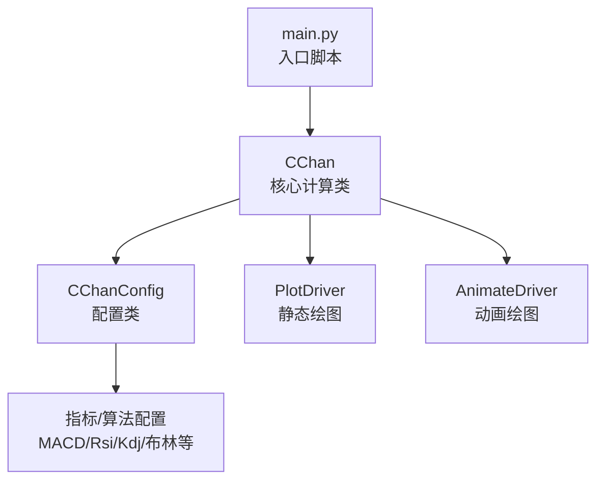
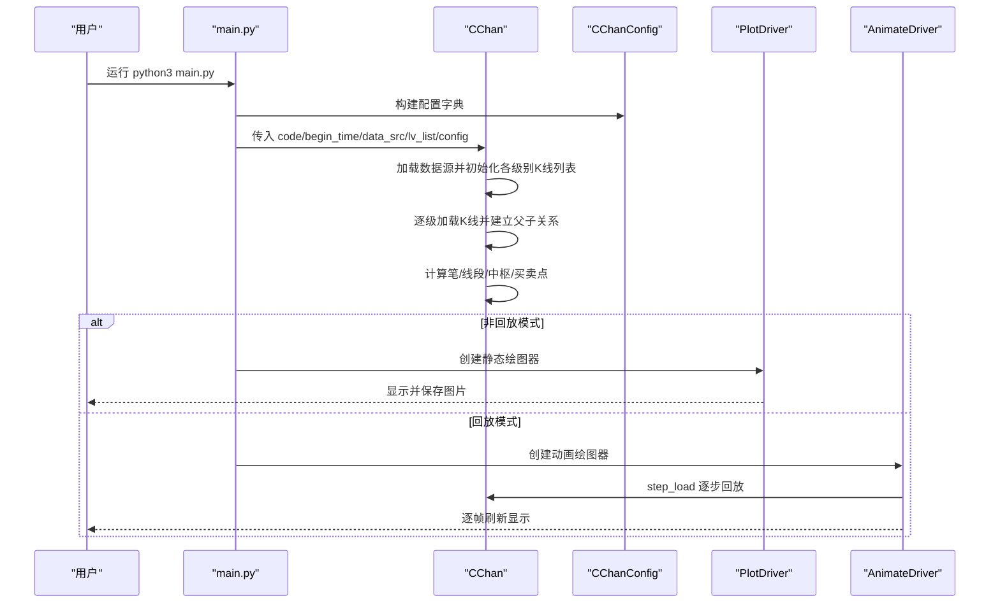
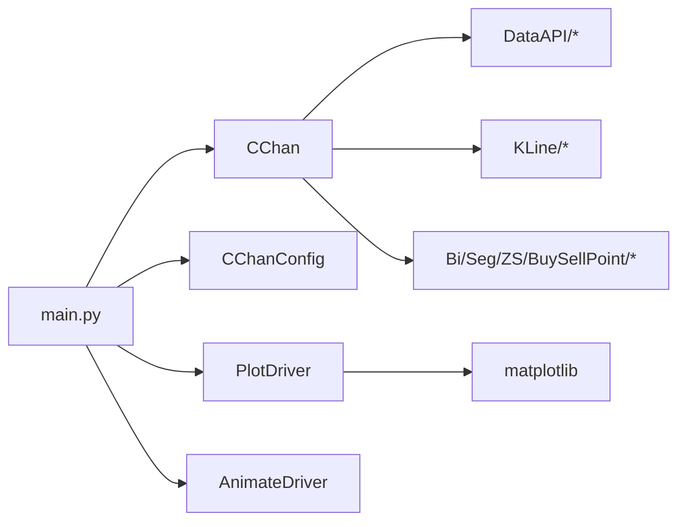

# 快速开始

<cite>
**本文引用的文件**
- [README.md](file://README.md)
- [quick_guide.md](file://quick_guide.md)
- [main.py](file://main.py)
- [Chan.py](file://Chan.py)
- [ChanConfig.py](file://ChanConfig.py)
- [Plot/PlotDriver.py](file://Plot/PlotDriver.py)
- [Plot/AnimatePlotDriver.py](file://Plot/AnimatePlotDriver.py)
- [Script/requirements.txt](file://Script/requirements.txt)
</cite>

## 目录
1. [简介](#简介)
2. [项目结构](#项目结构)
3. [核心组件](#核心组件)
4. [架构总览](#架构总览)
5. [详细组件分析](#详细组件分析)
6. [依赖关系分析](#依赖关系分析)
7. [性能注意事项](#性能注意事项)
8. [故障排除指南](#故障排除指南)
9. [结论](#结论)
10. [附录](#附录)

## 简介
本指南面向首次使用者，提供从零开始的安装与运行步骤，以及从导入 CChan 与 CChanConfig 开始，到创建实例、配置绘图参数并生成静态或动画图表的完整流程。同时解释 CChan 构造函数的关键参数，指导如何运行 main.py 体验 demo，并提供常见问题的解决方案，确保新手能够直接上手操作。

## 项目结构
- 顶层入口：main.py 提供一键运行的 demo 示例，展示如何创建 CChan 实例并绘制静态或动画图。
- 核心类：Chan.py 定义 CChan 主类，负责数据加载、多级别 K 线合并、笔/线段/中枢/买卖点计算等。
- 配置类：ChanConfig.py 定义 CChanConfig，集中管理笔/线段/中枢/买卖点等各类配置。
- 绘图模块：Plot/PlotDriver.py 提供静态图绘制；Plot/AnimatePlotDriver.py 提供逐步回放动画。
- 依赖清单：Script/requirements.txt 列出运行所需的 Python 第三方库。

**图表来源**
- [main.py](file://main.py#L1-L89)
- [Chan.py](file://Chan.py#L19-L120)
- [ChanConfig.py](file://ChanConfig.py#L1-L184)
- [Plot/PlotDriver.py](file://Plot/PlotDriver.py#L156-L206)
- [Plot/AnimatePlotDriver.py](file://Plot/AnimatePlotDriver.py#L9-L20)

**章节来源**
- [README.md](file://README.md#L308-L403)
- [Script/requirements.txt](file://Script/requirements.txt#L1-L6)

## 核心组件
- CChan：封装数据源、级别列表、配置对象，负责加载 K 线、建立父子关系、计算笔/线段/中枢/买卖点，并支持逐步回放与触发式增量更新。
- CChanConfig：集中管理笔/线段/中枢/买卖点/指标等配置项，支持按笔/线段/买卖点类型差异化配置。
- PlotDriver：将 CChan 计算结果渲染为静态图，支持多级别、多指标叠加绘制。
- AnimateDriver：在 step_load 模式下，逐帧刷新并显示绘图，便于观察计算过程。

**章节来源**
- [Chan.py](file://Chan.py#L19-L120)
- [ChanConfig.py](file://ChanConfig.py#L1-L184)
- [Plot/PlotDriver.py](file://Plot/PlotDriver.py#L156-L206)
- [Plot/AnimatePlotDriver.py](file://Plot/AnimatePlotDriver.py#L9-L20)

## 架构总览
下图展示了从 main.py 启动到生成图表的整体流程，以及各模块之间的依赖关系。

**图表来源**
- [main.py](file://main.py#L1-L89)
- [Chan.py](file://Chan.py#L120-L212)
- [Plot/PlotDriver.py](file://Plot/PlotDriver.py#L156-L206)
- [Plot/AnimatePlotDriver.py](file://Plot/AnimatePlotDriver.py#L9-L20)

## 详细组件分析

### 安装与运行
- 安装依赖：使用 pip 安装 Script/requirements.txt 中列出的库，确保 matplotlib、numpy、pandas、baostock、requests 等依赖可用。
- 运行 demo：直接执行 python3 main.py 即可体验。该脚本内置了示例配置与绘图参数，会根据配置选择静态图或动画图。

提示
- 若系统画图窗口在程序结束后自动关闭，可在代码末尾添加阻塞等待或在 Jupyter 环境中运行以避免窗口立即退出。

**章节来源**
- [Script/requirements.txt](file://Script/requirements.txt#L1-L6)
- [quick_guide.md](file://quick_guide.md#L153-L161)
- [main.py](file://main.py#L1-L89)

### CChan 构造函数参数详解
- code：股票代码，格式取决于数据源。例如使用 BaoStock 数据源时，可传入如 sz.000001 的格式。
- begin_time/end_time：起止时间，None 表示不限制；具体语义取决于数据源实现。
- data_src：数据源类型，支持 BaoStock、CSV、CCXT 等；也可传入自定义解析器字符串。
- lv_list：级别列表，必须从大到小排列，如 [K_DAY, K_60M]。
- config：CChanConfig 实例，承载笔/线段/中枢/买卖点/指标等配置。
- autype：复权类型，如 QFQ/HFQ/NONE。
- extra_kl：额外 K 线，用于补充数据源缺失的最新数据。

注意
- 若只传入一个级别，可通过 CChan[0] 访问；多级别时可按 KL_TYPE 索引访问。

**章节来源**
- [Chan.py](file://Chan.py#L19-L68)
- [README.md](file://README.md#L521-L559)

### CChanConfig 配置要点
- 笔/线段/中枢/买卖点相关：如 bi_strict、bi_fx_check、seg_algo、zs_combine、divergence_rate、bs_type 等。
- 指标配置：macd、rsi、kdj、boll_n、mean_metrics、trend_metrics 等。
- 数据一致性检查：kl_data_check、max_kl_misalgin_cnt、max_kl_inconsistent_cnt、print_warning 等。
- 回放模式：trigger_step 控制是否逐步回放；skip_step 控制跳过前若干帧。
- 自定义策略：cbsp_strategy、strategy_para、only_judge_last、cal_cover 等。

提示
- 可针对买卖点类型分别设置参数，如在键名后追加 -buy/-sell/-segbuy/-segsell/-seg，实现差异化配置。

**章节来源**
- [ChanConfig.py](file://ChanConfig.py#L1-L184)
- [README.md](file://README.md#L561-L719)

### 绘图配置与参数
- plot_config：控制绘制哪些元素，支持字典/数组/字符串三种写法；可按级别分别配置。
- plot_para：控制具体元素的绘制细节，如 figure、bi、seg、kl、klc、macd、mean、boll、rsi、kdj、demark、marker 等。
- 静态图：使用 CPlotDriver 创建并显示，支持保存为图片。
- 动画图：使用 CAnimateDriver 在 step_load 模式下逐帧刷新显示。

**章节来源**
- [Plot/PlotDriver.py](file://Plot/PlotDriver.py#L18-L62)
- [Plot/PlotDriver.py](file://Plot/PlotDriver.py#L156-L206)
- [Plot/PlotDriver.py](file://Plot/PlotDriver.py#L239-L279)
- [Plot/AnimatePlotDriver.py](file://Plot/AnimatePlotDriver.py#L9-L20)
- [README.md](file://README.md#L720-L800)

### 使用示例：从导入到生成图表
- 导入模块：from Chan import CChan；from ChanConfig import CChanConfig；from Plot.PlotDriver import CPlotDriver；from Plot.AnimatePlotDriver import CAnimateDriver。
- 构建配置：CChanConfig({...})，设置买卖点/线段/中枢/指标等参数。
- 创建实例：CChan(code, begin_time, data_src, lv_list, config, autype)。
- 绘制静态图：若 config.trigger_step 为 False，创建 CPlotDriver 并调用 figure.show() 与 save2img(...)。
- 绘制动画：若 config.trigger_step 为 True，创建 CAnimateDriver 并传入相同参数。

**章节来源**
- [README.md](file://README.md#L443-L519)
- [main.py](file://main.py#L1-L89)

## 依赖关系分析
- main.py 依赖 CChan、CChanConfig、PlotDriver、AnimateDriver。
- CChan 依赖 DataAPI（根据 data_src 动态选择）、Common（枚举、时间、工具）、KLine（合并/单位K线）、Bi/Seg/ZS/BuySellPoint（元素计算）。
- PlotDriver 依赖 matplotlib 与 PlotMeta，负责将 CChan 的计算结果映射为图形元素。
- AnimateDriver 依赖 PlotDriver，并通过 CChan.step_load() 实现逐帧刷新。

**图表来源**
- [main.py](file://main.py#L1-L89)
- [Chan.py](file://Chan.py#L171-L212)
- [Plot/PlotDriver.py](file://Plot/PlotDriver.py#L1-L20)

**章节来源**
- [README.md](file://README.md#L135-L200)

## 性能注意事项
- 回放模式（trigger_step=True）会逐帧计算，适合观察过程但可能占用较多内存；若内存紧张，建议使用非回放模式并适当缩小 x_range/x_bi_cnt/x_seg_cnt 等可视范围。
- 指标计算（MACD、RSI、KDJ、布林等）会增加计算量，如仅需静态图可按需开启。
- 若需要序列化/深拷贝 CChan，可使用框架提供的 chan_dump_pickle/chan_load_pickle 方法，或在极端情况下提升系统递归限制。

**章节来源**
- [quick_guide.md](file://quick_guide.md#L183-L207)
- [Plot/PlotDriver.py](file://Plot/PlotDriver.py#L239-L279)
- [Chan.py](file://Chan.py#L310-L377)

## 故障排除指南
- 运行后无输出
  - 常见原因：系统画图窗口在程序结束后自动关闭。建议在 Jupyter 环境运行，或在代码末尾添加阻塞等待。
  - 参考：[quick_guide.md](file://quick_guide.md#L157-L161)

- 信号消失
  - 说明：框架始终给出“当前帧”下的元素，随 K 线新增，原有信号可能因形态不再成立而消失。这是预期行为。
  - 参考：[quick_guide.md](file://quick_guide.md#L177-L182)

- 动画图内存不足/卡顿
  - 说明：动画为实验性功能，存在内存泄漏问题。建议改用静态图或降低可视范围。
  - 参考：[quick_guide.md](file://quick_guide.md#L188-L191)

- K 线时间相关错误
  - 现象：类似 kline time err 的报错。
  - 处理：若数据级别为天级别以下且存在 00:00 数据，可在数据源返回的 CTime 中将 auto 设为 False。
  - 参考：[quick_guide.md](file://quick_guide.md#L207-L214)

- 递归溢出（序列化/深拷贝）
  - 处理：提升系统递归限制，或使用框架提供的 pickle 序列化方法。
  - 参考：[quick_guide.md](file://quick_guide.md#L192-L207)

- 线段画法不符合预期
  - 建议：打开 plot_eigen 辅助分析特征序列；或切换 seg_algo 以改变线段计算方式。
  - 参考：[quick_guide.md](file://quick_guide.md#L214-L218)

**章节来源**
- [quick_guide.md](file://quick_guide.md#L153-L218)

## 结论
通过本快速开始指南，你可以完成安装与运行，理解 CChan 的关键参数与 CChanConfig 的配置要点，并掌握静态与动画两种绘图方式。遇到常见问题时，可依据故障排除指南快速定位与解决。建议在实际使用中结合 plot_config/plot_para 进行可视化裁剪，以获得更佳的性能与观感。

## 附录

### 从零开始的安装步骤
- 安装依赖库：pip install -r Script/requirements.txt
- 运行 demo：python3 main.py
- 如需自定义数据源，可参考 DataAPI 下的实现并通过 data_src 传入自定义字符串。

**章节来源**
- [Script/requirements.txt](file://Script/requirements.txt#L1-L6)
- [main.py](file://main.py#L1-L89)
- [README.md](file://README.md#L308-L403)