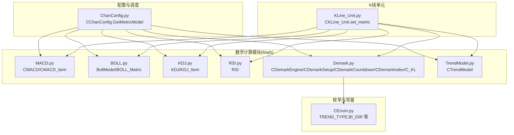
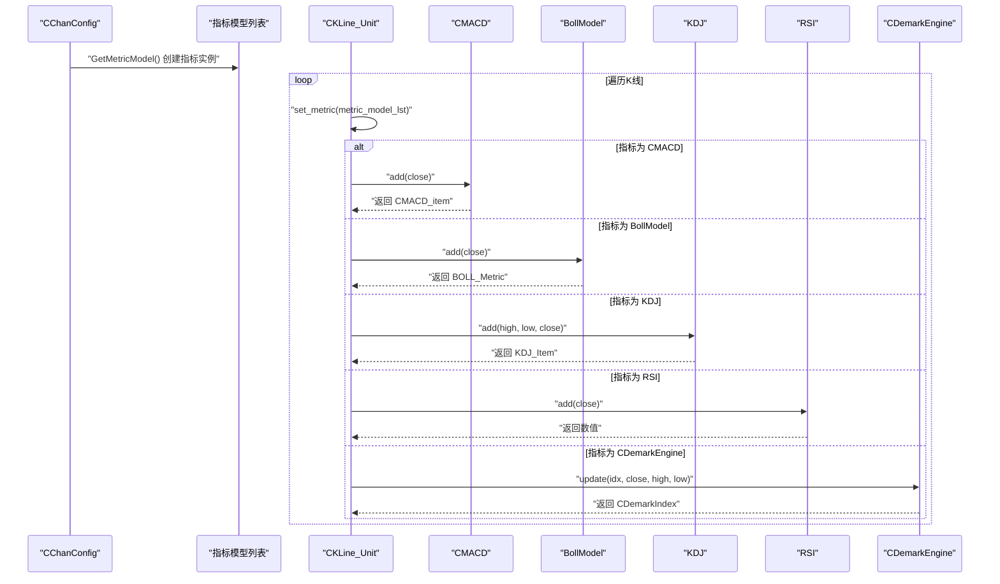
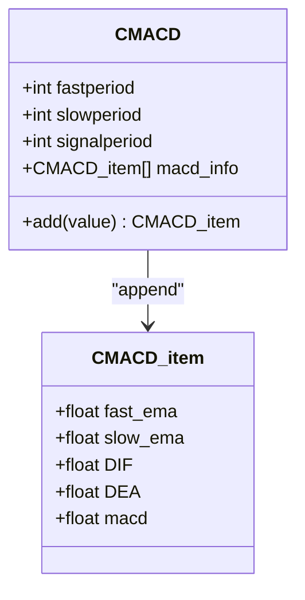
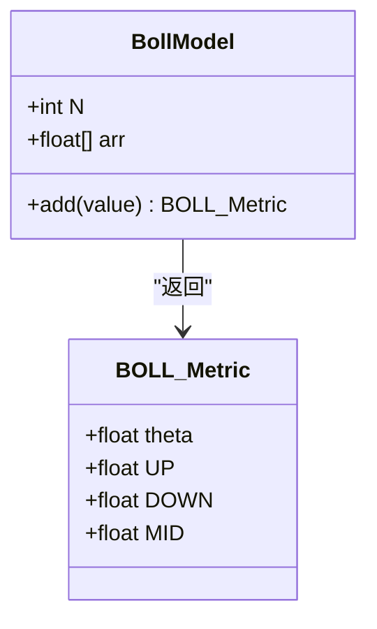
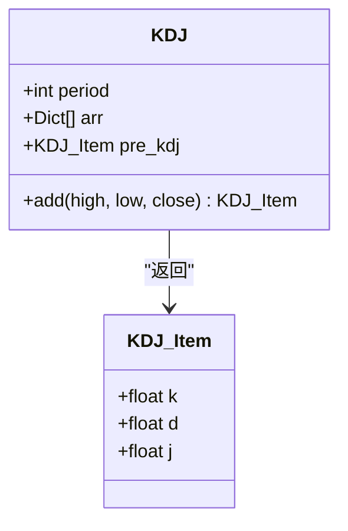
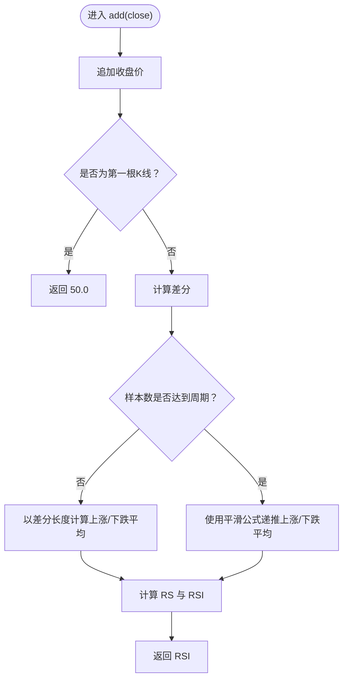
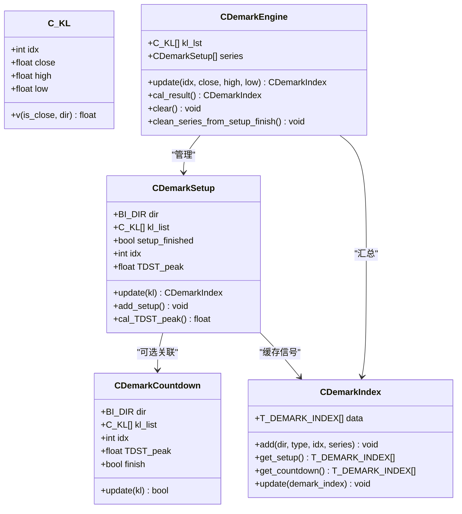
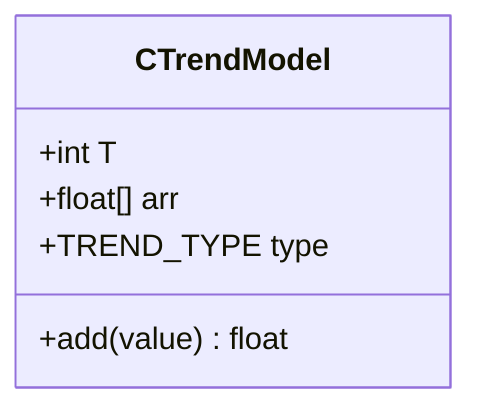
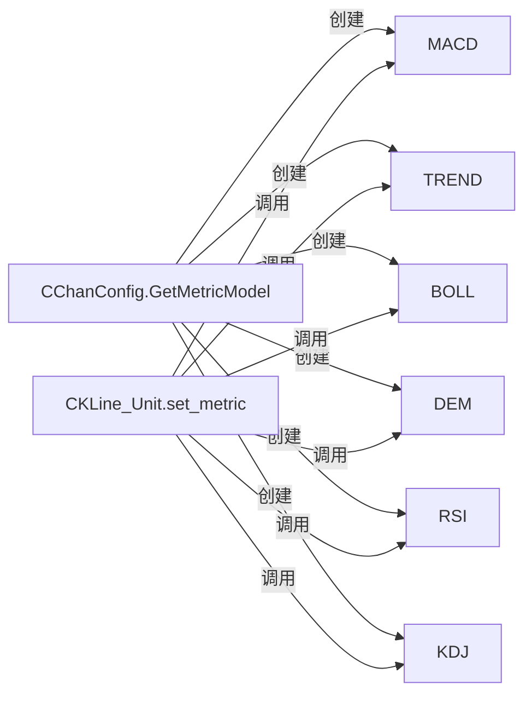

# 数学计算模块

<cite>
**本文引用的文件**
- [Math/MACD.py](file://Math/MACD.py)
- [Math/BOLL.py](file://Math/BOLL.py)
- [Math/KDJ.py](file://Math/KDJ.py)
- [Math/RSI.py](file://Math/RSI.py)
- [Math/Demark.py](file://Math/Demark.py)
- [Math/TrendModel.py](file://Math/TrendModel.py)
- [ChanConfig.py](file://ChanConfig.py)
- [KLine/KLine_Unit.py](file://KLine/KLine_Unit.py)
- [Common/CEnum.py](file://Common/CEnum.py)
- [quick_guide.md](file://quick_guide.md)
</cite>

## 目录
1. [引言](#引言)
2. [项目结构](#项目结构)
3. [核心组件](#核心组件)
4. [架构总览](#架构总览)
5. [详细组件分析](#详细组件分析)
6. [依赖关系分析](#依赖关系分析)
7. [性能考量](#性能考量)
8. [故障排查指南](#故障排查指南)
9. [结论](#结论)
10. [附录](#附录)

## 引言
本章节面向开发者，系统性讲解数学计算模块的设计与实现，重点覆盖以下技术指标类：CMACD、BollModel、KDJ、RSI、CDemarkEngine；并说明它们如何在 CChanConfig 的 GetMetricModel 方法中被实例化，随后通过 CKLine_Unit 的 set_metric 方法进行增量计算与结果存储。同时给出新增指标的完整流程与最佳实践，强调增量计算对性能的关键意义。

## 项目结构
数学计算模块位于 Math 目录，包含各指标的独立实现；配置与调度集中在 ChanConfig；指标最终在 K 线单元层（CKLine_Unit）完成计算与落盘。

图表来源
- [ChanConfig.py](file://ChanConfig.py#L75-L103)
- [KLine/KLine_Unit.py](file://KLine/KLine_Unit.py#L119-L135)
- [Math/MACD.py](file://Math/MACD.py#L1-L30)
- [Math/BOLL.py](file://Math/BOLL.py#L1-L29)
- [Math/KDJ.py](file://Math/KDJ.py#L1-L35)
- [Math/RSI.py](file://Math/RSI.py#L1-L39)
- [Math/Demark.py](file://Math/Demark.py#L1-L208)
- [Math/TrendModel.py](file://Math/TrendModel.py#L1-L23)
- [Common/CEnum.py](file://Common/CEnum.py#L75-L80)

章节来源
- [ChanConfig.py](file://ChanConfig.py#L75-L103)
- [KLine/KLine_Unit.py](file://KLine/KLine_Unit.py#L119-L135)

## 核心组件
- CMACD：基于指数移动平均的 MACD 计算，输出快线、慢线、DIF、DEA 与柱状值，采用增量 EMA 更新。
- BollModel：布林带滚动统计，输出上轨、中轨、下轨及波动度，采用滑动窗口与增量方差思想。
- KDJ：随机指标，输出 K、D、J，采用滑动窗口与指数平滑更新。
- RSI：相对强弱指数，采用增量平滑计算上涨/下跌平均值，避免全量重算。
- CDemarkEngine：基于摆动序列的 CDemar 指标引擎，跟踪 Setup/Countdown 状态，输出信号索引。
- CTrendModel：通用趋势模型，按周期取均值/最大/最小，作为通用指标基类。

章节来源
- [Math/MACD.py](file://Math/MACD.py#L1-L30)
- [Math/BOLL.py](file://Math/BOLL.py#L1-L29)
- [Math/KDJ.py](file://Math/KDJ.py#L1-L35)
- [Math/RSI.py](file://Math/RSI.py#L1-L39)
- [Math/Demark.py](file://Math/Demark.py#L1-L208)
- [Math/TrendModel.py](file://Math/TrendModel.py#L1-L23)

## 架构总览
指标实例化与计算的端到端流程如下：

图表来源
- [ChanConfig.py](file://ChanConfig.py#L75-L103)
- [KLine/KLine_Unit.py](file://KLine/KLine_Unit.py#L119-L135)
- [Math/MACD.py](file://Math/MACD.py#L20-L30)
- [Math/BOLL.py](file://Math/BOLL.py#L22-L29)
- [Math/KDJ.py](file://Math/KDJ.py#L15-L35)
- [Math/RSI.py](file://Math/RSI.py#L10-L39)
- [Math/Demark.py](file://Math/Demark.py#L159-L183)

## 详细组件分析

### CMACD 组件分析
- 数据结构与复杂度
  - CMACD_item：保存快线 EMA、慢线 EMA、DIF、DEA 与 MACD 柱值，O(1) 存储。
  - CMACD：维护历史指标序列，每次 add 仅 O(1) 时间，空间 O(N)。
- 处理逻辑
  - 初始时以当前收盘价填充快慢 EMA；随后使用指数移动平均递推公式更新快慢 EMA，再据此更新 DIF 与 DEA，最后计算 MACD 柱值。
- 关键路径
  - 初始化与增量更新均在 add 方法内完成，适合实时流式计算。

图表来源
- [Math/MACD.py](file://Math/MACD.py#L1-L30)

章节来源
- [Math/MACD.py](file://Math/MACD.py#L1-L30)

### BollModel 组件分析
- 数据结构与复杂度
  - BOLL_Metric：包含上轨、中轨、下轨与波动度，O(1) 存储。
  - BollModel：维护长度为 N 的滑动窗口，add 时 O(N) 计算均值与标准差，空间 O(N)。
- 处理逻辑
  - 使用滑动窗口维护最近 N 个收盘价，计算均值与样本标准差，生成布林带上下轨。
- 关键路径
  - 通过截断 theta 避免零波动导致的除零风险。

图表来源
- [Math/BOLL.py](file://Math/BOLL.py#L1-L29)

章节来源
- [Math/BOLL.py](file://Math/BOLL.py#L1-L29)

### KDJ 组件分析
- 数据结构与复杂度
  - KDJ_Item：保存 K、D、J，O(1) 存储。
  - KDJ：维护长度为 period 的滑动窗口与前一时刻 KDJ 值，add 时 O(period) 时间，空间 O(period)。
- 处理逻辑
  - 计算周期内最高/最低与收盘价的 RSV，使用指数平滑更新 K、D，再计算 J。
- 关键路径
  - 通过 pre_kdj 缓存上一时刻结果，实现增量更新。

图表来源
- [Math/KDJ.py](file://Math/KDJ.py#L1-L35)

章节来源
- [Math/KDJ.py](file://Math/KDJ.py#L1-L35)

### RSI 组件分析
- 数据结构与复杂度
  - RSI：维护收盘价序列、差分序列、上涨/下跌平均序列，add 时 O(1) 时间，空间 O(period)。
- 处理逻辑
  - 增量更新上涨/下跌平均值，避免对全量数据重算；当样本不足时以简单平均初始化。
- 关键路径
  - 通过平滑公式递推上涨/下跌平均，最后计算 RS 与 RSI。

图表来源
- [Math/RSI.py](file://Math/RSI.py#L1-L39)

章节来源
- [Math/RSI.py](file://Math/RSI.py#L1-L39)

### CDemarkEngine 组件分析
- 数据结构与复杂度
  - C_KL：封装 K 线字段，便于引擎内部使用。
  - CDemarkSetup/CDemarkCountdown：跟踪 Setup/Countdown 状态，add/update 时 O(1)。
  - CDemarkEngine：维护当前 K 线序列与多个序列对象，update 时整体 O(S)，S 为活跃序列数量。
- 处理逻辑
  - 基于方向与偏移判断触发 Setup，随后进入 Countdown 计数，期间根据阈值条件推进或终止。
  - 支持跳空特殊处理与多种比较策略。
- 关键路径
  - 通过 last_demark_index 缓存最新信号，减少重复计算。

图表来源
- [Math/Demark.py](file://Math/Demark.py#L1-L208)
- [Common/CEnum.py](file://Common/CEnum.py#L38-L41)

章节来源
- [Math/Demark.py](file://Math/Demark.py#L1-L208)
- [Common/CEnum.py](file://Common/CEnum.py#L38-L41)

### CTrendModel 组件分析
- 数据结构与复杂度
  - CTrendModel：维护长度为 T 的滑动窗口，add 时 O(1) 时间，空间 O(T)。
- 处理逻辑
  - 根据类型返回均值/最大/最小，作为通用趋势指标基类，供配置启用不同周期与类型。

图表来源
- [Math/TrendModel.py](file://Math/TrendModel.py#L1-L23)
- [Common/CEnum.py](file://Common/CEnum.py#L75-L79)

章节来源
- [Math/TrendModel.py](file://Math/TrendModel.py#L1-L23)
- [Common/CEnum.py](file://Common/CEnum.py#L75-L79)

## 依赖关系分析
- 指标实例化依赖
  - CChanConfig.GetMetricModel 根据配置创建 CMACD、CTrendModel、BollModel、CDemarkEngine、RSI、KDJ 实例。
- 指标计算依赖
  - CKLine_Unit.set_metric 依据类型分支调用对应指标的 add/update 方法，并将结果写入 K 线单元属性。
- 枚举依赖
  - TREND_TYPE、BI_DIR 等枚举用于类型与方向控制。

图表来源
- [ChanConfig.py](file://ChanConfig.py#L75-L103)
- [KLine/KLine_Unit.py](file://KLine/KLine_Unit.py#L119-L135)

章节来源
- [ChanConfig.py](file://ChanConfig.py#L75-L103)
- [KLine/KLine_Unit.py](file://KLine/KLine_Unit.py#L119-L135)

## 性能考量
- 增量计算优先
  - 所有开源指标均采用增量更新策略，避免全量重算，显著降低时间复杂度与内存占用。
  - 示例：CMACD 使用 EMA 递推、RSI 使用平滑递推、KDJ 使用滑动窗口与指数平滑、BollModel 使用滑动窗口统计。
- 窗口大小与空间
  - 指标通常以固定窗口或周期限制存储规模，确保空间复杂度线性或常数级。
- 实时流式友好
  - set_metric 在每根 K 线到达时增量计算，适合实时/回放场景。
- 新增指标建议
  - 尽量使用增量公式，避免对历史全量数据重算；对外暴露统一的 add 方法，接收所需字段而非整条 K 线，避免循环引用。

章节来源
- [quick_guide.md](file://quick_guide.md#L485-L519)
- [Math/MACD.py](file://Math/MACD.py#L20-L30)
- [Math/RSI.py](file://Math/RSI.py#L10-L39)
- [Math/KDJ.py](file://Math/KDJ.py#L15-L35)
- [Math/BOLL.py](file://Math/BOLL.py#L22-L29)

## 故障排查指南
- 参数校验与异常
  - CTrendModel 对未知趋势类型抛出异常，确保配置正确。
- 数据一致性检查
  - CKLine_Unit.check 在构造阶段校验价格区间合法性，必要时自动修复或抛错。
- 配置项核对
  - CChanConfig.GetMetricModel 会根据配置开关与参数创建指标实例，若出现指标未生效，检查对应开关与周期参数。

章节来源
- [Math/TrendModel.py](file://Math/TrendModel.py#L1-L23)
- [KLine/KLine_Unit.py](file://KLine/KLine_Unit.py#L92-L103)
- [ChanConfig.py](file://ChanConfig.py#L75-L103)

## 结论
数学计算模块通过“配置驱动 + 增量计算”的设计，实现了高扩展性与高性能的技术指标体系。CMACD、BollModel、KDJ、RSI、CDemarkEngine 等指标均遵循增量更新原则，配合 CChanConfig 的集中注册与 CKLine_Unit 的统一落盘，形成清晰、可维护、可扩展的指标生态。新增指标只需实现增量计算类、在配置中注册并在 set_metric 中接入即可，无需改动核心流程。

## 附录

### 如何添加新的技术指标（开发者指南）
- 步骤概览
  1) 实现计算类：提供构造函数接收周期/参数，提供 add 方法接收所需字段（如收盘价、最高最低等），返回指标值或包含多值的对象。
  2) 在 CChanConfig.GetMetricModel 中注册：将实例加入返回列表，并从配置读取周期/参数。
  3) 在 CKLine_Unit.set_metric 中接入：增加 isinstance 分支，调用 add 并将结果写入 K 线单元属性。
- 参考路径
  - 指标实现示例：[Math/RSI.py](file://Math/RSI.py#L1-L39)
  - 注册位置：[ChanConfig.py](file://ChanConfig.py#L75-L103)
  - 接入位置：[KLine/KLine_Unit.py](file://KLine/KLine_Unit.py#L119-L135)
  - 新增指引文档：[quick_guide.md](file://quick_guide.md#L485-L519)

章节来源
- [Math/RSI.py](file://Math/RSI.py#L1-L39)
- [ChanConfig.py](file://ChanConfig.py#L75-L103)
- [KLine/KLine_Unit.py](file://KLine/KLine_Unit.py#L119-L135)
- [quick_guide.md](file://quick_guide.md#L485-L519)