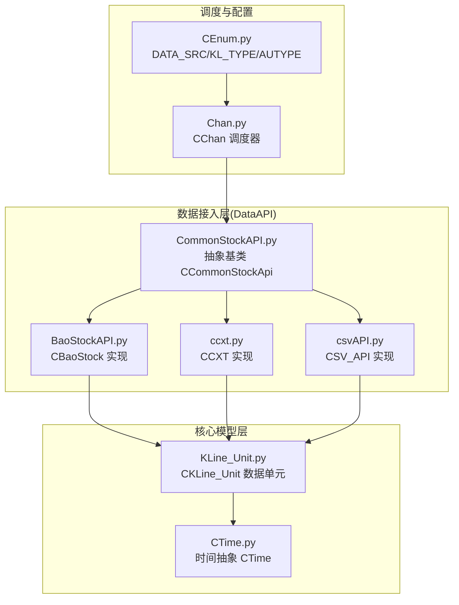
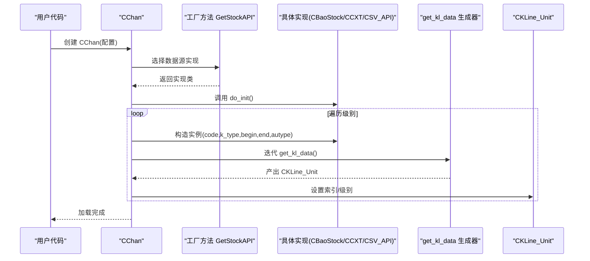
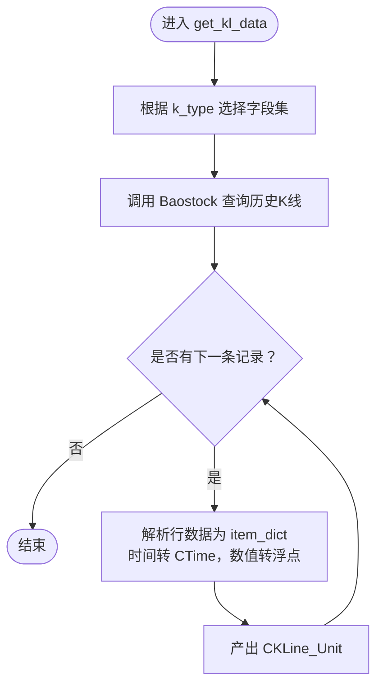
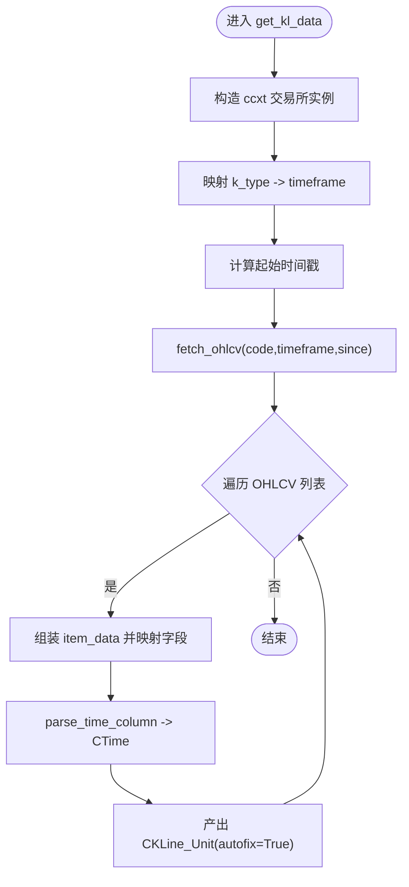
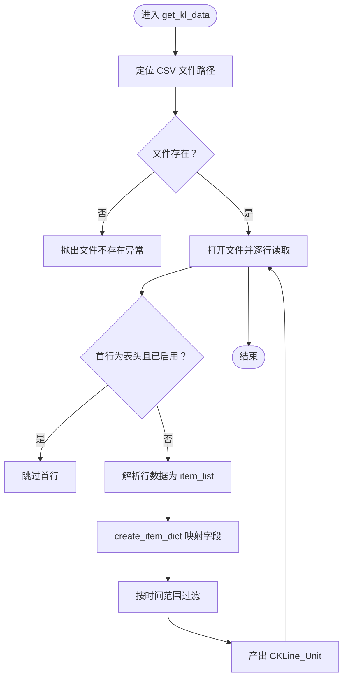
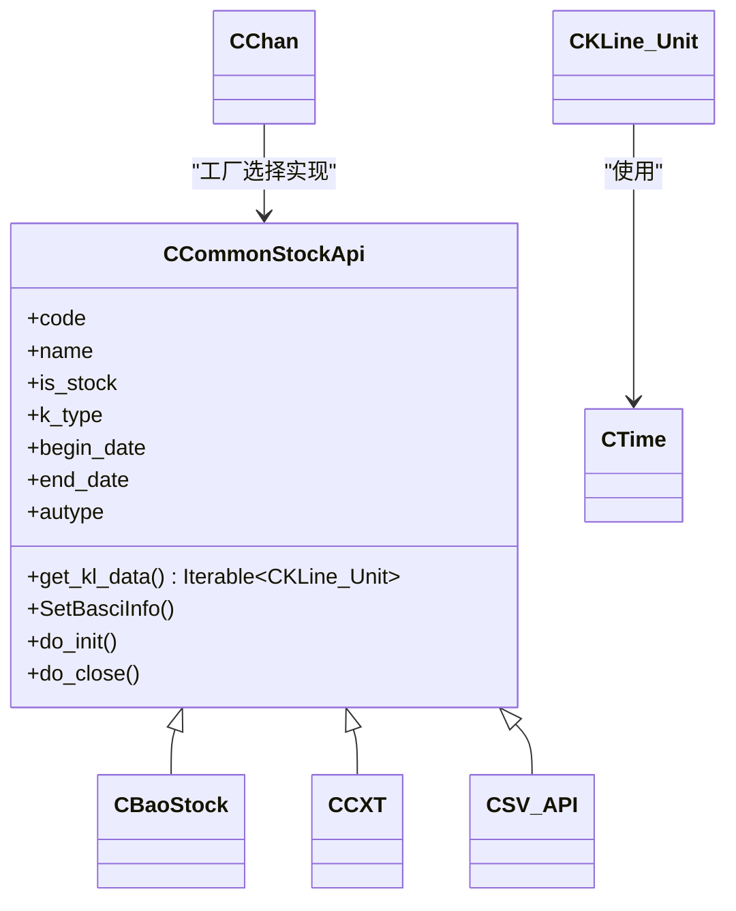

# 数据接入

<cite>
**本文引用的文件**
- [Common/CEnum.py](file://Common/CEnum.py)
- [Common/CTime.py](file://Common/CTime.py)
- [DataAPI/CommonStockAPI.py](file://DataAPI/CommonStockAPI.py)
- [DataAPI/BaoStockAPI.py](file://DataAPI/BaoStockAPI.py)
- [DataAPI/ccxt.py](file://DataAPI/ccxt.py)
- [DataAPI/csvAPI.py](file://DataAPI/csvAPI.py)
- [KLine/KLine_Unit.py](file://KLine/KLine_Unit.py)
- [Chan.py](file://Chan.py)
- [README.md](file://README.md)
- [quick_guide.md](file://quick_guide.md)
- [DataAPI/CLAUDE.md](file://DataAPI/CLAUDE.md)
</cite>

## 目录
1. [简介](#简介)
2. [项目结构](#项目结构)
3. [核心组件](#核心组件)
4. [架构总览](#架构总览)
5. [详细组件分析](#详细组件分析)
6. [依赖关系分析](#依赖关系分析)
7. [性能与稳定性考量](#性能与稳定性考量)
8. [故障排查指南](#故障排查指南)
9. [结论](#结论)
10. [附录](#附录)

## 简介
本章节面向希望接入各类金融数据源的开发者，系统性讲解“数据接入”子系统的设计与实现。重点包括：
- 抽象基类 CCommonStockApi 的设计意图与职责边界
- 具体实现 CBaoStock、CCXT、CSV_API 的工作流程与差异
- get_kl_data 作为生成器返回 CKLine_Unit 的机制与数据字典 item_dict 的构建规范
- 如何通过 custom:文件名.类名 的方式扩展自定义数据源
- 完整的自定义数据源实现步骤与示例要点（CTime 时间处理、item_dict 字典构建）
- 支持的数据源清单（baostock、ccxt、csv）及适用场景

## 项目结构
数据接入模块位于 DataAPI 目录，围绕统一抽象基类 CCommonStockApi 构建多数据源适配层，并通过 Chan 类在运行期按配置动态选择具体实现。KLine_Unit 作为统一的数据载体，贯穿于数据接入、K线组合与技术指标计算的全链路。

图表来源
- [DataAPI/CommonStockAPI.py](file://DataAPI/CommonStockAPI.py#L1-L35)
- [DataAPI/BaoStockAPI.py](file://DataAPI/BaoStockAPI.py#L57-L115)
- [DataAPI/ccxt.py](file://DataAPI/ccxt.py#L24-L98)
- [DataAPI/csvAPI.py](file://DataAPI/csvAPI.py#L43-L88)
- [KLine/KLine_Unit.py](file://KLine/KLine_Unit.py#L17-L48)
- [Common/CTime.py](file://Common/CTime.py#L4-L45)
- [Common/CEnum.py](file://Common/CEnum.py#L5-L23)
- [Chan.py](file://Chan.py#L171-L200)

章节来源
- [DataAPI/CommonStockAPI.py](file://DataAPI/CommonStockAPI.py#L1-L35)
- [Chan.py](file://Chan.py#L171-L200)
- [Common/CEnum.py](file://Common/CEnum.py#L5-L23)

## 核心组件
- 抽象基类 CCommonStockApi
  - 角色：定义统一的数据接入接口与生命周期钩子
  - 关键成员：code、name、is_stock、k_type、begin_date、end_date、autype
  - 关键方法：
    - get_kl_data(self) -> Iterable[CKLine_Unit]：生成器，逐条产出 CKLine_Unit
    - SetBasciInfo(self)：设置基础信息（如名称、是否股票等）
    - do_init(cls) / do_close(cls)：类方法，用于外部服务的初始化与释放
- 统一数据单元 CKLine_Unit
  - 角色：承载单根K线的完整信息，包含时间、开盘、最高、最低、收盘、成交量等字段
  - 关键能力：校验价格区间合法性、维护前后驱指针、挂接技术指标与子级别K线
- 时间抽象 CTime
  - 角色：统一时间表示，支持自动归一化与比较
  - 关键能力：字符串化、日期化、时间戳转换、大小比较

章节来源
- [DataAPI/CommonStockAPI.py](file://DataAPI/CommonStockAPI.py#L7-L35)
- [KLine/KLine_Unit.py](file://KLine/KLine_Unit.py#L17-L48)
- [Common/CTime.py](file://Common/CTime.py#L4-L45)

## 架构总览
CChan 在加载阶段根据配置选择具体数据源实现，调用 do_init 进行全局初始化，随后针对每个级别（如日线、60分钟线）构造实例并迭代 get_kl_data，将每条 CKLine_Unit 注入到对应的 CKLine_List 中。

图表来源
- [Chan.py](file://Chan.py#L171-L200)
- [Chan.py](file://Chan.py#L90-L99)
- [DataAPI/CommonStockAPI.py](file://DataAPI/CommonStockAPI.py#L18-L35)
- [KLine/KLine_Unit.py](file://KLine/KLine_Unit.py#L17-L48)

## 详细组件分析

### 抽象基类 CCommonStockApi 设计
- 设计要点
  - 将“数据源无关”的接口与“数据源相关”的实现解耦，便于扩展新数据源
  - 通过类方法 do_init/do_close 提供全局生命周期管理
  - 通过 get_kl_data 以生成器形式输出，降低内存占用并支持流式处理
- 关键约束
  - get_kl_data 必须产出 CKLine_Unit
  - item_dict 中必须包含时间、开盘、最高、最低、收盘字段；成交量、成交额、换手率可选
  - 时间字段必须为 CTime 类型

章节来源
- [DataAPI/CommonStockAPI.py](file://DataAPI/CommonStockAPI.py#L7-L35)
- [quick_guide.md](file://quick_guide.md#L382-L420)

### CBaoStock（Baostock A股数据）
- 工作流程
  - 初始化：do_init 登录 Baostock；do_close 登出
  - 基础信息：SetBasciInfo 查询股票基本信息（名称、是否股票）
  - 数据获取：get_kl_data 根据 k_type 选择字段集，调用 Baostock 接口拉取历史K线，逐行解析并产出 CKLine_Unit
  - 字段映射：将 Baostock 返回的字段映射到 DATA_FIELD 常量
  - 时间解析：parse_time_column 支持多种时间格式，统一转为 CTime
- 特殊逻辑
  - 当 k_type 低于日线级别时，分钟级数据不包含成交量/成交额/换手率
  - 复权类型通过 autype 映射到 Baostock 的 adjustflag

图表来源
- [DataAPI/BaoStockAPI.py](file://DataAPI/BaoStockAPI.py#L63-L84)
- [DataAPI/BaoStockAPI.py](file://DataAPI/BaoStockAPI.py#L11-L20)
- [DataAPI/BaoStockAPI.py](file://DataAPI/BaoStockAPI.py#L42-L55)

章节来源
- [DataAPI/BaoStockAPI.py](file://DataAPI/BaoStockAPI.py#L57-L115)

### CCXT（数字货币交易所）
- 工作流程
  - 初始化：do_init/do_close 为空实现（当前未做连接池管理）
  - 数据获取：get_kl_data 使用 ccxt.binance 构造交易所实例，按 k_type 对应 timeframe，从指定起始时间拉取 OHLCV 列表
  - 时间解析：parse_time_column 支持多种时间格式，统一转为 CTime；分钟级别自动开启 auto
  - 字段映射：仅包含时间、开盘、最高、最低、收盘
- 特殊逻辑
  - 数字货币市场全天候交易，时间维度与股票不同，需注意日级别与分钟级别的 auto 行为差异

图表来源
- [DataAPI/ccxt.py](file://DataAPI/ccxt.py#L30-L48)
- [DataAPI/ccxt.py](file://DataAPI/ccxt.py#L72-L98)
- [DataAPI/ccxt.py](file://DataAPI/ccxt.py#L13-L22)

章节来源
- [DataAPI/ccxt.py](file://DataAPI/ccxt.py#L24-L98)

### CSV_API（本地CSV文件）
- 工作流程
  - 初始化：配置列映射（时间、开盘、最高、最低、收盘），默认启用表头行判断
  - 数据获取：get_kl_data 读取与代码+周期匹配的 CSV 文件，逐行解析为 item_dict 并产出 CKLine_Unit
  - 时间解析：parse_time_column 支持多种时间格式，统一转为 CTime
  - 边界控制：按 begin_date/end_date 过滤行，确保时间范围正确
- 特殊逻辑
  - 文件不存在或格式错误会抛出异常
  - 默认仅包含时间、开盘、最高、最低、收盘五列，其余字段可按需扩展

图表来源
- [DataAPI/csvAPI.py](file://DataAPI/csvAPI.py#L59-L77)
- [DataAPI/csvAPI.py](file://DataAPI/csvAPI.py#L12-L16)
- [DataAPI/csvAPI.py](file://DataAPI/csvAPI.py#L18-L41)

章节来源
- [DataAPI/csvAPI.py](file://DataAPI/csvAPI.py#L43-L88)

### get_kl_data 生成器与 CKLine_Unit 机制
- 生成器契约
  - 返回类型：Iterable[CKLine_Unit]
  - 每次迭代产出一条 CKLine_Unit，内部包含 DATA_FIELD 字段集合
- CKLine_Unit 构造与校验
  - 构造时从 item_dict 读取时间、开盘、最高、最低、收盘
  - 校验：若 autofix=False，当最低/最高不合法则抛出异常；autofix=True 时自动修正
  - 关联：设置索引、级别、前后驱指针、技术指标容器等
- 时间处理
  - 统一使用 CTime，支持多种时间格式解析与自动归一化

章节来源
- [DataAPI/CommonStockAPI.py](file://DataAPI/CommonStockAPI.py#L18-L24)
- [KLine/KLine_Unit.py](file://KLine/KLine_Unit.py#L17-L48)
- [Common/CTime.py](file://Common/CTime.py#L4-L45)

### 自定义数据源扩展指南
- 扩展步骤
  - 新建类继承 CCommonStockApi，实现以下方法：
    - get_kl_data(self)：生成器，逐条产出 CKLine_Unit(item_dict)
    - SetBasciInfo(self)：设置基础信息（如名称、是否股票）
    - do_init(cls)/do_close(cls)：如需外部服务初始化/释放，重载之
  - item_dict 字典构建规范
    - 必填字段：DATA_FIELD.FIELD_TIME、DATA_FIELD.FIELD_OPEN、DATA_FIELD.FIELD_HIGH、DATA_FIELD.FIELD_LOW、DATA_FIELD.FIELD_CLOSE
    - 可选字段：DATA_FIELD.FIELD_VOLUME、DATA_FIELD.FIELD_TURNOVER、DATA_FIELD.FIELD_TURNRATE
    - 时间字段必须为 CTime 类型
  - 配置接入
    - 将实现类放置于 DataAPI 目录下，命名为 custom_api.py（示例）
    - 在 CChan 的 data_src 参数中配置为 custom:custom_api.CCustomAPI
- 示例要点（不展示代码，仅说明路径）
  - 时间处理：参考 CTime 构造与 parse_time_column 的实现路径
  - 字典构建：参考 create_item_dict 的映射与类型转换逻辑路径
  - 异常处理：参考 CSV_API 的文件不存在与格式错误处理路径

章节来源
- [README.md](file://README.md#L1110-L1169)
- [quick_guide.md](file://quick_guide.md#L382-L420)
- [Chan.py](file://Chan.py#L171-L191)
- [DataAPI/CLAUDE.md](file://DataAPI/CLAUDE.md#L120-L165)

## 依赖关系分析
- 组件耦合
  - CCommonStockApi 为 DataAPI 层的唯一抽象入口，被 CBaoStock、CCXT、CSV_API 实现
  - CKLine_Unit 依赖 CTime 与 DATA_FIELD 常量，是数据接入与后续分析的桥梁
  - CChan 通过工厂方法 GetStockAPI 解耦具体实现，支持内置枚举与自定义扩展
- 外部依赖
  - Baostock：A股数据源
  - CCXT：数字货币交易所数据源
  - 文件系统：CSV 数据源

图表来源
- [DataAPI/CommonStockAPI.py](file://DataAPI/CommonStockAPI.py#L7-L35)
- [DataAPI/BaoStockAPI.py](file://DataAPI/BaoStockAPI.py#L57-L115)
- [DataAPI/ccxt.py](file://DataAPI/ccxt.py#L24-L98)
- [DataAPI/csvAPI.py](file://DataAPI/csvAPI.py#L43-L88)
- [KLine/KLine_Unit.py](file://KLine/KLine_Unit.py#L17-L48)
- [Common/CTime.py](file://Common/CTime.py#L4-L45)
- [Chan.py](file://Chan.py#L171-L200)

章节来源
- [DataAPI/CommonStockAPI.py](file://DataAPI/CommonStockAPI.py#L7-L35)
- [Chan.py](file://Chan.py#L171-L200)

## 性能与稳定性考量
- 流式生成器
  - get_kl_data 采用生成器，避免一次性加载全部数据，降低内存峰值
- 批量与限频
  - Baostock/CCXT 等外部接口建议合理设置批量与限频策略，避免触发风控
- 数据校验
  - CKLine_Unit 在构造时进行价格区间校验，autofix 可在可控范围内自动修复，但建议优先保证上游数据质量
- 错误处理
  - CSV_API 对文件缺失与格式错误进行明确异常提示；CBaoStock/CCXT 对外部接口错误码进行异常抛出
- 自动跳级
  - CChan 在加载过程中对某些级别数据获取失败可自动跳过，提升整体鲁棒性

章节来源
- [DataAPI/csvAPI.py](file://DataAPI/csvAPI.py#L60-L77)
- [DataAPI/BaoStockAPI.py](file://DataAPI/BaoStockAPI.py#L80-L84)
- [Chan.py](file://Chan.py#L153-L169)
- [KLine/KLine_Unit.py](file://KLine/KLine_Unit.py#L92-L103)

## 故障排查指南
- 常见问题与定位
  - 数据源类型配置错误：确认 data_src 是否为内置枚举或 custom:文件名.类名 格式
  - 文件不存在或格式错误：CSV_API 会在文件不存在或列数不匹配时抛出异常
  - 复权参数或时间范围不合法：CBaoStock/CCXT 会对错误码/时间格式进行校验
  - 数据质量异常：CKLine_Unit 校验失败会抛出异常，检查 item_dict 字段与类型
- 建议排查步骤
  - 核对 DATA_SRC 枚举与配置
  - 检查 CSV 文件路径与列映射
  - 校验 item_dict 字段完整性与时序
  - 查看 do_init/do_close 生命周期是否正确执行

章节来源
- [Chan.py](file://Chan.py#L171-L191)
- [DataAPI/csvAPI.py](file://DataAPI/csvAPI.py#L60-L77)
- [DataAPI/BaoStockAPI.py](file://DataAPI/BaoStockAPI.py#L80-L84)
- [KLine/KLine_Unit.py](file://KLine/KLine_Unit.py#L92-L103)

## 结论
数据接入子系统通过统一抽象与清晰的生命周期管理，实现了对 Baostock、CCXT、CSV 等多数据源的无缝接入。开发者只需遵循 item_dict 构建规范与生成器契约，即可快速扩展自定义数据源。配合 CTime 统一时间抽象与 CKLine_Unit 的严格校验，系统在保证易用性的同时兼顾了稳定性与性能。

## 附录

### 支持的数据源与适用场景
- Baostock（BAO_STOCK）
  - 适用场景：A股历史数据获取，免费、覆盖面广
  - 特点：支持日线及以上周期，分钟级数据有限
- CCXT（CCXT）
  - 适用场景：数字货币市场，支持多家交易所
  - 特点：24/7 交易，时间维度与股票不同
- CSV（CSV）
  - 适用场景：本地离线数据导入，灵活列映射
  - 特点：文件路径与列顺序需严格匹配

章节来源
- [Common/CEnum.py](file://Common/CEnum.py#L5-L23)
- [DataAPI/CLAUDE.md](file://DataAPI/CLAUDE.md#L84-L95)