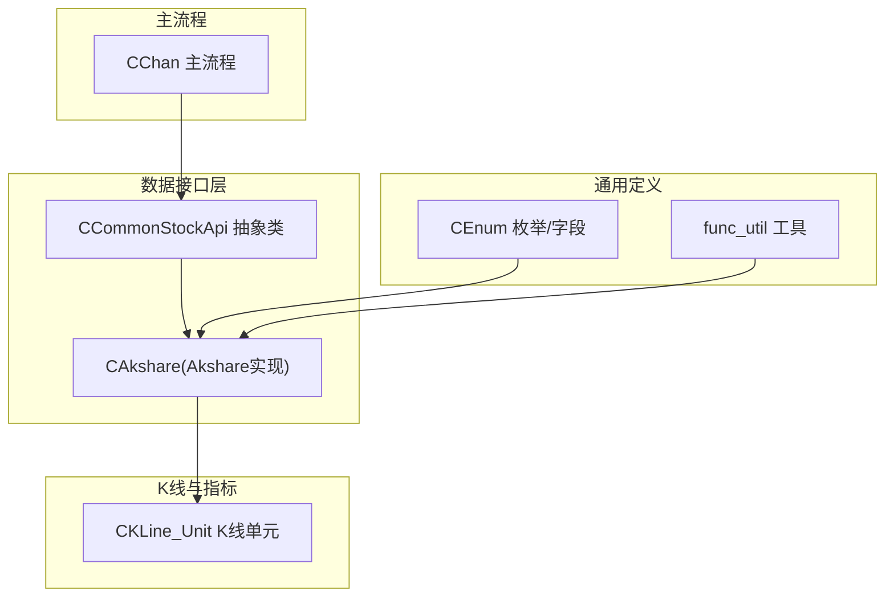
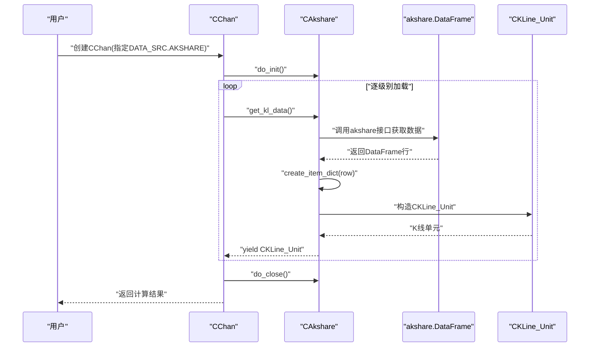
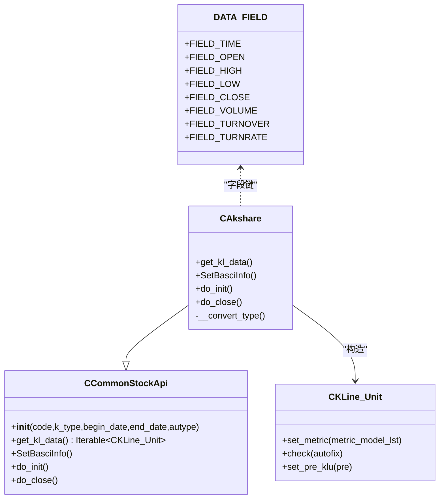
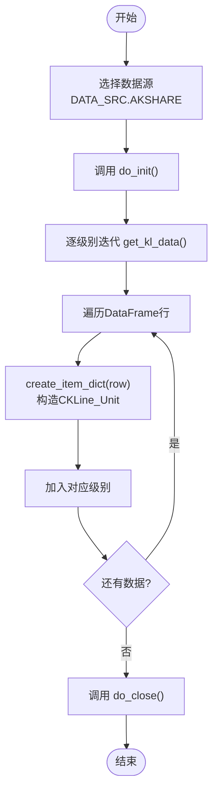
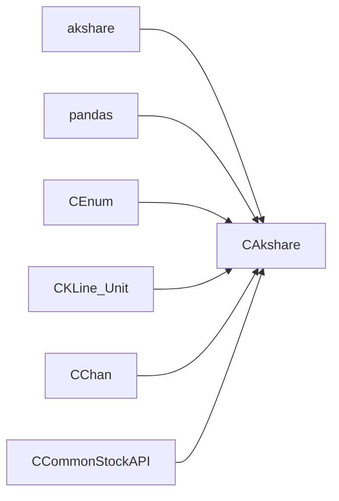

# Akshare数据源

<cite>
**本文引用的文件**
- [DataAPI/AkshareAPI.py](file://DataAPI/AkshareAPI.py)
- [DataAPI/CommonStockAPI.py](file://DataAPI/CommonStockAPI.py)
- [Common/CEnum.py](file://Common/CEnum.py)
- [Common/func_util.py](file://Common/func_util.py)
- [KLine/KLine_Unit.py](file://KLine/KLine_Unit.py)
- [Chan.py](file://Chan.py)
- [README.md](file://README.md)
- [quick_guide.md](file://quick_guide.md)
</cite>

## 目录
1. [简介](#简介)
2. [项目结构与定位](#项目结构与定位)
3. [核心组件](#核心组件)
4. [架构总览](#架构总览)
5. [组件详解](#组件详解)
6. [依赖关系分析](#依赖关系分析)
7. [性能与可用性特性](#性能与可用性特性)
8. [故障排查指南](#故障排查指南)
9. [结论](#结论)
10. [附录](#附录)

## 简介
本节面向使用者与开发者，概述Akshare数据源在项目中的作用、能力边界与使用方式。Akshare数据源通过第三方库akshare获取A股历史行情数据，统一为框架内部K线单元，供缠论计算、特征工程与可视化等模块消费。该实现遵循通用数据接口抽象，确保与CChan主流程无缝衔接。

## 项目结构与定位
- 数据接口层位于DataAPI目录，Akshare数据源实现位于DataAPI/AkshareAPI.py，继承通用抽象类CCommonStockApi，负责将akshare返回的原始数据行转换为CKLine_Unit对象。
- 通用枚举与字段定义位于Common/CEnum.py，用于统一K线周期、复权类型、数据字段键等。
- K线单元定义位于KLine/KLine_Unit.py，承载时间、OHLC、成交量/成交额/换手率等交易信息，并支持指标计算挂载。
- 主流程CChan在Chan.py中根据data_src选择具体数据源类，统一调用do_init/do_close与迭代器接口，完成数据加载与计算。

图表来源
- [DataAPI/AkshareAPI.py](file://DataAPI/AkshareAPI.py#L51-L141)
- [DataAPI/CommonStockAPI.py](file://DataAPI/CommonStockAPI.py#L7-L35)
- [Common/CEnum.py](file://Common/CEnum.py#L5-L131)
- [Common/func_util.py](file://Common/func_util.py#L41-L55)
- [KLine/KLine_Unit.py](file://KLine/KLine_Unit.py#L17-L73)
- [Chan.py](file://Chan.py#L171-L215)

章节来源
- [README.md](file://README.md#L91-L112)
- [Chan.py](file://Chan.py#L171-L215)

## 核心组件
- CAkshare：Akshare数据源实现，负责将akshare返回的DataFrame行转换为CKLine_Unit，支持日线、周线、月线级别，支持前复权、后复权与无复权。
- CCommonStockApi：通用股票数据接口抽象，定义get_kl_data、SetBasciInfo、do_init、do_close等接口契约。
- CEnum：提供DATA_SRC、KL_TYPE、AUTYPE、DATA_FIELD等枚举与字段键，保证数据字段命名一致性。
- CKLine_Unit：K线单元，封装时间、OHLC与交易指标，支持指标模型挂载与父子级关系维护。
- CChan：主流程，按data_src选择具体数据源类，统一初始化/关闭与迭代加载。

章节来源
- [DataAPI/AkshareAPI.py](file://DataAPI/AkshareAPI.py#L51-L141)
- [DataAPI/CommonStockAPI.py](file://DataAPI/CommonStockAPI.py#L7-L35)
- [Common/CEnum.py](file://Common/CEnum.py#L5-L131)
- [KLine/KLine_Unit.py](file://KLine/KLine_Unit.py#L17-L73)
- [Chan.py](file://Chan.py#L171-L215)

## 架构总览
Akshare数据源在CChan主流程中的调用链路如下：
- CChan根据data_src映射到CAkshare类
- 调用CAkshare.do_init()进行数据源初始化（Akshare无需登录）
- 逐级初始化各K线级别迭代器，依次拉取K线数据
- 将akshare返回的每行数据转换为CKLine_Unit并加入对应级别
- 完成后调用CAkshare.do_close()进行资源清理

图表来源
- [Chan.py](file://Chan.py#L171-L215)
- [DataAPI/AkshareAPI.py](file://DataAPI/AkshareAPI.py#L57-L106)
- [KLine/KLine_Unit.py](file://KLine/KLine_Unit.py#L17-L73)

## 组件详解

### CAkshare：Akshare数据源实现
- 角色与职责
  - 继承CCommonStockApi，实现get_kl_data、SetBasciInfo、do_init、do_close。
  - 将akshare返回的原始数据行转换为统一的K线单元字典，再构造CKLine_Unit。
- 关键行为
  - 复权类型映射：前复权、后复权、无复权。
  - 周期类型映射：日线、周线、月线。
  - 日期格式化：将begin_date/end_date转换为akshare要求的YYYYMMDD格式。
  - 指数与个股识别：根据代码前缀与编号规则判断is_stock。
  - 数据字段映射：开盘、最高、最低、收盘、成交量、成交额、换手率等。
- 错误处理
  - 不支持的K线级别将抛出异常。
  - 日期范围筛选与字段缺失处理（如指数无分钟线）。
- 性能与可用性
  - 使用生成器逐行产出CKLine_Unit，降低内存占用。
  - 对换手率字段存在性进行条件映射，避免字段缺失导致异常。

图表来源
- [DataAPI/CommonStockAPI.py](file://DataAPI/CommonStockAPI.py#L7-L35)
- [DataAPI/AkshareAPI.py](file://DataAPI/AkshareAPI.py#L51-L141)
- [KLine/KLine_Unit.py](file://KLine/KLine_Unit.py#L17-L73)
- [Common/CEnum.py](file://Common/CEnum.py#L119-L131)

章节来源
- [DataAPI/AkshareAPI.py](file://DataAPI/AkshareAPI.py#L57-L141)
- [Common/func_util.py](file://Common/func_util.py#L41-L55)

### 数据字段与类型映射
- 字段键
  - 时间：DATA_FIELD.FIELD_TIME
  - 价格：OPEN/HIGH/LOW/CLOSE
  - 交易量：VOLUME、TURNOVER、TURNRATE
- 映射规则
  - 日期解析兼容多种格式（pd.Timestamp、字符串YYYY-MM-DD、YYYYMMDD）。
  - 成交量、成交额、换手率采用安全转换，缺失时默认为0。
- 复权与周期
  - 复权类型：QFQ/HFQ/NONE
  - 周期类型：日线、周线、月线（分钟线及以上不支持）

章节来源
- [Common/CEnum.py](file://Common/CEnum.py#L70-L131)
- [Common/func_util.py](file://Common/func_util.py#L41-L55)
- [DataAPI/AkshareAPI.py](file://DataAPI/AkshareAPI.py#L36-L141)

### CChan主流程与数据源集成
- 数据源选择
  - 通过DATA_SRC.AKSHARE标识使用Akshare数据源。
  - GetStockAPI根据data_src返回对应实现类。
- 生命周期
  - do_init/do_close在加载前后被统一调用。
- 加载过程
  - 逐级别迭代，将CAkshare产出的CKLine_Unit加入对应级别容器。
  - 支持多级别父子关系建立与一致性校验。

图表来源
- [Chan.py](file://Chan.py#L171-L215)
- [DataAPI/AkshareAPI.py](file://DataAPI/AkshareAPI.py#L57-L106)

章节来源
- [Chan.py](file://Chan.py#L171-L215)

## 依赖关系分析
- 外部依赖
  - akshare：用于获取A股历史行情数据。
  - pandas：用于DataFrame数据处理。
- 内部依赖
  - CCommonStockApi：抽象契约，约束数据源实现。
  - CEnum：统一枚举与字段键，避免硬编码。
  - CKLine_Unit：统一K线单元结构，承载OHLC与交易指标。
  - CChan：主流程编排，负责生命周期管理与数据加载。

图表来源
- [DataAPI/AkshareAPI.py](file://DataAPI/AkshareAPI.py#L1-L10)
- [DataAPI/CommonStockAPI.py](file://DataAPI/CommonStockAPI.py#L7-L35)
- [Common/CEnum.py](file://Common/CEnum.py#L5-L131)
- [KLine/KLine_Unit.py](file://KLine/KLine_Unit.py#L17-L73)
- [Chan.py](file://Chan.py#L171-L215)

章节来源
- [DataAPI/AkshareAPI.py](file://DataAPI/AkshareAPI.py#L1-L10)
- [DataAPI/CommonStockAPI.py](file://DataAPI/CommonStockAPI.py#L7-L35)

## 性能与可用性特性
- 生成器驱动：get_kl_data以生成器逐行产出CKLine_Unit，降低内存占用，适合长时间序列数据处理。
- 字段安全转换：对成交量、成交额、换手率等字段采用安全转换，缺失时默认为0，避免异常中断。
- 复权与周期映射：明确的映射关系，减少调用方心智负担。
- 一致性校验：CChan在多级别加载过程中进行时间一致性与对齐检查，提升数据质量。

章节来源
- [DataAPI/AkshareAPI.py](file://DataAPI/AkshareAPI.py#L57-L106)
- [Common/func_util.py](file://Common/func_util.py#L41-L55)
- [Chan.py](file://Chan.py#L238-L290)

## 故障排查指南
- 不支持的K线级别
  - 现象：抛出异常提示不支持的K线级别。
  - 排查：确认KL_TYPE是否为日线、周线或月线。
  - 参考：[DataAPI/AkshareAPI.py](file://DataAPI/AkshareAPI.py#L132-L141)
- 指数无分钟线
  - 现象：指数数据不提供分钟线，调用时可能触发异常。
  - 排查：确认is_stock判断与数据源返回字段。
  - 参考：[DataAPI/AkshareAPI.py](file://DataAPI/AkshareAPI.py#L74-L101)
- 字段缺失或格式异常
  - 现象：OHLC或交易量字段缺失导致异常。
  - 排查：检查DataFrame列名与数据格式，确保字段存在。
  - 参考：[Common/CEnum.py](file://Common/CEnum.py#L119-L131)、[Common/func_util.py](file://Common/func_util.py#L41-L55)
- 数据源初始化/关闭
  - 现象：Akshare无需登录，若自定义数据源需实现do_init/do_close。
  - 参考：[DataAPI/AkshareAPI.py](file://DataAPI/AkshareAPI.py#L122-L131)、[quick_guide.md](file://quick_guide.md#L404-L418)

章节来源
- [DataAPI/AkshareAPI.py](file://DataAPI/AkshareAPI.py#L74-L141)
- [Common/CEnum.py](file://Common/CEnum.py#L119-L131)
- [Common/func_util.py](file://Common/func_util.py#L41-L55)
- [quick_guide.md](file://quick_guide.md#L404-L418)

## 结论
Akshare数据源通过清晰的抽象与严格的字段映射，将akshare的历史行情数据标准化为CKLine_Unit，无缝融入CChan主流程。其实现具备良好的扩展性与健壮性，能够满足日线、周线、月线级别的缠论计算需求。对于自定义数据源，建议遵循CCommonStockApi契约，实现do_init/do_close与get_kl_data，确保生命周期与数据一致性。

## 附录
- 快速上手与接入指引
  - 参考README“功能介绍”中关于数据源支持的说明。
  - 参考quick_guide中关于字段字典、CTime构造与初始化/结束的说明。
- 常用枚举与字段
  - DATA_SRC.AKSHARE：标识使用Akshare数据源。
  - KL_TYPE：支持日线、周线、月线。
  - AUTYPE：支持前复权、后复权、无复权。
  - DATA_FIELD：统一字段键，确保OHLC与交易量/成交额/换手率的一致性。

章节来源
- [README.md](file://README.md#L91-L112)
- [quick_guide.md](file://quick_guide.md#L382-L418)
- [Common/CEnum.py](file://Common/CEnum.py#L5-L131)