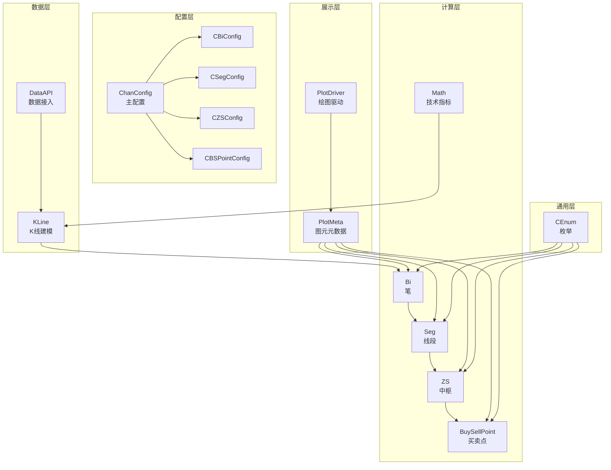
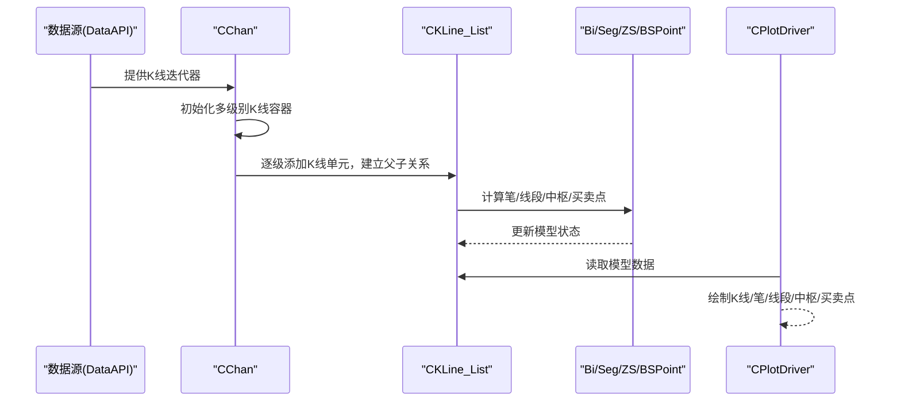
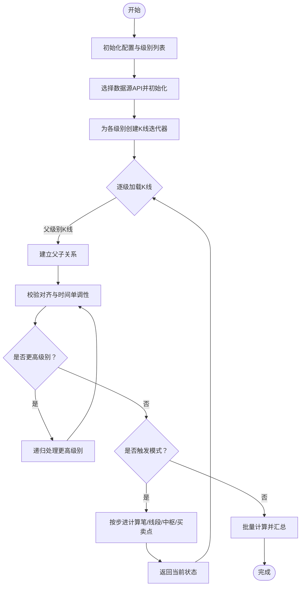
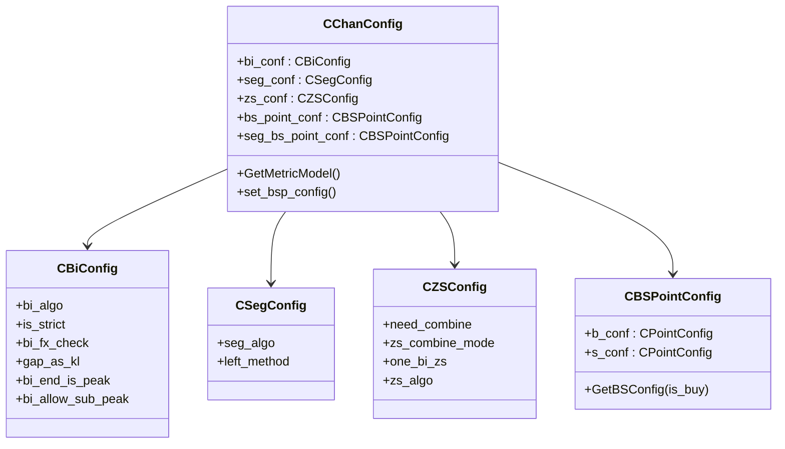
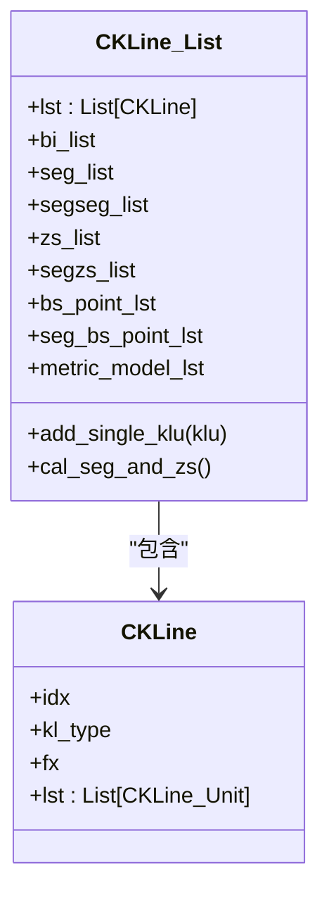
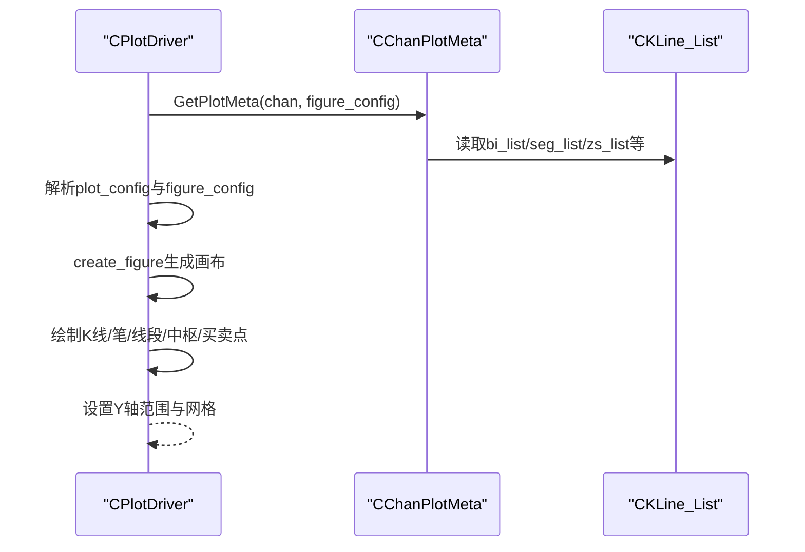
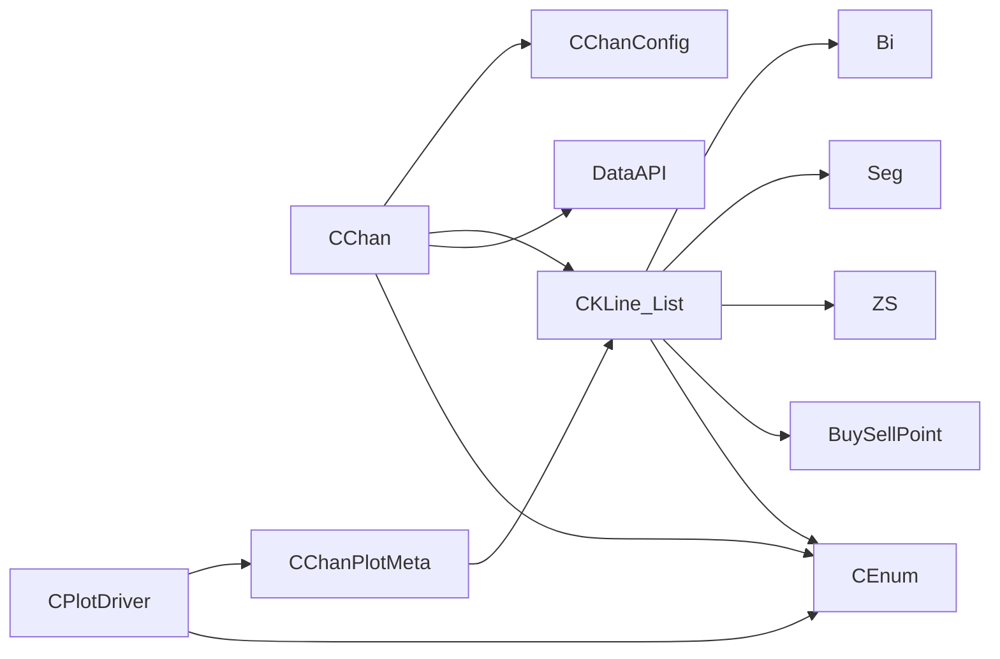

# 核心架构

<cite>
**本文引用的文件**
- [Chan.py](file://Chan.py)
- [ChanConfig.py](file://ChanConfig.py)
- [KLine/KLine_List.py](file://KLine/KLine_List.py)
- [KLine/KLine.py](file://KLine/KLine.py)
- [Common/CEnum.py](file://Common/CEnum.py)
- [Plot/PlotDriver.py](file://Plot/PlotDriver.py)
- [Plot/PlotMeta.py](file://Plot/PlotMeta.py)
- [Bi/BiConfig.py](file://Bi/BiConfig.py)
- [Seg/SegConfig.py](file://Seg/SegConfig.py)
- [ZS/ZSConfig.py](file://ZS/ZSConfig.py)
- [BuySellPoint/BSPointConfig.py](file://BuySellPoint/BSPointConfig.py)
- [README.md](file://README.md)
</cite>

## 目录
1. [引言](#引言)
2. [项目结构](#项目结构)
3. [核心组件](#核心组件)
4. [架构总览](#架构总览)
5. [详细组件分析](#详细组件分析)
6. [依赖关系分析](#依赖关系分析)
7. [性能考量](#性能考量)
8. [故障排查指南](#故障排查指南)
9. [结论](#结论)

## 引言
本节聚焦于chan.py项目的核心架构与数据流，围绕主控制器CChan展开，解释从数据源获取K线到计算并存储缠论元素的全过程；阐述CChanConfig配置类如何通过CBiConfig、CSegConfig、CZSConfig等子配置管理参数；说明MVC设计模式在项目中的体现（CKLine_List等作为数据模型，CPlotDriver作为视图，CChan作为控制器）；解释CEnum.py中枚举类型在系统中的作用；并提供系统上下文图与组件交互图，帮助开发者理解整体设计。

## 项目结构
项目采用按领域/功能分层的组织方式，核心模块包括：
- 数据层：DataAPI（数据接入）、KLine（K线建模与合并）
- 计算层：Bi（笔）、Seg（线段）、ZS（中枢）、BuySellPoint（买卖点）、Math（技术指标）
- 配置层：ChanConfig及其子配置（BiConfig、SegConfig、ZSConfig、BSPointConfig）
- 展示层：Plot（绘图驱动与元数据）
- 通用层：Common（枚举、异常、时间、工具）

图表来源
- [Chan.py](file://Chan.py#L1-L377)
- [ChanConfig.py](file://ChanConfig.py#L1-L184)
- [KLine/KLine_List.py](file://KLine/KLine_List.py#L1-L205)
- [Plot/PlotDriver.py](file://Plot/PlotDriver.py#L1-L888)
- [Plot/PlotMeta.py](file://Plot/PlotMeta.py#L1-L171)
- [Common/CEnum.py](file://Common/CEnum.py#L1-L130)

章节来源
- [README.md](file://README.md#L135-L306)

## 核心组件
- CChan：主控制器，负责从数据源加载K线、维护多级别K线列表、建立父子K线关系、触发笔/线段/中枢/买卖点计算、提供逐步回放与持久化能力。
- CChanConfig：主配置中心，聚合Bi/Seg/ZS/BSPoint等子配置，并提供指标模型工厂方法。
- CKLine_List：数据模型，封装K线列表、笔/线段/中枢/买卖点集合、指标模型、步进计算开关等。
- CPlotDriver：视图，负责解析绘图配置、生成画布、按配置绘制各类缠论元素。
- CEnum：系统枚举，统一K线级别、方向、笔类型、买卖点类型、算法枚举等。

章节来源
- [Chan.py](file://Chan.py#L19-L377)
- [ChanConfig.py](file://ChanConfig.py#L1-L184)
- [KLine/KLine_List.py](file://KLine/KLine_List.py#L1-L205)
- [Plot/PlotDriver.py](file://Plot/PlotDriver.py#L1-L888)
- [Common/CEnum.py](file://Common/CEnum.py#L1-L130)

## 架构总览
CChan作为控制器，贯穿“数据获取—K线合并—笔/线段—中枢—买卖点”的完整链路；配置通过CChanConfig集中管理；绘图通过CPlotDriver消费CKLine_List等模型数据生成可视化。

图表来源
- [Chan.py](file://Chan.py#L90-L212)
- [KLine/KLine_List.py](file://KLine/KLine_List.py#L104-L141)
- [Plot/PlotDriver.py](file://Plot/PlotDriver.py#L149-L206)

## 详细组件分析

### CChan 主控制器
职责与流程要点：
- 初始化与配置：接收lv_list（从高到低）、data_src、autype、config等；若未提供config则创建默认CChanConfig。
- 数据加载：根据data_src选择具体数据API类，构造迭代器，逐级推进；支持触发式逐步加载（trigger_step）与一次性加载。
- 多级别K线管理：为每个级别维护CKLine_List；通过add_lv_iter/g_kl_iter管理各级别K线迭代。
- 关系建立：load_iterator递归构建父子K线关系，校验时间单调性与对齐，记录不一致与缺失统计。
- 计算触发：非触发模式在全部加载完成后统一调用CKLine_List.cal_seg_and_zs；触发模式在步进时按需计算。
- 结果访问：通过[]按KL_TYPE或索引访问各级别CKLine_List；提供买卖点查询接口。

图表来源
- [Chan.py](file://Chan.py#L120-L212)
- [Chan.py](file://Chan.py#L235-L269)

章节来源
- [Chan.py](file://Chan.py#L19-L377)

### CChanConfig 配置体系
- 子配置聚合：CBiConfig、CSegConfig、CZSConfig、CBSPointConfig分别管理笔、线段、中枢、买卖点的参数。
- 指标模型工厂：GetMetricModel根据配置生成MACD、均线、通道、布林、Demark、RSI、KDJ等指标模型列表。
- 买卖点配置扩展：set_bsp_config支持对笔/线段买卖点分别设置参数，兼容字符串与字典输入，解析inf等特殊值。
- 参数校验：ConfigWithCheck确保未识别参数被及时发现并抛出异常。

图表来源
- [ChanConfig.py](file://ChanConfig.py#L1-L184)
- [Bi/BiConfig.py](file://Bi/BiConfig.py#L1-L31)
- [Seg/SegConfig.py](file://Seg/SegConfig.py#L1-L14)
- [ZS/ZSConfig.py](file://ZS/ZSConfig.py#L1-L7)
- [BuySellPoint/BSPointConfig.py](file://BuySellPoint/BSPointConfig.py#L1-L82)

章节来源
- [ChanConfig.py](file://ChanConfig.py#L1-L184)

### CKLine_List 数据模型
- 结构组成：lst（K线列表）、bi_list（笔列表）、seg_list/segseg_list（线段与线段的线段列表）、zs_list/segzs_list（中枢与线段中枢）、bs_point_lst/seg_bs_point_lst（买卖点）。
- 指标模型：由CChanConfig.GetMetricModel注入，用于K线单元的指标计算。
- 计算入口：add_single_klu接收新K线单元，尝试合并K线、更新分形、触发笔计算；在步进模式下按需计算线段/中枢/买卖点。
- 批量计算：cal_seg_and_zs统一计算线段与中枢，并生成买卖点。

图表来源
- [KLine/KLine_List.py](file://KLine/KLine_List.py#L1-L205)
- [KLine/KLine.py](file://KLine/KLine.py#L1-L98)

章节来源
- [KLine/KLine_List.py](file://KLine/KLine_List.py#L1-L205)

### CPlotDriver 视图
- 配置解析：parse_plot_config支持字典/字符串/数组形式，兼容多级别配置；parse_single_lv_plot_config统一格式化。
- 画布生成：create_figure根据是否绘制MACD动态生成子图布局；set_x_tick/set_grid设置坐标与网格。
- 绘制元素：draw_klu、draw_klc、draw_bi、draw_seg、draw_segseg、draw_zs、draw_segzs、draw_macd、draw_mean、draw_channel、draw_boll、draw_bs_point、draw_seg_bs_point、draw_demark、draw_rsi、draw_kdj等。
- 元数据桥接：GetPlotMeta将CKLine_List映射为CChanPlotMeta，供绘图驱动消费。

图表来源
- [Plot/PlotDriver.py](file://Plot/PlotDriver.py#L149-L206)
- [Plot/PlotMeta.py](file://Plot/PlotMeta.py#L118-L171)

章节来源
- [Plot/PlotDriver.py](file://Plot/PlotDriver.py#L1-L888)
- [Plot/PlotMeta.py](file://Plot/PlotMeta.py#L1-L171)

### CEnum 枚举类型
- 数据源与K线级别：DATA_SRC、KL_TYPE
- 方向与分形：KLINE_DIR、FX_TYPE、BI_DIR、BI_TYPE
- 买卖点与算法：BSP_TYPE、MACD_ALGO、LEFT_SEG_METHOD、FX_CHECK_METHOD
- 趋势与中枢类型：TREND_TYPE、SEG_TYPE
- 数据字段：DATA_FIELD、TRADE_INFO_LST

这些枚举贯穿Bi/Seg/ZS/BSPoint等模块，保证类型安全与配置一致性。

章节来源
- [Common/CEnum.py](file://Common/CEnum.py#L1-L130)

## 依赖关系分析
- 控制器依赖：CChan依赖CChanConfig、DataAPI、CKLine_List、CEnum、Common工具与异常。
- 模型依赖：CKLine_List依赖Bi/Seg/ZS/BSPoint模块与CChanConfig提供的指标模型。
- 视图依赖：CPlotDriver依赖CChanPlotMeta与CEnum，消费CKLine_List数据。
- 配置依赖：CChanConfig依赖各子配置类与CEnum。

图表来源
- [Chan.py](file://Chan.py#L1-L377)
- [ChanConfig.py](file://ChanConfig.py#L1-L184)
- [KLine/KLine_List.py](file://KLine/KLine_List.py#L1-L205)
- [Plot/PlotDriver.py](file://Plot/PlotDriver.py#L1-L888)
- [Plot/PlotMeta.py](file://Plot/PlotMeta.py#L1-L171)
- [Common/CEnum.py](file://Common/CEnum.py#L1-L130)

章节来源
- [Chan.py](file://Chan.py#L1-L377)
- [ChanConfig.py](file://ChanConfig.py#L1-L184)
- [KLine/KLine_List.py](file://KLine/KLine_List.py#L1-L205)
- [Plot/PlotDriver.py](file://Plot/PlotDriver.py#L1-L888)
- [Plot/PlotMeta.py](file://Plot/PlotMeta.py#L1-L171)
- [Common/CEnum.py](file://Common/CEnum.py#L1-L130)

## 性能考量
- 步进计算：通过CChanConfig.trigger_step启用逐步回放，降低内存占用，适合动画与实时场景。
- 指标模型：CChanConfig.GetMetricModel按需生成指标模型，避免不必要的计算。
- 数据校验：kl_data_check在低级别数据缺失与时间不一致时提前告警，减少无效计算。
- 深拷贝与持久化：CChan与CKLine_List提供深拷贝与pickle序列化/反序列化，便于缓存与恢复。

章节来源
- [Chan.py](file://Chan.py#L120-L212)
- [ChanConfig.py](file://ChanConfig.py#L75-L104)
- [KLine/KLine_List.py](file://KLine/KLine_List.py#L119-L136)

## 故障排查指南
- 数据源异常：GetStockAPI根据data_src选择API类，支持自定义“custom:模块.类名”，异常时抛出错误码。
- 时间单调性：load_iterator中对K线时间进行严格单调性检查，若不满足抛出异常。
- 级别对齐与一致性：check_kl_align与check_kl_consitent分别检测次级别缺失与父子级别日期不一致，超过阈值抛出异常。
- 配置错误：ConfigWithCheck在未知参数时抛出异常，提示无效键。

章节来源
- [Chan.py](file://Chan.py#L171-L212)
- [Chan.py](file://Chan.py#L235-L287)
- [ChanConfig.py](file://ChanConfig.py#L162-L184)

## 结论
本项目以CChan为核心控制器，串联数据源、K线建模、笔/线段/中枢/买卖点计算与绘图展示，形成清晰的MVC架构。CChanConfig通过子配置统一管理参数，CEnum提供类型安全的枚举体系，PlotDriver以元数据驱动实现灵活可视化。整体设计具备良好的扩展性与可维护性，适合在多级别、多指标、多策略场景下演进。