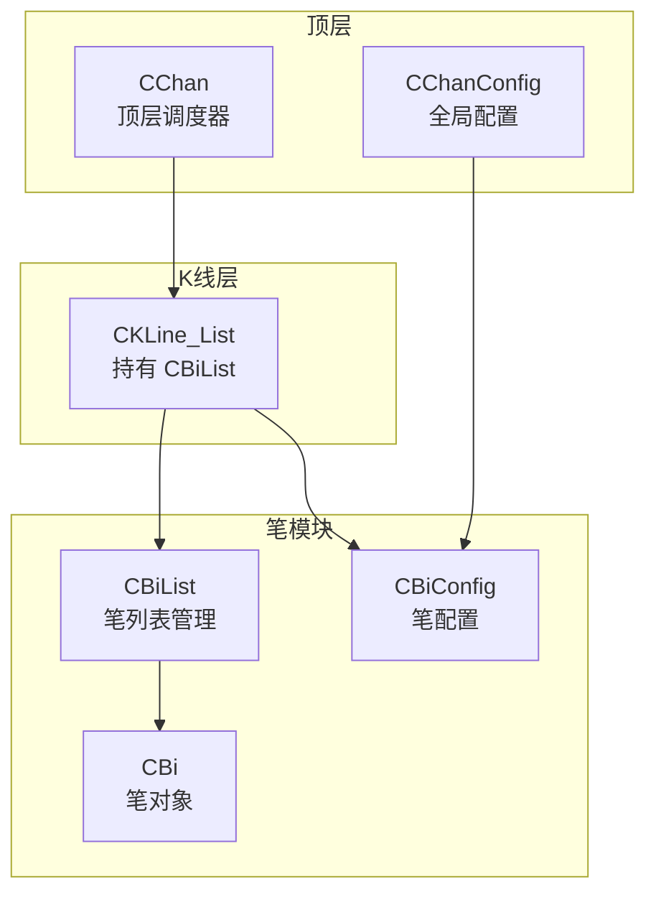
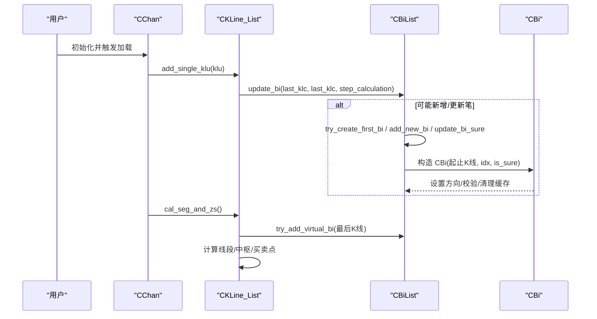
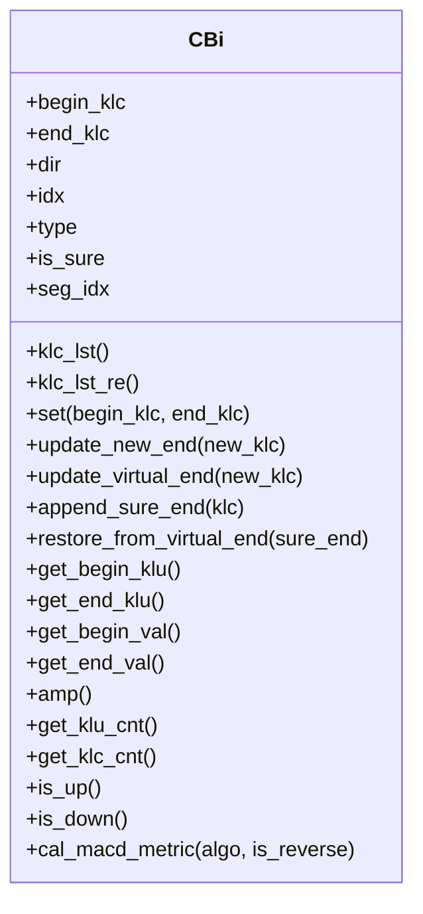
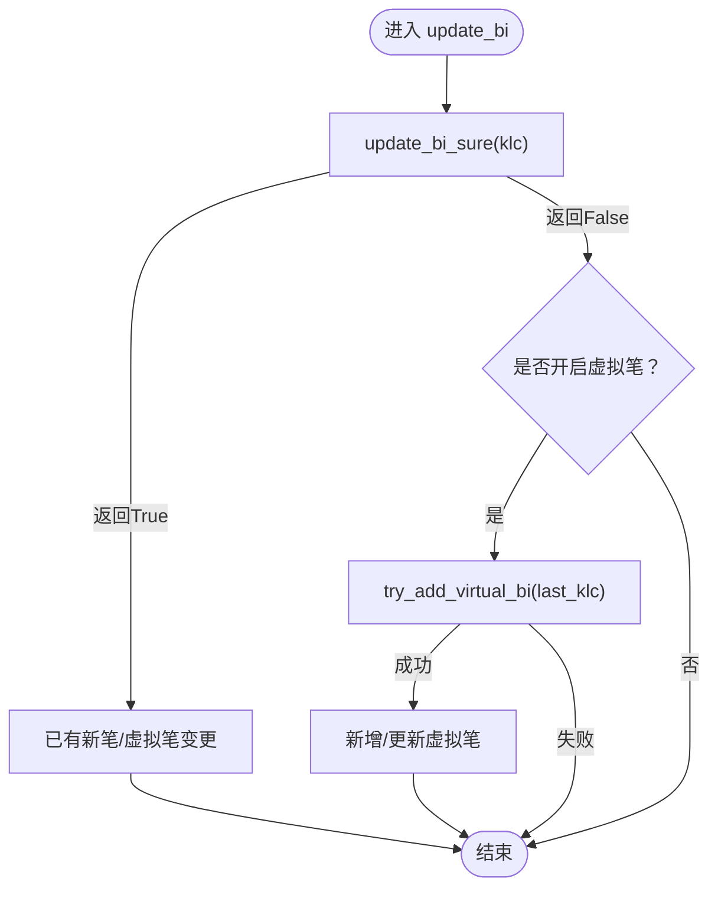
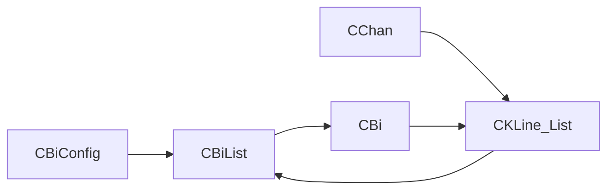

# 笔模块

<cite>
**本文引用的文件**
- [Bi.py](file://Bi/Bi.py)
- [BiList.py](file://Bi/BiList.py)
- [BiConfig.py](file://Bi/BiConfig.py)
- [KLine_List.py](file://KLine/KLine_List.py)
- [Chan.py](file://Chan.py)
- [ChanConfig.py](file://ChanConfig.py)
- [quick_guide.md](file://quick_guide.md)
</cite>

## 目录
1. [简介](#简介)
2. [项目结构](#项目结构)
3. [核心组件](#核心组件)
4. [架构总览](#架构总览)
5. [详细组件分析](#详细组件分析)
6. [依赖关系分析](#依赖关系分析)
7. [性能考量](#性能考量)
8. [故障排查指南](#故障排查指南)
9. [结论](#结论)
10. [附录](#附录)

## 简介
本章节面向“笔模块”的使用者与维护者，系统阐述笔（CBi）类的实现细节、笔列表（CBiList）的管理与计算逻辑，以及配置项（CBiConfig）对笔形成规则的影响，并给出从 CChan 实例中获取笔列表并遍历的实践示例路径。文档力求以循序渐进的方式，帮助读者理解从 K 线到笔、再到线段与中枢的完整链路。

## 项目结构
笔模块位于 Bi 子目录，配合 K 线、线段、中枢等模块共同构成缠论分析体系。与笔直接相关的核心文件如下：
- Bi/Bi.py：定义笔对象 CBi，包含方向、起止 K 线、确定性状态、关联的 CKLine 列表等。
- Bi/BiList.py：管理笔列表，负责笔的创建、更新、虚拟笔处理、跨度与分形检查等。
- Bi/BiConfig.py：笔算法配置，控制笔算法、严格模式、分形检查方式、缺口处理等。
- KLine/KLine_List.py：K 线列表容器，持有 CBiList 并驱动笔的计算流程。
- Chan.py：顶层调度器，负责数据加载、K 线合并、笔/线段/中枢计算。
- ChanConfig.py：全局配置入口，其中包含 bi_conf 的装配。
- quick_guide.md：快速指南，包含笔对象常用属性与方法的说明。

图表来源
- [KLine_List.py](file://KLine/KLine_List.py#L35-L60)
- [BiList.py](file://Bi/BiList.py#L10-L20)
- [Bi.py](file://Bi/Bi.py#L10-L35)
- [ChanConfig.py](file://ChanConfig.py#L18-L31)
- [Chan.py](file://Chan.py#L193-L210)

章节来源
- [KLine_List.py](file://KLine/KLine_List.py#L35-L60)
- [Chan.py](file://Chan.py#L193-L210)
- [ChanConfig.py](file://ChanConfig.py#L18-L31)

## 核心组件
- CBi（笔）：表示一根笔，包含方向、起止 K 线、确定性状态、关联的 CKLine 列表、前后笔指针等；提供多种指标计算（幅度、MACD 指标、RSI 等）。
- CBiList（笔列表）：维护笔序列，负责尝试创建首笔、更新确定笔、处理虚拟笔、跨度与分形检查、峰值更新等。
- CBiConfig（笔配置）：控制笔算法、严格模式、分形检查方法、缺口处理、末端是否为峰等。

章节来源
- [Bi.py](file://Bi/Bi.py#L10-L35)
- [BiList.py](file://Bi/BiList.py#L10-L35)
- [BiConfig.py](file://Bi/BiConfig.py#L5-L31)

## 架构总览
下图展示了从 CChan 到 CKLine_List，再到 CBiList 与 CBi 的调用链，以及配置如何贯穿到笔计算过程：

图表来源
- [Chan.py](file://Chan.py#L235-L269)
- [KLine_List.py](file://KLine/KLine_List.py#L122-L136)
- [BiList.py](file://Bi/BiList.py#L48-L104)
- [Bi.py](file://Bi/Bi.py#L94-L105)

章节来源
- [Chan.py](file://Chan.py#L235-L269)
- [KLine_List.py](file://KLine/KLine_List.py#L122-L136)
- [BiList.py](file://Bi/BiList.py#L48-L104)
- [Bi.py](file://Bi/Bi.py#L94-L105)

## 详细组件分析

### CBi（笔）类
- 关键属性与含义
  - 方向 dir：区分上升/下降笔。
  - 起止 K 线 begin_klc/end_klc：分别对应起止分形所在 K 线。
  - 确定性 is_sure：是否为确定笔；若为假，则处于“虚拟笔”状态，后续可能恢复为确定笔或追加确定尾。
  - 关联 CKLine 列表 klc_lst：按 K 线索引顺序迭代该笔所覆盖的所有合并 K 线。
  - 前后指针 next/pre：用于笔序列的双向遍历。
  - 线段索引 seg_idx 与父线段 parent_seg：记录该笔所属线段及线段对象。
- 核心方法与用途
  - set(begin_klc, end_klc)：设置起止 K 线并推导方向，随后进行方向与收尾一致性校验。
  - update_new_end/new_end/update_virtual_end：更新确定尾或虚拟尾，维护 is_sure 与 sure_end 列表。
  - get_begin_klu/get_end_klu：获取起止 K 线单元（考虑是否为峰）。
  - get_begin_val/get_end_val/amp：获取起止价格与幅度。
  - get_klu_cnt/get_klc_cnt：统计起止 K 线单元与 K 线数量。
  - is_up/is_down：方向判定。
  - cal_macd_metric：根据配置选择不同 MACD 指标（面积、峰值、半面积、差值、斜率、振幅、交易量/成交额等），或 RSI。
- 错误处理
  - 方向与收尾不一致时抛出异常，确保笔的几何与方向正确。

图表来源
- [Bi.py](file://Bi/Bi.py#L38-L179)
- [Bi.py](file://Bi/Bi.py#L180-L327)

章节来源
- [Bi.py](file://Bi/Bi.py#L38-L179)
- [Bi.py](file://Bi/Bi.py#L180-L327)

### CBiList（笔列表）管理与计算逻辑
- 维护结构
  - bi_list：笔列表。
  - last_end：最后一笔的尾部 K 线，便于快速判断是否延续或新建笔。
  - free_klc_lst：首笔尚未成形时的临时缓存，提升首笔识别精度。
  - config：来自 CBiConfig 的配置。
- 主要流程
  - update_bi(klc, last_klc, cal_virtual)：统一入口，先尝试更新确定笔，再按需尝试虚拟笔。
  - update_bi_sure(klc)：删除虚拟笔、尝试创建/更新首笔、判断是否可成笔、处理峰值更新。
  - try_create_first_bi(klc)：在 free_klc_lst 中寻找异向候选，满足条件即创建首笔。
  - can_make_bi(klc, last_end, for_virtual)：综合跨度、分形检查、末端是否为峰等条件决定是否成笔。
  - satisfy_bi_span(klc, last_end)：根据 is_strict 与 gap_as_kl 决定笔跨度阈值。
  - try_add_virtual_bi(klc, need_del_end)：当最后一笔方向允许且价格创新高/低时，更新虚拟尾或沿前向回溯尝试新增虚拟笔。
  - update_peak(klc, for_virtual)：在特定条件下对最后一笔进行峰值更新（仅在允许子峰或最后一笔方向变化时）。
  - delete_virtual_bi()：当最后一笔为虚拟笔时，优先恢复其确定尾，否则删除整笔。
- 辅助函数
  - end_is_peak(last_end, cur_end)：判断末端是否为峰，用于约束笔终点质量。

图表来源
- [BiList.py](file://Bi/BiList.py#L48-L104)
- [BiList.py](file://Bi/BiList.py#L120-L141)

章节来源
- [BiList.py](file://Bi/BiList.py#L36-L104)
- [BiList.py](file://Bi/BiList.py#L120-L141)
- [BiList.py](file://Bi/BiList.py#L143-L236)

### CBiConfig（笔配置）与形成规则
- 关键配置项
  - bi_algo：笔算法类型（如“normal/fx”），影响跨度计算策略。
  - is_strict：是否启用严格笔规则，决定最小跨度阈值。
  - bi_fx_check：分形检查方法（strict/loss/half/totally），控制分形有效性判定。
  - gap_as_kl：缺口是否按 K 线计数，影响跨度计算。
  - bi_end_is_peak：笔终点是否必须为峰。
  - bi_allow_sub_peak：是否允许子峰参与峰值更新。
- 影响路径
  - can_make_bi：综合上述配置决定是否可成笔。
  - satisfy_bi_span：在非严格模式下，结合 uint_kl_cnt 与 klc_span 决定是否满足笔跨度。
  - get_klc_span：在 gap_as_kl 为真时，逐 K 线扫描缺口并累加跨度。
  - end_is_peak：在 bi_end_is_peak 为真时，限制笔终点必须为峰。

章节来源
- [BiConfig.py](file://Bi/BiConfig.py#L5-L31)
- [BiList.py](file://Bi/BiList.py#L149-L176)
- [BiList.py](file://Bi/BiList.py#L165-L176)
- [BiList.py](file://Bi/BiList.py#L178-L186)
- [BiList.py](file://Bi/BiList.py#L216-L236)

### 从 CChan 实例获取笔列表并遍历
- 获取路径
  - CChan 持有多级别 K 线列表，可通过索引访问某级别的 CKLine_List。
  - CKLine_List 内部持有 bi_list（CBiList），可直接遍历或切片访问。
- 示例路径（不展示具体代码，仅给出定位）
  - CChan 索引访问 CKLine_List：参考 [Chan.py](file://Chan.py#L288-L294)
  - CKLine_List 持有 bi_list：参考 [KLine_List.py](file://KLine/KLine_List.py#L35-L45)
  - CBiList 支持迭代与切片：参考 [BiList.py](file://Bi/BiList.py#L18-L35)
  - 快速指南中对笔对象属性与方法的说明：参考 [quick_guide.md](file://quick_guide.md#L290-L335)

章节来源
- [Chan.py](file://Chan.py#L288-L294)
- [KLine_List.py](file://KLine/KLine_List.py#L35-L45)
- [BiList.py](file://Bi/BiList.py#L18-L35)
- [quick_guide.md](file://quick_guide.md#L290-L335)

## 依赖关系分析
- 组件耦合
  - CBiList 依赖 CKLine 与 FX 类型枚举，用于判断分形与方向。
  - CBiList 依赖 CBiConfig 决策笔形成规则。
  - CKLine_List 持有 CBiList，并在 add_single_klu 时驱动笔计算。
  - CChan 作为顶层调度器，协调数据加载与计算。
- 外部依赖
  - Common.CEnum 提供 BI_DIR、FX_TYPE、KLINE_DIR 等枚举。
  - Common.ChanException 提供统一异常与错误码。

图表来源
- [BiConfig.py](file://Bi/BiConfig.py#L5-L31)
- [BiList.py](file://Bi/BiList.py#L10-L20)
- [Bi.py](file://Bi/Bi.py#L10-L35)
- [KLine_List.py](file://KLine/KLine_List.py#L35-L60)
- [Chan.py](file://Chan.py#L193-L210)

章节来源
- [BiConfig.py](file://Bi/BiConfig.py#L5-L31)
- [BiList.py](file://Bi/BiList.py#L10-L20)
- [Bi.py](file://Bi/Bi.py#L10-L35)
- [KLine_List.py](file://KLine/KLine_List.py#L35-L60)
- [Chan.py](file://Chan.py#L193-L210)

## 性能考量
- 缓存机制：CBi 对多项计算结果使用缓存装饰器，避免重复计算，提高指标计算效率。
- 虚拟笔处理：通过删除/恢复虚拟笔与增量更新，减少不必要的重建成本。
- 跨度计算优化：在 gap_as_kl 为真时，通过早期短路与逐 K 线扫描，平衡精度与性能。
- 配置选择：合理设置 bi_strict 与 bi_algo 可在稳定性与灵敏度之间取得平衡。

## 故障排查指南
- 异常类型
  - 笔方向与收尾不一致：在 set 中进行断言，不满足时抛出异常。
  - 参数非法：配置项 bi_fx_check 非法时抛出参数错误异常。
- 常见问题定位
  - 笔无法形成：检查 bi_fx_check、gap_as_kl、bi_end_is_peak、bi_allow_sub_peak 等配置是否与数据特性匹配。
  - 虚拟笔频繁切换：确认是否启用了虚拟笔计算，以及 last_klc 的价格是否持续创新高/低。
  - 首笔识别不准：free_klc_lst 的存在有助于提升首笔识别，但需确保数据流连续性。

章节来源
- [Bi.py](file://Bi/Bi.py#L85-L105)
- [BiConfig.py](file://Bi/BiConfig.py#L17-L26)
- [BiList.py](file://Bi/BiList.py#L120-L141)

## 结论
笔模块通过 CBi、CBiList 与 CBiConfig 的协同，实现了从 K 线到笔、再到线段与中枢的完整分析链路。合理的配置可显著影响笔的形成规则与稳定性；清晰的虚拟笔与确定笔管理机制保证了实时计算的准确性与鲁棒性。通过 CChan 与 CKLine_List 的协作，用户可便捷地获取笔列表并进行进一步分析与可视化。

## 附录
- 快速指南中对笔对象属性与方法的说明可参考：[quick_guide.md](file://quick_guide.md#L290-L335)
- 全局配置装配与笔配置注入：[ChanConfig.py](file://ChanConfig.py#L18-L31)
- 笔列表在 K 线列表中的持有位置：[KLine_List.py](file://KLine/KLine_List.py#L35-L45)