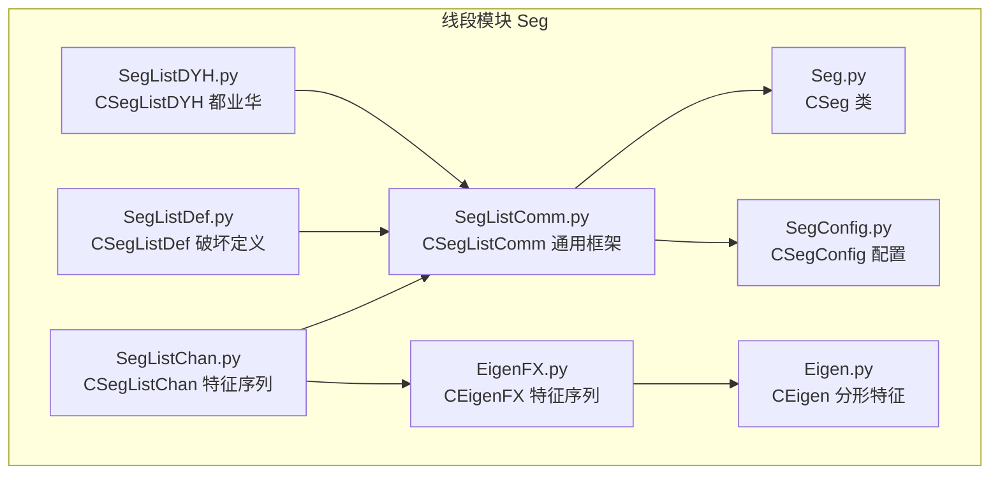
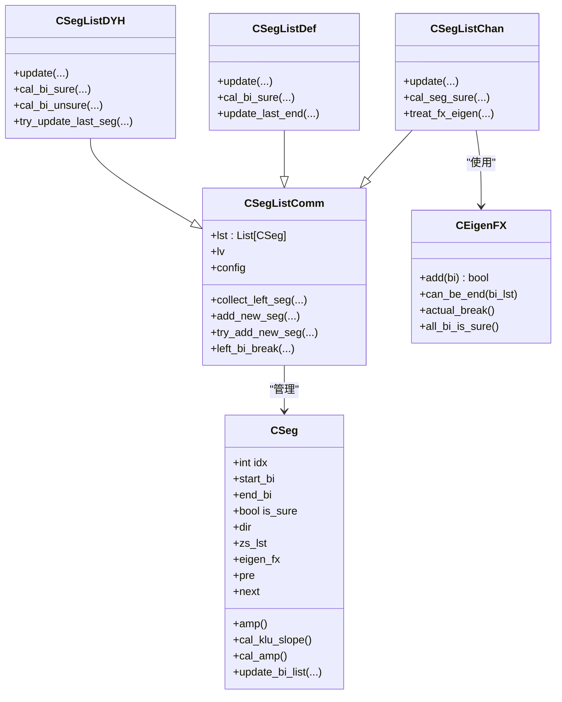
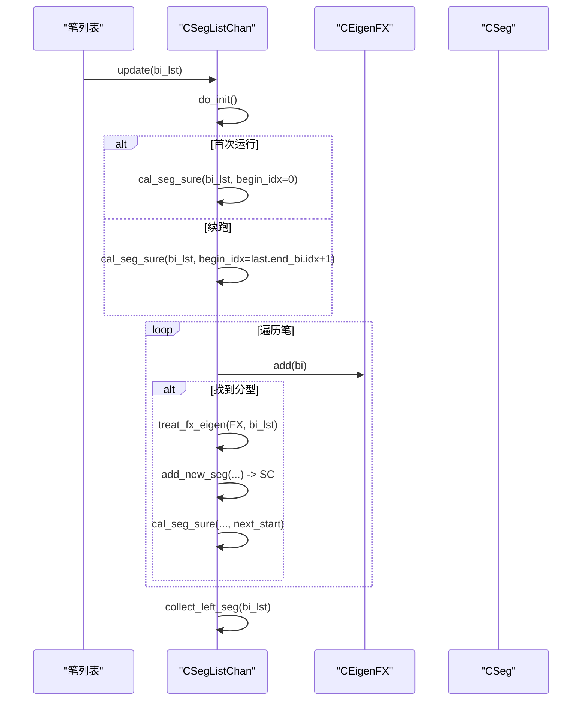
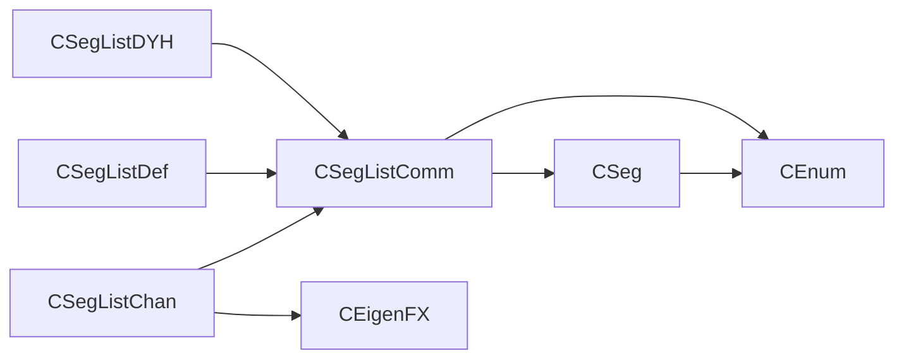

# 线段模块

<cite>
**本文引用的文件**
- [Seg.py](file://Seg/Seg.py)
- [SegConfig.py](file://Seg/SegConfig.py)
- [SegListComm.py](file://Seg/SegListComm.py)
- [SegListChan.py](file://Seg/SegListChan.py)
- [SegListDef.py](file://Seg/SegListDef.py)
- [SegListDYH.py](file://Seg/SegListDYH.py)
- [Eigen.py](file://Seg/Eigen.py)
- [EigenFX.py](file://Seg/EigenFX.py)
- [CEnum.py](file://Common/CEnum.py)
- [CLAUDE.md](file://Seg/CLAUDE.md)
- [quick_guide.md](file://quick_guide.md)
</cite>

## 目录
1. [引言](#引言)
2. [项目结构](#项目结构)
3. [核心组件](#核心组件)
4. [架构总览](#架构总览)
5. [详细组件分析](#详细组件分析)
6. [依赖关系分析](#依赖关系分析)
7. [性能考量](#性能考量)
8. [故障排查指南](#故障排查指南)
9. [结论](#结论)
10. [附录](#附录)

## 引言
本文件系统化梳理线段模块的设计与实现，重点围绕以下目标展开：
- 解释 CSeg（线段）类的结构与行为，包括起止笔、方向、is_sure 状态及内部中枢列表。
- 描述 CSegListComm 作为通用线段计算框架的职责与公共逻辑。
- 对比不同算法实现：SegListChan（特征序列）、SegListDef（破坏定义）、SegListDYH（都业华）。
- 详解 CSegConfig 中的 seg_algo（线段算法）配置项，说明“chan”“1+1”“break”等差异。
- 讲解“虚段”（is_sure=False）的概念及其在实时分析中的意义。

## 项目结构
线段模块位于 Seg 目录，围绕 CSegListComm 抽象出通用框架，派生出三种具体算法实现；同时提供特征序列分析工具 CEigenFX 与 CEigen，用于识别分形与线段确认。

图表来源
- [Seg.py](file://Seg/Seg.py#L1-L157)
- [SegListComm.py](file://Seg/SegListComm.py#L1-L175)
- [SegListChan.py](file://Seg/SegListChan.py#L1-L77)
- [SegListDef.py](file://Seg/SegListDef.py#L1-L61)
- [SegListDYH.py](file://Seg/SegListDYH.py#L1-L97)
- [SegConfig.py](file://Seg/SegConfig.py#L1-L14)
- [Eigen.py](file://Seg/Eigen.py#L1-L29)
- [EigenFX.py](file://Seg/EigenFX.py#L1-L151)

章节来源
- [Seg.py](file://Seg/Seg.py#L1-L157)
- [SegListComm.py](file://Seg/SegListComm.py#L1-L175)
- [SegListChan.py](file://Seg/SegListChan.py#L1-L77)
- [SegListDef.py](file://Seg/SegListDef.py#L1-L61)
- [SegListDYH.py](file://Seg/SegListDYH.py#L1-L97)
- [SegConfig.py](file://Seg/SegConfig.py#L1-L14)
- [Eigen.py](file://Seg/Eigen.py#L1-L29)
- [EigenFX.py](file://Seg/EigenFX.py#L1-L151)

## 核心组件
- CSeg：线段对象，记录起止笔、方向、is_sure 状态、中枢列表、趋势线、买卖点标记等，并提供长度、幅度、MACD 指标等计算方法。
- CSegListComm：通用线段列表框架，负责收集左侧未确认线段、寻找首个线段、连接相邻线段、添加新线段等。
- CSegListChan：基于特征序列的线段算法，利用 CEigenFX 识别分形并判断线段确认。
- CSegListDef：基于破坏定义的线段算法，依据连续笔的高低关系与峰值变化确定线段边界。
- CSegListDYH：都业华风格的线段算法，强调特定形态与破坏判断，支持对最后线段末端的动态更新。
- CEigen/CEigenFX：特征序列与分形分析工具，用于识别顶/底分型、缺口、实际突破等。
- CSegConfig：线段算法配置，包含 seg_algo 与 left_method。

章节来源
- [Seg.py](file://Seg/Seg.py#L1-L157)
- [SegListComm.py](file://Seg/SegListComm.py#L1-L175)
- [SegListChan.py](file://Seg/SegListChan.py#L1-L77)
- [SegListDef.py](file://Seg/SegListDef.py#L1-L61)
- [SegListDYH.py](file://Seg/SegListDYH.py#L1-L97)
- [Eigen.py](file://Seg/Eigen.py#L1-L29)
- [EigenFX.py](file://Seg/EigenFX.py#L1-L151)
- [SegConfig.py](file://Seg/SegConfig.py#L1-L14)

## 架构总览
线段模块采用“抽象框架 + 多算法实现”的设计。CSegListComm 提供统一的线段收集与连接逻辑；各算法实现通过不同的策略识别线段边界与确认条件，最终产出 CSeg 列表。

图表来源
- [Seg.py](file://Seg/Seg.py#L1-L157)
- [SegListComm.py](file://Seg/SegListComm.py#L1-L175)
- [SegListChan.py](file://Seg/SegListChan.py#L1-L77)
- [SegListDef.py](file://Seg/SegListDef.py#L1-L61)
- [SegListDYH.py](file://Seg/SegListDYH.py#L1-L97)
- [EigenFX.py](file://Seg/EigenFX.py#L1-L151)

## 详细组件分析

### CSeg（线段）类
- 关键字段与属性
  - 起止笔：start_bi、end_bi
  - 方向：dir（由 end_bi.dir 或显式指定）
  - 确定性：is_sure（True 表示确认，False 表示虚段）
  - 中枢列表：zs_lst（按反序存储）
  - 特征分形：eigen_fx（用于特征序列算法）
  - 邻接指针：pre、next（前后线段串联）
  - 买卖点：bsp（尾部是否为买卖点）
  - 内部笔列表：bi_list（通过 update_bi_list 更新）
- 核心方法
  - 幅度与斜率：amp、cal_amp、cal_klu_slope
  - MACD 指标：cal_macd_metric、Cal_MACD_slope、Cal_MACD_amp
  - 辅助查询：get_begin_val、get_end_val、get_begin_klu、get_end_klu、get_klu_cnt
  - 中枢统计：add_zs、clear_zs_lst、get_first_multi_bi_zs、get_multi_bi_zs_lst、get_final_multi_bi_zs、get_multi_bi_zs_cnt
  - 线段检查：check（校验起止值与长度）
- 设计要点
  - is_sure 为 False 的线段称为“虚段”，在实时分析中用于展示推断的线段，后续可能因新的 K 线或破坏而调整。
  - update_bi_list 会为内部笔建立 parent_seg 关联，并在笔数≥3 时计算内部支撑/阻力趋势线。

章节来源
- [Seg.py](file://Seg/Seg.py#L1-L157)

### CSegListComm（通用线段框架）
- 职责
  - 维护线段列表 lst，提供迭代、索引与长度访问。
  - 左侧线段收集：根据 left_method（PEAK/ALL）策略收集剩余未确认线段。
  - 首线段初始化：根据 PEAK 或 ALL 方法选择首个线段方向与边界。
  - 新线段添加：try_add_new_seg/add_new_seg，确保相邻线段双向链接。
  - 破坏检测：left_bi_break 检查最后一段之后的笔是否突破最后一笔。
  - 峰值查找：FindPeakBi 用于寻找局部高/低笔。
- 关键流程
  - collect_left_seg → collect_first_seg / collect_segs → collect_left_as_seg
  - add_new_seg 调用 CSeg 构造并更新 bi_list，同时维护 pre/next 链接。

章节来源
- [SegListComm.py](file://Seg/SegListComm.py#L1-L175)

### CSegListChan（特征序列算法）
- 算法思想
  - 将反向笔作为“特征序列 K 线”进行合并，寻找顶/底分型，以反向分型破坏确认线段结束。
  - 若出现缺口（gap），需在后续找到合法的反向分型才确认；否则分型出现即确认。
- 关键步骤
  - do_init：清理末尾虚段，必要时回退至确定线段的第三元素也为确定的状态。
  - update：从上次结束位置继续，调用 cal_seg_sure 寻找分型；若找到则 treat_fx_eigen 处理确认与继续推进。
  - cal_seg_sure：维护上升线段对应的下降笔特征序列与下降线段对应的上升笔特征序列，遇到合适分型即触发确认。
  - treat_fx_eigen：根据 can_be_end 判断是否确认，若确认则继续推进，否则回退到分型第二元素处继续搜索。
- 与 CEigenFX 的协作
  - CEigenFX.add 逐步构建特征序列三元素，actual_break 与 can_be_end 协助判断缺口与反向分型确认。

图表来源
- [SegListChan.py](file://Seg/SegListChan.py#L1-L77)
- [SegListComm.py](file://Seg/SegListComm.py#L1-L175)
- [Seg.py](file://Seg/Seg.py#L1-L157)
- [EigenFX.py](file://Seg/EigenFX.py#L1-L151)

章节来源
- [SegListChan.py](file://Seg/SegListChan.py#L1-L77)
- [SegListComm.py](file://Seg/SegListComm.py#L1-L175)
- [Seg.py](file://Seg/Seg.py#L1-L157)
- [EigenFX.py](file://Seg/EigenFX.py#L1-L151)

### CSegListDef（破坏定义算法）
- 算法思想
  - 基于连续笔的高低关系与峰值变化判断线段边界；允许对最后线段末端进行动态更新。
- 关键步骤
  - update：先 cal_bi_sure 识别线段边界，再 collect_left_seg。
  - cal_bi_sure：遍历笔，若出现方向变化且与上一段方向相反，且中间笔满足破坏条件，则形成线段；若开启 sure_seg_update_end，则在同向持续中动态延长最后线段末端。
  - update_last_end：更新最后线段的末端笔，同时刷新内部笔列表。
- 适用场景
  - 适合对“破坏”敏感的策略，强调笔的高低关系与连续性。

章节来源
- [SegListDef.py](file://Seg/SegListDef.py#L1-L61)
- [SegListComm.py](file://Seg/SegListComm.py#L1-L175)

### CSegListDYH（都业华算法）
- 算法思想
  - 强化对特定形态的识别与破坏判断，支持对最后线段末端的动态更新，并在最后一段发生突破时回退到最近的峰值位置重新形成线段。
- 关键步骤
  - update：do_init → cal_bi_sure → try_update_last_seg → 若 last_bi 突破则 cal_bi_unsure → collect_left_seg。
  - cal_bi_sure：使用 situation1/situation2 判定特殊形态，满足条件则形成线段。
  - cal_bi_unsure：在 last_seg_dir 方向上寻找最近的反向笔，以其为终点形成虚线段。
  - try_update_last_seg：在同向持续中动态提升最后线段末端，若提升则将 last_seg.is_sure 设为 False。
- 适用场景
  - 适合对形态识别与动态回撤敏感的策略。

章节来源
- [SegListDYH.py](file://Seg/SegListDYH.py#L1-L97)
- [SegListComm.py](file://Seg/SegListComm.py#L1-L175)

### CEigen 与 CEigenFX（特征序列与分形）
- CEigen
  - 以笔为元素的组合器，支持合并与分形判断，记录 gap（缺口）状态，提供 GetPeakBiIdx 获取峰值笔索引。
- CEigenFX
  - 面向线段方向的特征序列，维护三个元素的序列与最后证据笔 last_evidence_bi。
  - add：按阶段构建三元素，若无法构成有效序列则 reset。
  - can_be_end：在缺口情况下，需在后续找到合法反向分型才确认；否则直接确认。
  - actual_break：在排除包含的情况下，验证第二元素是否产生实际突破。
  - all_bi_is_sure：判断特征序列中所有笔是否均为确定。

章节来源
- [Eigen.py](file://Seg/Eigen.py#L1-L29)
- [EigenFX.py](file://Seg/EigenFX.py#L1-L151)

### CSegConfig（线段算法配置）
- seg_algo：线段算法选择
  - chan：特征序列算法（CSegListChan）
  - 1+1：破坏定义算法（CSegListDef）
  - break：破坏定义算法（CSegListDef）
- left_method：左侧线段收集策略
  - peak：按峰值方向选择首个线段方向，再递归收集剩余线段
  - all：按首尾方向一致性收集剩余线段

章节来源
- [SegConfig.py](file://Seg/SegConfig.py#L1-L14)
- [CEnum.py](file://Common/CEnum.py#L86-L90)

## 依赖关系分析
- CSegListComm 依赖
  - CSeg：用于构造与连接线段
  - CBi/CBiList：笔序列与笔对象
  - CEnum：BI_DIR、LEFT_SEG_METHOD、SEG_TYPE 等枚举
  - ChanException：错误码与异常抛出
- CSegListChan 依赖
  - CEigenFX：特征序列与分形确认
  - CSegListComm：通用逻辑
- CSegListDef/CSegListDYH 依赖
  - CSegListComm：通用逻辑
  - 自身定义的破坏判断函数（is_up_seg/is_down_seg、situation1/situation2）

图表来源
- [SegListComm.py](file://Seg/SegListComm.py#L1-L175)
- [SegListChan.py](file://Seg/SegListChan.py#L1-L77)
- [SegListDef.py](file://Seg/SegListDef.py#L1-L61)
- [SegListDYH.py](file://Seg/SegListDYH.py#L1-L97)
- [Seg.py](file://Seg/Seg.py#L1-L157)
- [CEnum.py](file://Common/CEnum.py#L1-L130)

## 性能考量
- 特征序列算法（chan）
  - 时间复杂度：近似 O(n)，其中 n 为笔数量；每次 add 笔最多三次状态转移，整体线性。
  - 空间复杂度：O(1) 额外空间（特征序列三元素与少量临时变量）。
  - 优化点：在 do_init 中清理末尾虚段，避免无效回溯。
- 破坏定义算法（1+1/break）
  - 时间复杂度：近似 O(n)，但可能多次扫描以寻找峰值与更新末端。
  - 优化点：开启 sure_seg_update_end 后，尽量减少不必要的重算。
- 都业华算法（DYH）
  - 时间复杂度：近似 O(n)，但包含额外的形态判断与回退逻辑。
  - 优化点：在 cal_bi_unsure 中按方向寻找最近反向笔，避免全量扫描。

[本节为通用性能讨论，不直接分析具体文件，故无章节来源]

## 故障排查指南
- 线段长度过短
  - 现象：抛出长度错误，提示线段长度不能小于 2。
  - 排查：确认起止笔索引差值与内部笔数量是否满足最小长度要求。
  - 参考路径：[Seg.py](file://Seg/Seg.py#L48-L58)
- 起止值与方向不一致
  - 现象：抛出起止值错误，提示上升/下降线段的起止值应满足的条件。
  - 排查：核对线段方向与起止值关系，确保符合上升/下降约束。
  - 参考路径：[Seg.py](file://Seg/Seg.py#L51-L55)
- 左侧线段收集异常
  - 现象：left_method 配置非法或收集逻辑未覆盖边界。
  - 排查：检查 CSegConfig.left_method 设置与 CSegListComm.collect_left_seg 的分支。
  - 参考路径：[SegConfig.py](file://Seg/SegConfig.py#L1-L14)，[SegListComm.py](file://Seg/SegListComm.py#L40-L110)
- 特征序列确认失败
  - 现象：缺口存在但未找到合法反向分型，导致线段确认延迟。
  - 排查：检查 CEigenFX.can_be_end 与 actual_break 的逻辑，确认是否遗漏后续反向分型。
  - 参考路径：[EigenFX.py](file://Seg/EigenFX.py#L79-L151)，[SegListChan.py](file://Seg/SegListChan.py#L60-L77)
- 虚段频繁变化
  - 现象：is_sure=False 的线段在实时推进中反复变化。
  - 排查：检查是否启用了动态更新（如 sure_seg_update_end），以及是否及时调用 update。
  - 参考路径：[SegListDef.py](file://Seg/SegListDef.py#L26-L61)，[SegListDYH.py](file://Seg/SegListDYH.py#L79-L97)

章节来源
- [Seg.py](file://Seg/Seg.py#L48-L58)
- [SegConfig.py](file://Seg/SegConfig.py#L1-L14)
- [SegListComm.py](file://Seg/SegListComm.py#L40-L110)
- [SegListChan.py](file://Seg/SegListChan.py#L60-L77)
- [SegListDef.py](file://Seg/SegListDef.py#L26-L61)
- [SegListDYH.py](file://Seg/SegListDYH.py#L79-L97)
- [EigenFX.py](file://Seg/EigenFX.py#L79-L151)

## 结论
- CSeg 是线段模块的核心数据结构，承载方向、确定性、中枢与辅助指标。
- CSegListComm 提供统一的线段收集与连接机制，屏蔽不同算法的差异。
- 三种算法各有侧重：
  - chan：强调特征序列与反向分型破坏，适合稳健确认。
  - 1+1/break：强调笔的高低关系与破坏，适合对破坏敏感的策略。
  - DYH：强调形态识别与动态更新，适合对形态与回撤敏感的策略。
- “虚段”（is_sure=False）体现了实时分析的滞后性与不确定性，是线段模块在动态市场中的关键设计。

[本节为总结性内容，不直接分析具体文件，故无章节来源]

## 附录

### 算法对比与选择建议
- 特征序列（chan）
  - 优点：确认严格、逻辑清晰、适合稳健交易。
  - 缺点：确认滞后较强，可能错过短期机会。
  - 适用：趋势跟踪、中枢交易。
- 破坏定义（1+1/break）
  - 优点：对破坏敏感，回撤更小。
  - 缺点：可能误判震荡行情。
  - 适用：震荡转趋势、回调交易。
- 都业华（DYH）
  - 优点：形态识别强，动态更新及时。
  - 缺点：参数敏感，形态识别复杂。
  - 适用：形态交易、动态回撤策略。

章节来源
- [SegListChan.py](file://Seg/SegListChan.py#L1-L77)
- [SegListDef.py](file://Seg/SegListDef.py#L1-L61)
- [SegListDYH.py](file://Seg/SegListDYH.py#L1-L97)
- [CLAUDE.md](file://Seg/CLAUDE.md#L132-L216)
- [quick_guide.md](file://quick_guide.md#L423-L439)