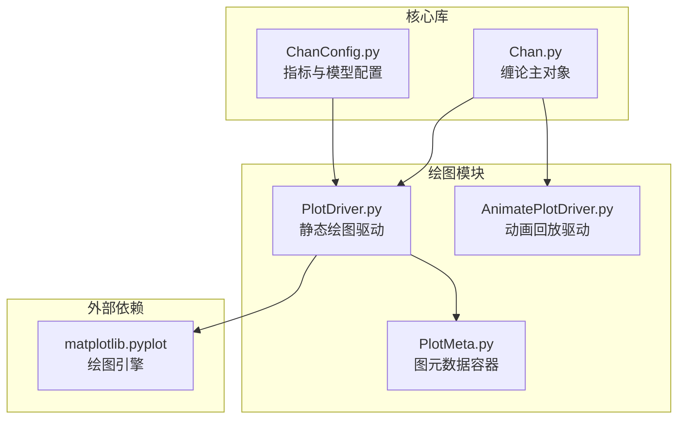
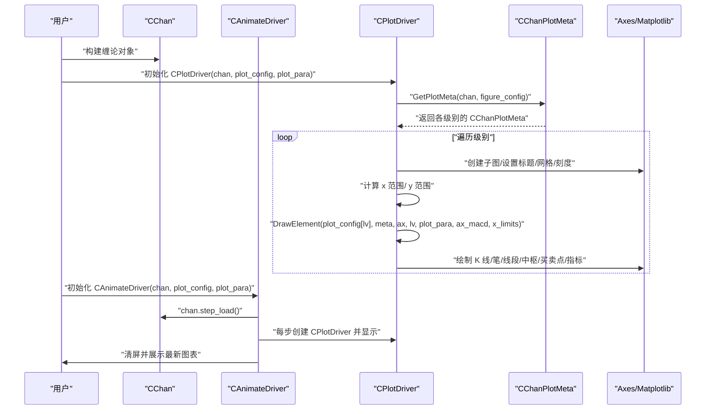
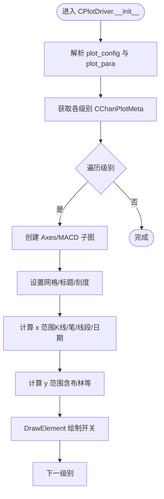
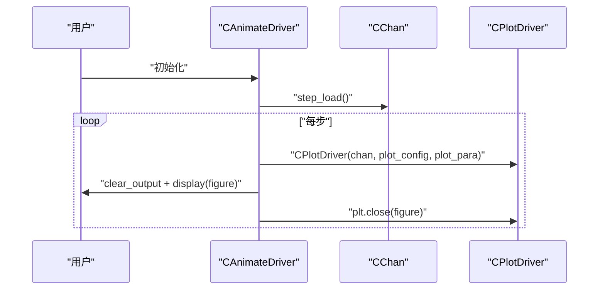
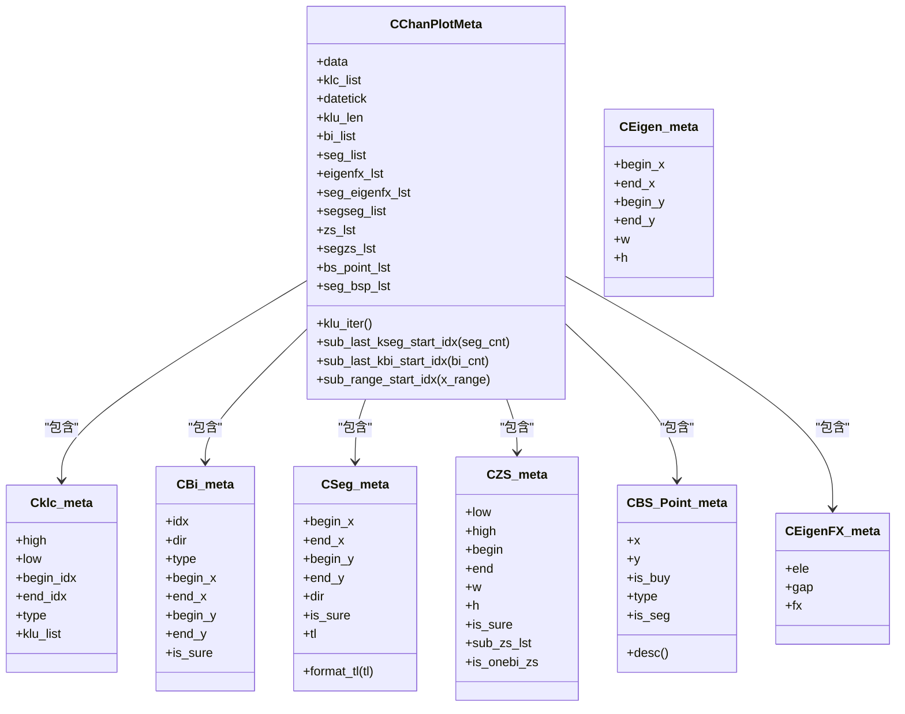
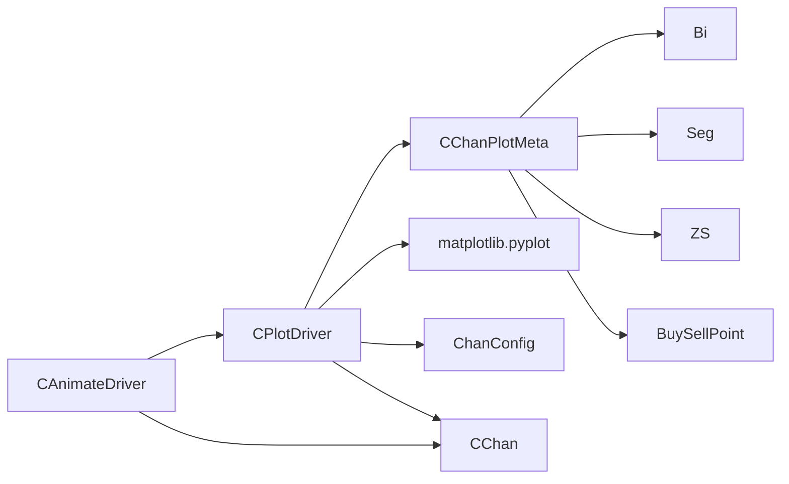

# 绘图模块

<cite>
**本文引用的文件列表**
- [PlotDriver.py](file://Plot/PlotDriver.py)
- [AnimatePlotDriver.py](file://Plot/AnimatePlotDriver.py)
- [PlotMeta.py](file://Plot/PlotMeta.py)
- [CLAUDE.md](file://Plot/CLAUDE.md)
- [README.md](file://README.md)
- [ChanConfig.py](file://ChanConfig.py)
</cite>

## 目录
1. [简介](#简介)
2. [项目结构](#项目结构)
3. [核心组件](#核心组件)
4. [架构总览](#架构总览)
5. [组件详解](#组件详解)
6. [依赖关系分析](#依赖关系分析)
7. [性能与扩展性](#性能与扩展性)
8. [故障排查指南](#故障排查指南)
9. [结论](#结论)
10. [附录：配置参考与示例路径](#附录配置参考与示例路径)

## 简介
本章节面向使用者与开发者，系统化介绍绘图模块的设计与使用方法，重点覆盖：
- 静态绘图驱动 CPlotDriver 的工作流程与参数体系
- 动画回放驱动 CAnimateDriver 的使用方式
- 绘图元素开关 plot_config 与绘图细节参数 plot_para 的结构与用法
- 图元数据容器 CPlotMeta（在当前代码中为 CChanPlotMeta）如何承载缠论元素并转换为绘图坐标
- 如何通过配置定制图表宽度、颜色与显示范围

## 项目结构
绘图模块位于 Plot 目录，核心文件包括：
- PlotDriver.py：静态绘图驱动，负责解析配置、生成图表、绘制各类元素
- AnimatePlotDriver.py：动画回放驱动，基于 step_load 流式渲染
- PlotMeta.py：图元数据容器，将缠论对象映射为可绘制的坐标与属性
- CLAUDE.md：Plot 模块的概览与示例
- README.md：plot_config 与 plot_para 的官方说明
- ChanConfig.py：与绘图相关的指标与模型配置（如 MACD、布林、RSI、KDJ、Demark）

**图表来源**
- [PlotDriver.py](file://Plot/PlotDriver.py#L150-L206)
- [AnimatePlotDriver.py](file://Plot/AnimatePlotDriver.py#L9-L19)
- [PlotMeta.py](file://Plot/PlotMeta.py#L118-L171)
- [ChanConfig.py](file://ChanConfig.py#L52-L103)

**章节来源**
- [PlotDriver.py](file://Plot/PlotDriver.py#L150-L206)
- [AnimatePlotDriver.py](file://Plot/AnimatePlotDriver.py#L9-L19)
- [PlotMeta.py](file://Plot/PlotMeta.py#L118-L171)
- [ChanConfig.py](file://ChanConfig.py#L52-L103)

## 核心组件
- CPlotDriver：静态绘图驱动器，负责解析 plot_config 与 plot_para，按级别生成子图布局，调用具体绘制函数完成 K 线、笔、线段、中枢、买卖点、技术指标等元素的绘制。
- CAnimateDriver：动画回放驱动器，遍历 CChan 的 step_load 过程，逐帧刷新图表，适合演示分析过程。
- CChanPlotMeta：图元数据容器，将 CKLine_List 中的 K 线、笔、线段、中枢、买卖点等对象映射为可直接绘制的坐标与属性，同时提供辅助索引（如 datetick、klu_len）。

**章节来源**
- [PlotDriver.py](file://Plot/PlotDriver.py#L156-L206)
- [AnimatePlotDriver.py](file://Plot/AnimatePlotDriver.py#L9-L19)
- [PlotMeta.py](file://PlotMeta.py#L118-L171)

## 架构总览
下图展示了从 CChan 到 CPlotDriver，再到 matplotlib 的完整调用链路，以及各元素绘制的入口与参数传递。

**图表来源**
- [PlotDriver.py](file://Plot/PlotDriver.py#L156-L206)
- [PlotDriver.py](file://Plot/PlotDriver.py#L239-L279)
- [AnimatePlotDriver.py](file://Plot/AnimatePlotDriver.py#L9-L19)

## 组件详解

### CPlotDriver（静态绘图）
- 初始化与配置解析
  - 解析 plot_config：支持字符串、列表、字典；可按级别分别配置；自动补全“plot_”前缀
  - 解析 plot_para：figure、kl、klc、bi、seg、macd、mean、channel、boll、bsp、seg_bsp、demark、marker、rsi、kdj 等二级参数
  - 计算 x 范围：支持按 K 线数、笔数、线段数或起始日期限定显示范围
  - 生成子图：根据是否需要 MACD 动态调整子图数量与高度比例
- 绘制流程
  - 设置网格、标题、日期刻度
  - 计算 Y 范围（包含 K 线与布林带等）
  - 调用 DrawElement，按开关逐项绘制：K 线、合并 K 线、笔、线段、中枢、线段中枢、特征序列、均线、通道、布林、买卖点、线段买卖点、Demark、标记、RSI、KDJ、MACD
- 关键参数与行为
  - figure：w、h、macd_h、only_top_lv、x_range、x_bi_cnt、x_seg_cnt、x_begin_date、x_tick_num、grid
  - kl：width、rugd、plot_mode
  - klc：width、plot_single_kl
  - bi/seg：颜色、线宽、是否显示末端数值、趋势线、子级别高亮区域等
  - macd：绘制 DIF、DEA、柱状，正负柱颜色区分
  - mean/channel/boll：按配置维度绘制均线/通道/布林
  - rsi/kdj：在共享 X 轴的次坐标轴上绘制
  - marker：按日期映射到 K 线索引，绘制箭头与标注
  - demark：绘制设置与倒计时阶段，支持起始线与背景高亮

**图表来源**
- [PlotDriver.py](file://Plot/PlotDriver.py#L156-L206)
- [PlotDriver.py](file://Plot/PlotDriver.py#L239-L279)

**章节来源**
- [PlotDriver.py](file://Plot/PlotDriver.py#L156-L206)
- [PlotDriver.py](file://Plot/PlotDriver.py#L239-L279)

### CAnimateDriver（动画回放）
- 工作原理
  - 通过 CChan.step_load() 逐步加载数据，每步实例化一次 CPlotDriver
  - 清屏并显示最新图表，关闭旧图以释放内存
- 适用场景
  - 演示分析过程（K 线、笔、线段、中枢、买卖点随数据推进而出现）
  - 实时数据流可视化

**图表来源**
- [AnimatePlotDriver.py](file://Plot/AnimatePlotDriver.py#L9-L19)

**章节来源**
- [AnimatePlotDriver.py](file://Plot/AnimatePlotDriver.py#L9-L19)

### CChanPlotMeta（图元数据容器）
- 职责
  - 将 CKLine_List 中的 K 线、笔、线段、中枢、买卖点等对象映射为可绘制的坐标与属性
  - 提供日期刻度 datetick、K 线单元总数 klu_len、迭代器 klu_iter 等辅助
  - 提供子级别起始索引计算（按线段、笔、范围）以便联动显示
- 数据结构要点
  - K 线合并：Cklc_meta（high/low/begin/end/type/klu_list）
  - 笔：CBi_meta（idx/dir/type/begin_x/end_x/begin_y/end_y/is_sure）
  - 线段：CSeg_meta（同笔，含趋势线映射 format_tl）
  - 特征序列：CEigen_meta/CEigenFX_meta
  - 中枢：CZS_meta（low/high/begin/end/w/h/is_sure/sub_zs_lst/is_onebi_zs）
  - 买卖点：CBS_Point_meta（x/y/描述文本）
  - 买卖点（线段级别）：CBS_Point_meta（is_seg 标记）

**图表来源**
- [PlotMeta.py](file://Plot/PlotMeta.py#L14-L171)

**章节来源**
- [PlotMeta.py](file://PlotMeta.py#L14-L171)

### plot_config（绘图元素开关）
- 作用：控制是否绘制某类元素，支持字符串、列表、字典三种写法，且可省略“plot_”前缀
- 常见开关（来自 README 与源码调用）：
  - plot_kline、plot_kline_combine、plot_bi、plot_seg、plot_eigen、plot_zs、plot_segseg、plot_segeigen、plot_bsp、plot_cbsp、plot_segzs、plot_segbsp、plot_macd、plot_channel、plot_boll、plot_mean、plot_tradeinfo、plot_marker、plot_demark、plot_rsi、plot_kdj
- 级别支持：可按级别分别配置（如 KL_TYPE.K_DAY、KL_TYPE.K_30M 等）

**章节来源**
- [PlotDriver.py](file://Plot/PlotDriver.py#L18-L61)
- [README.md](file://README.md#L720-L781)

### plot_para（绘图细节参数）
- 作用：对具体绘制细节进行微调，分为两级配置
- figure（图级）
  - w、h：图表宽高
  - macd_h：MACD 子图高度占主图的比例
  - only_top_lv：仅绘制最高级别
  - x_range、x_bi_cnt、x_seg_cnt、x_begin_date：显示范围控制
  - x_tick_num：横坐标刻度数量
  - grid：xy/x/y/None 控制网格方向
- 元素级（二级字典）
  - kl：width、rugd、plot_mode（'kl'/'close'/'open'/'high'/'low'）
  - klc：width、plot_single_kl
  - bi/seg：颜色、线宽、是否显示末端数值、趋势线、子级别高亮区域
  - macd：柱状宽度等
  - mean/channel/boll：维度与颜色
  - rsi/kdj：颜色
  - marker：markers 字典（日期映射）、箭头长度/头部比例/宽度、字体大小、默认颜色
  - demark：颜色、最小设置数、倒计时背景色、起始线颜色与样式等

**章节来源**
- [README.md](file://README.md#L754-L781)
- [PlotDriver.py](file://Plot/PlotDriver.py#L239-L279)

### CPlotMeta（图元数据容器）与对接任意绘图引擎
- 当前实现为 CChanPlotMeta，它将缠论对象映射为：
  - 坐标：begin_x/end_x、begin_y/end_y、low/high、w/h、klu_len、datetick
  - 属性：is_sure、dir、type、tl（趋势线）、sub_zs_lst 等
- 对接任意绘图引擎的建议：
  - 读取 CChanPlotMeta 的 klu_iter、bi_list、seg_list、zs_lst、bs_point_lst 等集合
  - 使用 datetick 与索引建立时间轴映射
  - 依据 is_sure、dir、type 等属性选择线型、颜色与样式
  - 若需叠加指标，可从 K 线单元访问对应指标字段（如 macd、boll、rsi、kdj）

**章节来源**
- [PlotMeta.py](file://PlotMeta.py#L118-L171)

## 依赖关系分析
- CPlotDriver 依赖
  - CChan：提供多级别 K 线与分析结果
  - CChanPlotMeta：提供绘图所需的数据与索引
  - matplotlib：绘制 K 线、线段、矩形、箭头、文本、条形图等
  - 指标模型：MACD、布林、RSI、KDJ、Demark（由 ChanConfig 配置）
- CAnimateDriver 依赖
  - CChan.step_load：流式增量生成
  - matplotlib：显示与清屏
- PlotMeta 依赖
  - Bi、Seg、ZS、BuySellPoint 等模块的对象结构

**图表来源**
- [PlotDriver.py](file://Plot/PlotDriver.py#L156-L206)
- [AnimatePlotDriver.py](file://Plot/AnimatePlotDriver.py#L9-L19)
- [PlotMeta.py](file://PlotMeta.py#L1-L171)
- [ChanConfig.py](file://ChanConfig.py#L52-L103)

**章节来源**
- [PlotDriver.py](file://Plot/PlotDriver.py#L156-L206)
- [AnimatePlotDriver.py](file://Plot/AnimatePlotDriver.py#L9-L19)
- [PlotMeta.py](file://PlotMeta.py#L1-L171)
- [ChanConfig.py](file://ChanConfig.py#L52-L103)

## 性能与扩展性
- 性能特性
  - 仅绘制可视范围内的元素，避免全量绘制
  - 布林带与均线等指标在计算 Y 范围时纳入，减少溢出重绘
  - 动画回放逐帧刷新，及时关闭旧图释放内存
- 扩展建议
  - 新增绘图元素：在 CPlotDriver.DrawElement 中新增分支，并在 plot_config 中增加对应开关
  - 新增指标：在 ChanConfig 中注册指标模型，确保 CChan 在绘图前已计算相应字段
  - 自定义引擎：通过 CChanPlotMeta 的 klu_iter 与集合迭代，将坐标与属性映射到任意绘图库

[本节为通用指导，无需列出具体文件来源]

## 故障排查指南
- plot_config 类型错误
  - 现象：抛出异常，提示仅支持 list/str/dict
  - 排查：确认传入类型正确，或省略“plot_”前缀后由 reformat 自动补全
- figure.grid 配置非法
  - 现象：抛出异常，提示不支持的 grid 配置
  - 排查：grid 仅允许 "xy"/"x"/"y"/None
- 未启用指标导致无法绘制
  - 现象：绘制 MACD 抛出异常，提示需删除 macd_metric=False
  - 排查：在 ChanConfig 中开启相应指标（如 macd、boll、rsi、kdj、demark）
- 显示范围冲突
  - 现象：x_range 与 x_bi_cnt/x_seg_cnt/x_begin_date 同时设置报错
  - 排查：三者只能二选一，确保仅设置其一

**章节来源**
- [PlotDriver.py](file://Plot/PlotDriver.py#L18-L61)
- [PlotDriver.py](file://Plot/PlotDriver.py#L137-L146)
- [PlotDriver.py](file://Plot/PlotDriver.py#L537-L540)
- [PlotDriver.py](file://Plot/PlotDriver.py#L206-L238)

## 结论
绘图模块以 CPlotDriver 为核心，结合 CChanPlotMeta 的数据桥接，实现了对缠论元素的静态与动画可视化。通过 plot_config 与 plot_para 的双层配置体系，用户可以灵活控制元素开关与细节参数，满足从基础 K 线到复杂技术指标的多样化需求。同时，模块设计便于扩展新的绘图元素与对接任意绘图引擎。

[本节为总结性内容，无需列出具体文件来源]

## 附录：配置参考与示例路径
- plot_config 开关与写法
  - 参考路径：[README.md](file://README.md#L720-L781)
- plot_para figure/元素级参数
  - 参考路径：[README.md](file://README.md#L754-L781)
- 指标模型配置（MACD、布林、RSI、KDJ、Demark）
  - 参考路径：[ChanConfig.py](file://ChanConfig.py#L52-L103)
- 静态绘图初始化与绘制流程
  - 参考路径：[PlotDriver.py](file://Plot/PlotDriver.py#L156-L206), [PlotDriver.py](file://Plot/PlotDriver.py#L239-L279)
- 动画回放初始化与循环
  - 参考路径：[AnimatePlotDriver.py](file://Plot/AnimatePlotDriver.py#L9-L19)
- 图元数据容器结构
  - 参考路径：[PlotMeta.py](file://PlotMeta.py#L118-L171)