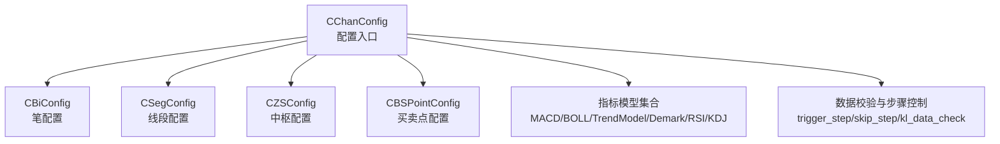
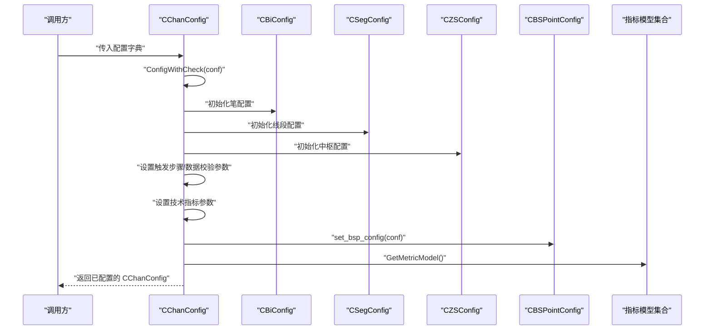
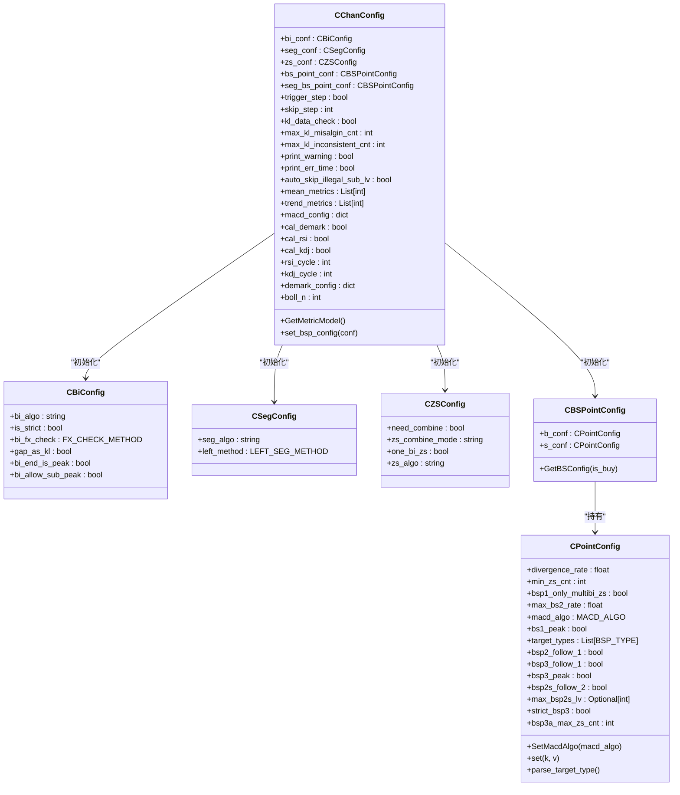
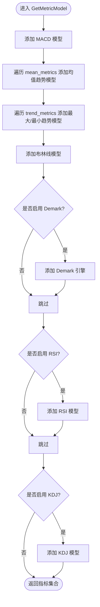
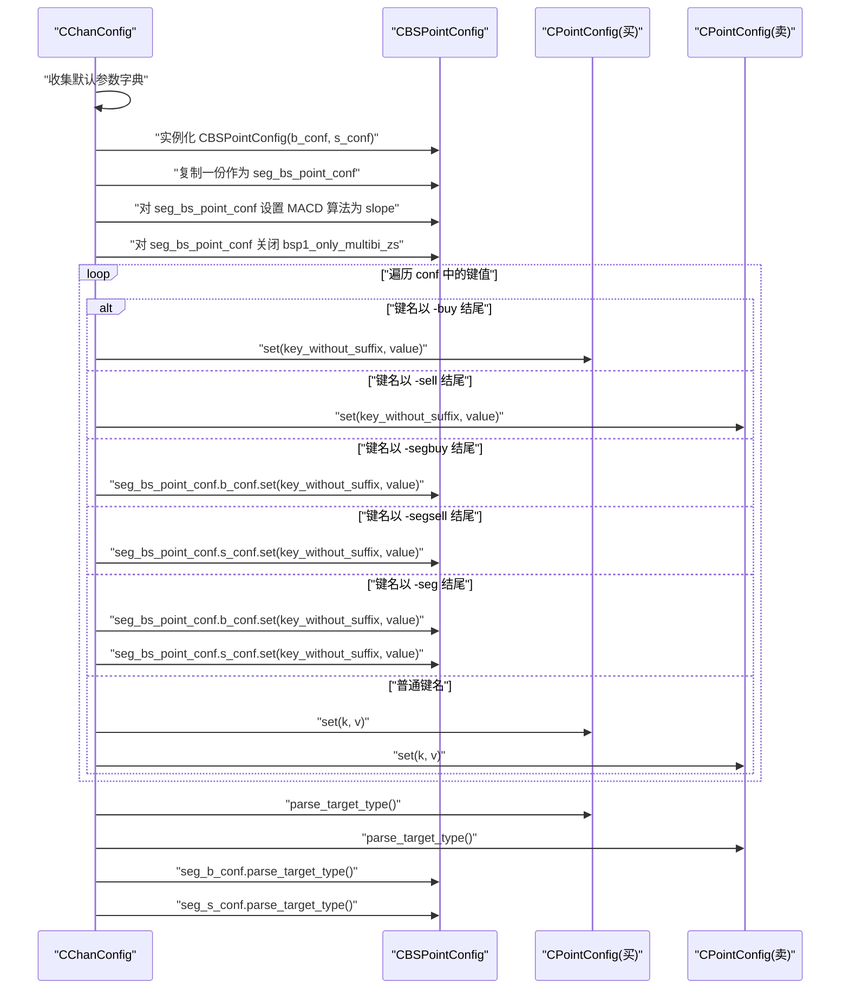
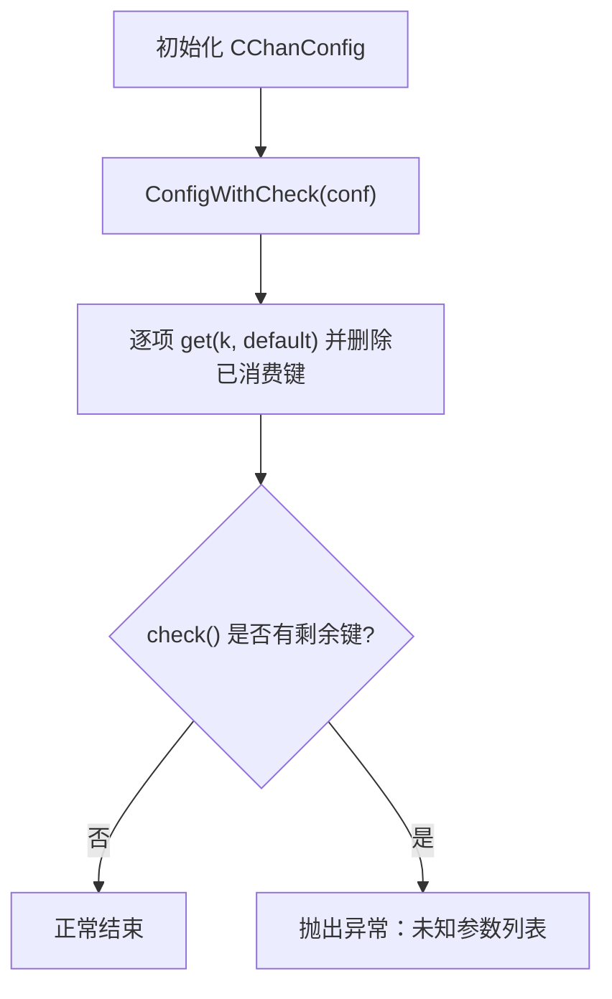
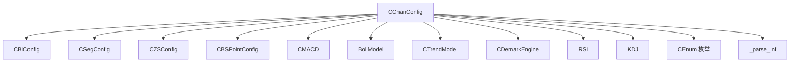

# 配置管理

<cite>
**本文引用的文件**
- [ChanConfig.py](file://ChanConfig.py)
- [BiConfig.py](file://Bi/BiConfig.py)
- [SegConfig.py](file://Seg/SegConfig.py)
- [ZSConfig.py](file://ZS/ZSConfig.py)
- [BSPointConfig.py](file://BuySellPoint/BSPointConfig.py)
- [CEnum.py](file://Common/CEnum.py)
- [MACD.py](file://Math/MACD.py)
- [BOLL.py](file://Math/BOLL.py)
- [TrendModel.py](file://Math/TrendModel.py)
- [Demark.py](file://Math/Demark.py)
- [KDJ.py](file://Math/KDJ.py)
- [RSI.py](file://Math/RSI.py)
- [README.md](file://README.md)
</cite>

## 目录
1. [简介](#简介)
2. [项目结构](#项目结构)
3. [核心组件](#核心组件)
4. [架构总览](#架构总览)
5. [详细组件分析](#详细组件分析)
6. [依赖关系分析](#依赖关系分析)
7. [性能考量](#性能考量)
8. [故障排查指南](#故障排查指南)
9. [结论](#结论)
10. [附录](#附录)

## 简介
本节面向“配置管理”的主题，围绕 CChanConfig 类展开，它是所有配置的入口与中枢。文档将系统性说明：
- 如何通过字典参数初始化 CChanConfig
- 所有可配置项的分类与作用：缠论计算（笔、线段、中枢、买卖点）、技术指标（MACD、BOLL、RSI、KDJ、Demark）、数据校验与自定义策略
- CChanConfig 如何将配置分发给 CBiConfig、CSegConfig、CZSConfig、CBSPointConfig 等子配置对象
- 提供一个完整的配置示例，并逐项解释关键参数的作用

## 项目结构
配置体系以 CChanConfig 为核心，向下拆分到笔、线段、中枢、买卖点等子配置对象，同时集成各类技术指标与数据校验策略。下图给出概念性结构示意（非代码映射）：

[无图表来源：该图为概念结构示意，不直接映射具体源码文件]

## 核心组件
- CChanConfig：负责接收顶层配置字典，构造各子配置对象，并按需构建指标模型集合；提供参数校验与错误提示。
- CBiConfig：封装笔计算相关的算法与规则选项。
- CSegConfig：封装线段计算算法与左段处理方式。
- CZSConfig：封装中枢合并、算法与模式等选项。
- CBSPointConfig：封装买卖点规则、MACD算法、目标类型等，并支持对“笔”和“线段”买卖点分别设置。

**章节来源**
- file://ChanConfig.py#L18-L161
- file://Bi/BiConfig.py#L5-L31
- file://Seg/SegConfig.py#L5-L14
- file://ZS/ZSConfig.py#L1-L7
- file://BuySellPoint/BSPointConfig.py#L7-L82

## 架构总览
下图展示 CChanConfig 在初始化时如何将配置分发到各子配置对象，并构建指标模型集合：

**图表来源**
- [ChanConfig.py](file://ChanConfig.py#L18-L161)

**章节来源**
- file://ChanConfig.py#L18-L161

## 详细组件分析

### CChanConfig 初始化与参数分发
- 初始化入口：接收配置字典 conf，若为 None 则使用空字典；随后通过 ConfigWithCheck 对字典进行“消费式”读取与校验。
- 子配置对象：
  - 笔配置：CBiConfig
  - 线段配置：CSegConfig
  - 中枢配置：CZSConfig
- 技术指标与数据校验：
  - 指标：MACD、均线、布林、趋势极值、RSI、KDJ、Demark
  - 数据校验：trigger_step、skip_step、kl_data_check、max_kl_misalgin_cnt、max_kl_inconsistent_cnt、print_warning、print_err_time、auto_skip_illegal_sub_lv
- 买卖点配置：set_bsp_config，支持对“笔”和“线段”买卖点分别设置，以及对“买/卖/线段买/线段卖/线段”统一设置的后缀语法。

**图表来源**
- [ChanConfig.py](file://ChanConfig.py#L18-L161)
- [BiConfig.py](file://Bi/BiConfig.py#L5-L31)
- [SegConfig.py](file://Seg/SegConfig.py#L5-L14)
- [ZSConfig.py](file://ZS/ZSConfig.py#L1-L7)
- [BSPointConfig.py](file://BuySellPoint/BSPointConfig.py#L7-L82)
- [CEnum.py](file://Common/CEnum.py#L57-L116)

**章节来源**
- file://ChanConfig.py#L18-L161
- file://BuySellPoint/BSPointConfig.py#L7-L82

### 技术指标模型构建流程
CChanConfig.GetMetricModel 依据配置字典动态构建指标模型集合，包括：
- MACD：周期参数来自 macd_config
- 均线与趋势极值：来自 mean_metrics 与 trend_metrics
- 布林线：来自 boll_n
- Demark：当 cal_demark 为真时启用
- RSI：当 cal_rsi 为真时启用
- KDJ：当 cal_kdj 为真时启用

**图表来源**
- [ChanConfig.py](file://ChanConfig.py#L75-L103)
- [MACD.py](file://Math/MACD.py#L14-L30)
- [BOLL.py](file://Math/BOLL.py#L16-L29)
- [TrendModel.py](file://Math/TrendModel.py#L5-L23)
- [Demark.py](file://Math/Demark.py#L129-L155)
- [RSI.py](file://Math/RSI.py#L1-L39)
- [KDJ.py](file://Math/KDJ.py#L8-L35)

**章节来源**
- file://ChanConfig.py#L75-L103
- file://Math/MACD.py#L14-L30
- file://Math/BOLL.py#L16-L29
- file://Math/TrendModel.py#L5-L23
- file://Math/Demark.py#L129-L155
- file://Math/RSI.py#L1-L39
- file://Math/KDJ.py#L8-L35

### 买卖点配置的“后缀语法”与分发机制
CChanConfig.set_bsp_config 支持对“笔”和“线段”买卖点分别设置，语法如下：
- 仅键名：对“笔”和“线段”买卖点同时生效
- 键名后缀 -buy：仅对“笔”买点生效
- 键名后缀 -sell：仅对“笔”卖点生效
- 键名后缀 -segbuy：仅对“线段”买点生效
- 键名后缀 -segsell：仅对“线段”卖点生效
- 键名后缀 -seg：对“线段”买卖点同时生效

此外，线段买卖点的 MACD 算法默认被强制设置为“斜率”，并针对“线段”买卖点关闭“仅多笔中枢”约束。

**图表来源**
- [ChanConfig.py](file://ChanConfig.py#L105-L159)
- [BSPointConfig.py](file://BuySellPoint/BSPointConfig.py#L16-L82)
- [CEnum.py](file://Common/CEnum.py#L57-L67)

**章节来源**
- file://ChanConfig.py#L105-L159
- file://BuySellPoint/BSPointConfig.py#L16-L82

### 参数校验与错误处理
- ConfigWithCheck.get：从字典中取出键值并从字典中删除，避免重复或遗漏
- ConfigWithCheck.check：若仍有未消费的键，抛出异常，提示无效参数
- CChanConfig.__init__：在初始化末尾调用 check，确保所有键都被正确识别

**图表来源**
- [ChanConfig.py](file://ChanConfig.py#L162-L184)

**章节来源**
- file://ChanConfig.py#L162-L184

## 依赖关系分析
- CChanConfig 依赖：
  - Bi/BiConfig、Seg/SegConfig、ZS/ZSConfig、BuySellPoint/BSPointConfig：用于封装子模块的配置
  - Common/CEnum：提供枚举类型（如 FX_CHECK_METHOD、LEFT_SEG_METHOD、BSP_TYPE、MACD_ALGO、TREND_TYPE）
  - Math/*：提供指标模型类（MACD、BOLL、TrendModel、Demark、RSI、KDJ）
  - Common/func_util：提供 _parse_inf 用于解析特殊值（如 inf）

**图表来源**
- [ChanConfig.py](file://ChanConfig.py#L1-L17)
- [CEnum.py](file://Common/CEnum.py#L57-L116)

**章节来源**
- file://ChanConfig.py#L1-L17
- file://Common/CEnum.py#L57-L116

## 性能考量
- 指标模型数量与复杂度：指标越多，每根 K 线的计算量越大。建议仅启用必要的指标（如仅启用 MACD 或布林线）。
- 触发步骤与回放：trigger_step 为 True 时，CChan 会以生成器形式逐步返回，适合动画回放，但会增加 CPU 与内存压力。
- 数据校验：kl_data_check 会引入额外的校验成本，建议在生产环境中按需开启。
- 线段买卖点的 MACD 算法默认改为 slope，有助于提升稳定性与速度。

[本节为通用指导，无需章节来源]

## 故障排查指南
- 无效参数：若传入了未识别的键，初始化时会在 check 阶段抛出异常，提示无效参数列表。请核对键名拼写与后缀语法。
- 买卖点 MACD 算法：若使用线段买卖点，请确认已正确设置 macd_algo 为 slope（框架已默认处理）。
- Demark 配置：若启用 Demark，请确保 demark_len、setup_bias、countdown_bias、max_countdown 等参数合理，避免过长序列导致计算延迟。
- RSI/KDJ 周期：rsi_cycle、kdj_cycle 过大将增加内存占用与计算时间，建议结合实际需求选择合适周期。

**章节来源**
- file://ChanConfig.py#L162-L184
- file://Math/Demark.py#L129-L155
- file://Math/RSI.py#L1-L39
- file://Math/KDJ.py#L8-L35

## 结论
CChanConfig 作为配置入口，通过清晰的参数分发与严格的参数校验，将缠论计算、技术指标与数据校验有机整合。借助 CBSPointConfig 的“后缀语法”，用户可以灵活地对“笔”和“线段”买卖点分别设置规则。建议在保证业务需求的前提下，尽量减少不必要的指标与校验，以获得更佳的性能表现。

[本节为总结，无需章节来源]

## 附录

### 完整配置示例与关键参数说明
以下是一个完整的配置示例，展示了如何通过字典初始化 CChanConfig，并逐项解释关键参数的作用（来源于 README 的配置说明与代码注释）：

- 中枢相关
  - zs_combine：是否进行中枢合并，默认为 True
  - zs_combine_mode：中枢合并模式，取值为“zs”或“peak”
  - one_bi_zs：是否需要计算只有一笔的中枢，默认为 False
  - zs_algo：中枢算法，取值为 normal/over_seg/auto

- 笔相关
  - bi_algo：笔算法，取值为 normal/fx，默认 normal
  - bi_strict：是否只用严格笔（bi_algo=normal 时有效），默认 True
  - gap_as_kl：缺口是否处理成一根 K 线，默认 True
  - bi_end_is_peak：笔的尾部是否是整笔中最低/最高，默认 True
  - bi_fx_check：检查笔顶底分形是否成立的方法，取值为 strict/totally/loss/half，默认 strict

- 线段相关
  - seg_algo：线段计算方法，取值为 chan/1+1/break，默认 chan
  - left_seg_method：剩余笔如何处理成段，取值为 all/peak，默认 peak

- 技术指标
  - mean_metrics：均线计算周期列表，默认 []
  - trend_metrics：计算上下轨道线周期列表，默认 []
  - boll_n：布林线参数 N，默认 20
  - macd：MACD 配置，包含 fast/slow/signal，默认 fast=12、slow=26、signal=9
  - cal_demark：是否计算 Demark 指标，默认 False
  - demark：Demark 指标配置，包含 demark_len/setup_bias/countdown_bias/max_countdown/tiaokong_st/setup_cmp2close/countdown_cmp2close
  - cal_rsi：是否计算 RSI，默认 False
  - rsi_cycle：RSI 计算周期，默认 14
  - cal_kdj：是否计算 KDJ，默认 False
  - kdj_cycle：KDJ 计算周期，默认 9

- 数据校验与步骤控制
  - trigger_step：是否回放逐步返回，默认 False
  - skip_step：trigger_step 为 True 时有效，指定跳过前面几根 K 线，默认 0
  - kl_data_check：是否需要检验 K 线数据，默认 True
  - max_kl_misalgin_cnt：次级别找不到 K 线最大条数，默认 2
  - max_kl_inconsistent_cnt：天 K 线以下（含）子级别与父级别日期不一致最大允许条数，默认 5
  - print_warning：打印 K 线不一致的明细，默认 True
  - print_err_time：计算发生错误时打印因何时间的 K 线数据导致，默认 False
  - auto_skip_illegal_sub_lv：如果获取次级别数据失败，自动删除该级别，默认 False

- 买卖点相关
  - divergence_rate：1 类买卖点背驰比例，默认 0.9
  - min_zs_cnt：1 类买卖点至少要经历几个中枢，默认 1
  - bsp1_only_multibi_zs：min_zs_cnt 计算的中枢至少 3 笔（少于 3 笔是因为开启了 one_bi_zs），默认 True
  - max_bs2_rate：2 类买卖点那一笔回撤最大比例，默认 0.9999
  - bs1_peak：1 类买卖点位置是否必须是整个中枢最低点，默认 True
  - macd_algo：MACD 指标算法，取值为 peak/full_area/area/slope/amp/diff/amount/volumn/amount_avg/volumn_avg/turnrate_avg/rsi，默认 peak
  - bs_type：关注的买卖点类型，逗号分隔，默认“1,1p,2,2s,3a,3b”
  - bsp2_follow_1：2 类买卖点是否必须跟在 1 类买卖点后面，默认 True
  - bsp3_follow_1：3 类买卖点是否必须跟在 1 类买卖点后面，默认 True
  - bsp3_peak：3 类买卖点突破笔是否必须突破中枢里最高/最低，默认 False
  - bsp3a_max_zs_cnt：3 类买卖点最多可以跨越多少个中枢，默认 1
  - bsp2s_follow_2：2 类买卖点是否必须跟在 2 类买卖点后面，默认 False
  - max_bsp2s_lv：2 类买卖点最大层级，默认 None
  - strict_bsp3：3 类买卖点对应的中枢必须紧挨着 1 类买卖点，默认 False

- 自定义策略相关
  - cbsp_strategy：自定义策略类，默认 None
  - strategy_para：传递给自定义买卖点的参数，字典，默认 {}
  - only_judge_last：只计算最后一根 K 线的买卖点类型/买卖点信号，默认 False
  - cal_cover：是否计算平仓，默认 True
  - cbsp_check_active：cbsp 开仓是否需要满足交易活跃度指标，默认 True
  - print_inactive_reason：是否打印股票不活跃原因，默认 False
  - stock_no_active_day：不活跃股票计算检测最近多少根 K 线，默认 30
  - stock_no_active_thred：stock_no_active_day 根 K 线内一字线超过阈值则定义为不活跃，默认 3
  - stock_distinct_price_thred：stock_no_active_day 根 K 线内股价多样性低于多少则定义为不活跃，默认 25

- 后缀语法（对买卖点/线段买卖点分别设置）
  - 后缀 -buy：对“笔”买点生效
  - 后缀 -sell：对“笔”卖点生效
  - 后缀 -segbuy：对“线段”买点生效
  - 后缀 -segsell：对“线段”卖点生效
  - 后缀 -seg：对“线段”买卖点同时生效

**章节来源**
- file://README.md#L562-L718
- file://ChanConfig.py#L18-L161
- file://BuySellPoint/BSPointConfig.py#L16-L82