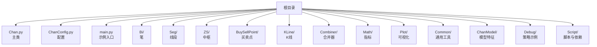
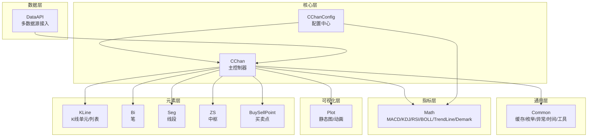
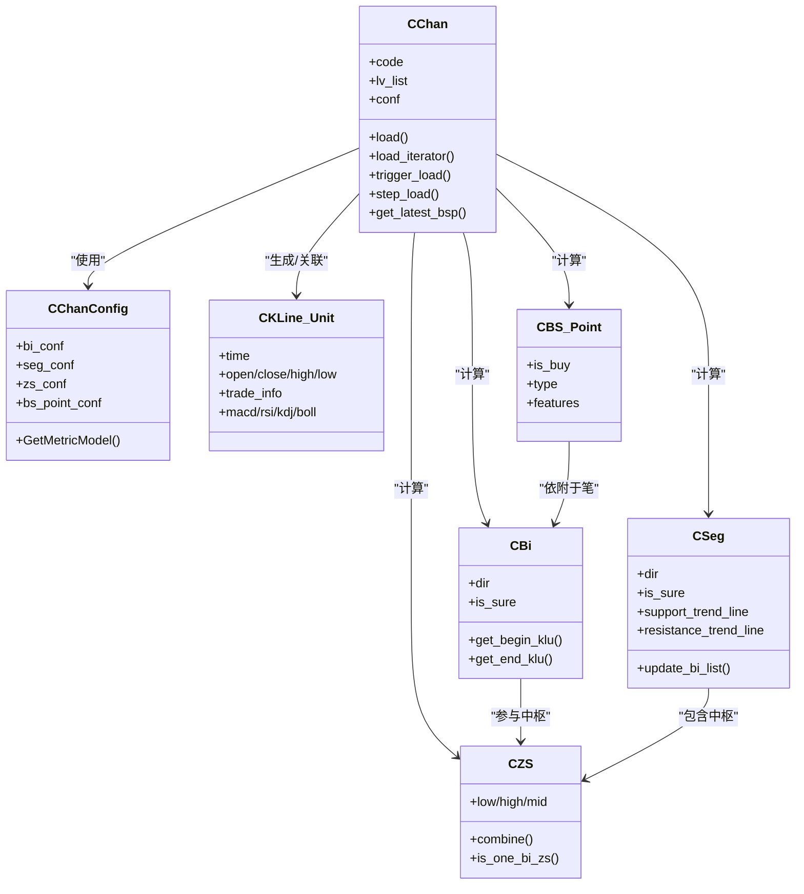
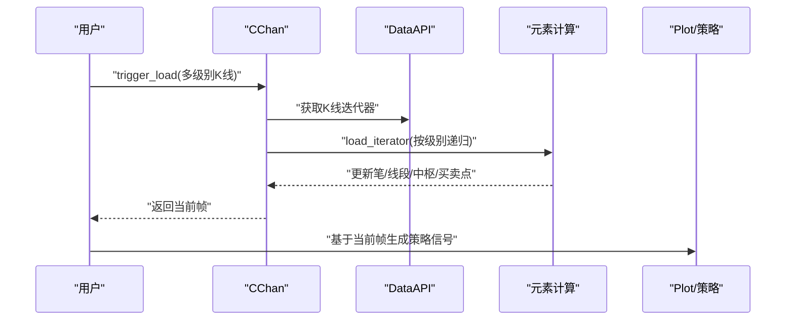
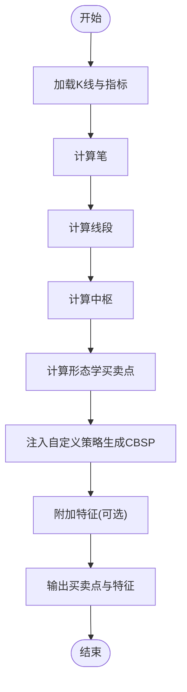
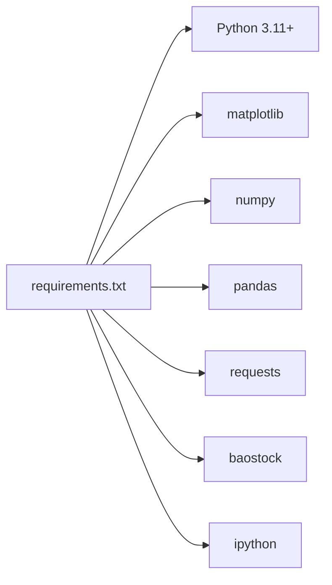

# 项目概述

<cite>
**本文引用的文件**
- [README.md](file://README.md)
- [quick_guide.md](file://quick_guide.md)
- [CLAUDE.md](file://CLAUDE.md)
- [Chan.py](file://Chan.py)
- [ChanConfig.py](file://ChanConfig.py)
- [main.py](file://main.py)
- [Bi.py](file://Bi/Bi.py)
- [Seg.py](file://Seg/Seg.py)
- [ZS.py](file://ZS/ZS.py)
- [BS_Point.py](file://BuySellPoint/BS_Point.py)
- [CEnum.py](file://Common/CEnum.py)
- [cache.py](file://Common/cache.py)
- [requirements.txt](file://Script/requirements.txt)
</cite>

## 目录
1. [简介](#简介)
2. [项目结构](#项目结构)
3. [核心组件](#核心组件)
4. [架构总览](#架构总览)
5. [详细组件分析](#详细组件分析)
6. [依赖关系分析](#依赖关系分析)
7. [性能考量](#性能考量)
8. [故障排查指南](#故障排查指南)
9. [结论](#结论)
10. [附录](#附录)

## 简介
chan.py 是一个基于缠论理论的 Python 量化交易技术分析框架。项目目标是提供完整的缠论分析工具链，覆盖分形、笔、线段、中枢、买卖点等核心元素的静态与增量计算，并支持策略开发、特征提取、机器学习模型集成以及线上交易对接。  
开源版本聚焦“静态计算能力”，涵盖笔、线段、中枢、买卖点的计算与可视化，以及多级别联立、指标扩展、逐步回放等能力；策略、模型、AutoML、交易引擎等完整版能力在开源说明中明确标注为“不包含”。

- 目标用户
  - 量化研究者：需要稳定、可扩展的缠论静态计算与可视化
  - 策略开发者：基于框架提供的元素与接口，构建自定义买卖点策略与回测
  - 机器学习工程师：基于框架特征体系，接入 XGBoost/LightGBM/MLP 等模型
  - 交易系统对接者：参考交易模块接口，对接富途等交易引擎

- 核心功能
  - 缠论基本元素计算：分形、笔、线段、中枢、买卖点（形态学 BSP 与动力学 CBSP）
  - 多级别联立：支持日线、60 分钟、30 分钟、15 分钟、5 分钟、1 分钟等多级别联立
  - 指标扩展：MACD、KDJ、RSI、布林带、趋势线等指标可插拔接入
  - 可视化：Matplotlib 驱动的静态图与逐步回放动画
  - 策略开发：提供逐步回放与外部喂K线能力，支持增量更新与策略回测
  - 机器学习：提供特征注册与模型接入接口（完整版包含模型训练与评估）
  - 交易对接：提供交易引擎接口与数据库封装（完整版包含自动交易）

- 项目徽标与功能列表
  - 徽标：项目 README 中包含 SVG 徽标
  - 功能列表：详见“功能介绍”章节与“快速上手指南”

- 开源理念与版本差异
  - 开源部分：静态计算、多级别联立、指标扩展、可视化、逐步回放、策略演示
  - 不包含：策略、模型、AutoML、交易引擎（完整版包含）
  - 说明：README 明确开源版约 5300 行，完整版约 22000 行

- 学习路径建议（面向初学者）
  1) 环境准备：Python 3.11+，安装依赖
  2) 快速体验：运行 main.py，查看静态图与动画
  3) 理解核心类：CChan、CChanConfig、CKLine_Unit、CBi、CSeg、CZS、CBS_Point
  4) 配置与参数：重点掌握 CChanConfig 的买卖点与线段配置
  5) 指标扩展：参考 quick_guide 的指标添加步骤
  6) 策略开发：使用 trigger_step 与 step_load 实现逐步回放与增量策略
  7) 机器学习：参考 machinelearning 分支的 demo（主分支不含 ML 特征）
  8) 交易对接：参考交易模块接口与配置（完整版包含）

**章节来源**
- file://README.md#L1-L120
- file://quick_guide.md#L69-L101
- file://README.md#L91-L134

## 项目结构
项目采用按“领域/功能”分层的目录组织方式，核心模块包括数据接入、K线处理、分形合并、笔/线段/中枢、买卖点、数学指标、可视化、通用工具、模型与策略、交易引擎等。

**图表来源**
- [README.md](file://README.md#L136-L306)

**章节来源**
- file://README.md#L136-L306

## 核心组件
- CChan：缠论主类，负责多级别数据加载、K线父子关系建立、笔/线段/中枢/买卖点的计算与更新，支持静态计算与逐步回放
- CChanConfig：统一配置入口，涵盖笔/线段/中枢/买卖点/指标/数据校验等参数
- CKLine_Unit：单根K线，承载时间、价格、成交量、换手率、指标等
- CBi/CSeg/CZS/CBS_Point：笔/线段/中枢/买卖点实体，提供方向、确定性、特征序列、趋势线等能力
- DataAPI：多数据源接入（baostock、ccxt、csv、富途等）
- Plot：Matplotlib 驱动的静态图与动画回放
- Common：缓存装饰器、枚举、异常、时间、工具函数等

**章节来源**
- file://Chan.py#L1-L120
- file://ChanConfig.py#L1-L120
- file://Bi/Bi.py#L1-L120
- file://Seg/Seg.py#L1-L120
- file://ZS/ZS.py#L1-L120
- file://BuySellPoint/BS_Point.py#L1-L39
- file://Common/CEnum.py#L1-L130
- file://Common/cache.py#L1-L35

## 架构总览
chan.py 采用“分层+模块化”的架构设计，围绕 CChan 主类组织数据流与控制流，通过配置驱动各模块行为，支持多级别联立与逐步回放。

**图表来源**
- [CLAUDE.md](file://CLAUDE.md#L22-L64)
- [Chan.py](file://Chan.py#L1-L120)
- [ChanConfig.py](file://ChanConfig.py#L1-L120)

## 详细组件分析

### CChan 主类与 MVC/工厂/观察者/策略模式
- MVC 角色映射
  - Model：CChanConfig、CKLine_Unit、CBi、CSeg、CZS、CBS_Point 等实体模型
  - View：PlotDriver/AnimatePlotDriver 提供图形视图
  - Controller：CChan 负责数据加载、级别联立、元素计算与更新
- 工厂模式
  - CChan.GetStockAPI：根据数据源枚举或自定义字符串，动态选择数据源类
  - CChanConfig.GetMetricModel：根据配置动态装配指标模型列表
- 观察者模式
  - 元素链式结构（pre/next）与父子关系（parent/children）体现观察与传播
  - 逐步回放时，外部通过迭代器观察当前帧的元素变化
- 策略模式
  - 买卖点策略：通过配置注入自定义策略类（如 CCustomStrategy/CSegBspStrategy），在每根新K线到来时判断是否形成新的 CBSP
  - 线段算法：通过配置选择不同线段算法（缠论特征序列、1+1 突破、破坏定义等）

**图表来源**
- [Chan.py](file://Chan.py#L1-L220)
- [ChanConfig.py](file://ChanConfig.py#L1-L120)
- [Bi.py](file://Bi/Bi.py#L1-L120)
- [Seg.py](file://Seg/Seg.py#L1-L120)
- [ZS.py](file://ZS/ZS.py#L1-L120)
- [BS_Point.py](file://BuySellPoint/BS_Point.py#L1-L39)

**章节来源**
- file://Chan.py#L1-L220
- file://ChanConfig.py#L1-L120
- file://Bi/Bi.py#L1-L120
- file://Seg/Seg.py#L1-L120
- file://ZS/ZS.py#L1-L120
- file://BuySellPoint/BS_Point.py#L1-L39

### 逐步回放与增量更新流程（策略模式）
- 触发机制：CChan.trigger_load 输入多级别 K 线，驱动元素重算
- 逐步回放：CChan.step_load 返回生成器，每喂入一根 K 线返回当前帧状态
- 增量更新：仅对不确定元素进行局部重算，提升性能

**图表来源**
- [Chan.py](file://Chan.py#L120-L220)
- [quick_guide.md](file://quick_guide.md#L446-L479)

**章节来源**
- file://Chan.py#L120-L220
- file://quick_guide.md#L446-L479

### 买卖点计算与特征体系（形态学 BSP 与动力学 CBSP）
- 形态学 BSP：基于笔/线段的定义与背驰算法，计算确定性买卖点
- 动力学 CBSP：通过自定义策略类在每根新K线到来时判断是否形成新的买卖点
- 特征体系：支持为买卖点附加特征，便于机器学习打分（完整版提供特征注册与模型）

**图表来源**
- [quick_guide.md](file://quick_guide.md#L481-L556)
- [BS_Point.py](file://BuySellPoint/BS_Point.py#L1-L39)

**章节来源**
- file://quick_guide.md#L481-L556
- file://BuySellPoint/BS_Point.py#L1-L39

### 多级别联立与数据校验
- 级别顺序：lv_list 从高到低传入，确保父子级别对齐
- 数据校验：父/子级别时间一致性检查、次级别缺失条数上限控制
- 自动跳过：非法子级别自动跳过，避免中断

**章节来源**
- file://Chan.py#L1-L120
- file://Chan.py#L220-L377

## 依赖关系分析
- 语言与运行时：Python 3.11+，Matplotlib、NumPy、Pandas、Requests、IPython、baostock
- 关键依赖：baostock（数据源）、matplotlib（绘图）、numpy/pandas（数值与数据处理）

**图表来源**
- [requirements.txt](file://Script/requirements.txt#L1-L6)

**章节来源**
- file://Script/requirements.txt#L1-L6

## 性能考量
- 缓存装饰器：make_cache 通过实例级缓存减少重复计算
- 增量更新：逐步回放与外部喂K线仅重算不确定元素，降低计算成本
- 指标计算：优先采用增量指标计算，避免全量重算
- 递归与序列化：pickle 时清理链式指针，避免递归溢出

**章节来源**
- file://Common/cache.py#L1-L35
- file://Chan.py#L300-L377
- file://quick_guide.md#L192-L206

## 故障排查指南
- 运行报错：确认 Python 3.11+，依赖安装
- 画图无输出：在 Jupyter 或代码末尾添加阻塞
- 信号消失：买卖点为“当前帧”下的形态学结果，随K线新增可能变化
- 动画内存占用高：动态图存在内存泄漏，建议使用静态图
- 递归溢出：使用框架提供的序列化/反序列化方法
- K线时间错误：天级别以下 K 线时间需设置 auto=False
- 线段画法不一致：可开启特征序列绘图辅助理解

**章节来源**
- file://quick_guide.md#L153-L218
- file://quick_guide.md#L192-L206
- file://quick_guide.md#L214-L218

## 结论
chan.py 以清晰的分层架构与模块化设计，提供了稳定可靠的缠论静态计算能力与可扩展的策略开发平台。开源版本聚焦基础元素与可视化，完整版在策略、模型、AutoML、交易引擎方面提供更完整的落地能力。对于初学者，建议从 main.py 快速体验入手，逐步掌握配置、指标扩展与策略开发，最终结合机器学习与交易对接实现闭环。

[无需来源：总结性内容]

## 附录
- 项目徽标：README 中包含 SVG 徽标
- 快速上手：参考 quick_guide.md 的“如何开始”与“不可绕过的步骤”
- 机器学习分支：machinelearning 分支提供特征与模型演示（主分支不含 ML 特征）

**章节来源**
- file://README.md#L1-L40
- file://quick_guide.md#L103-L170
- file://quick_guide.md#L536-L556