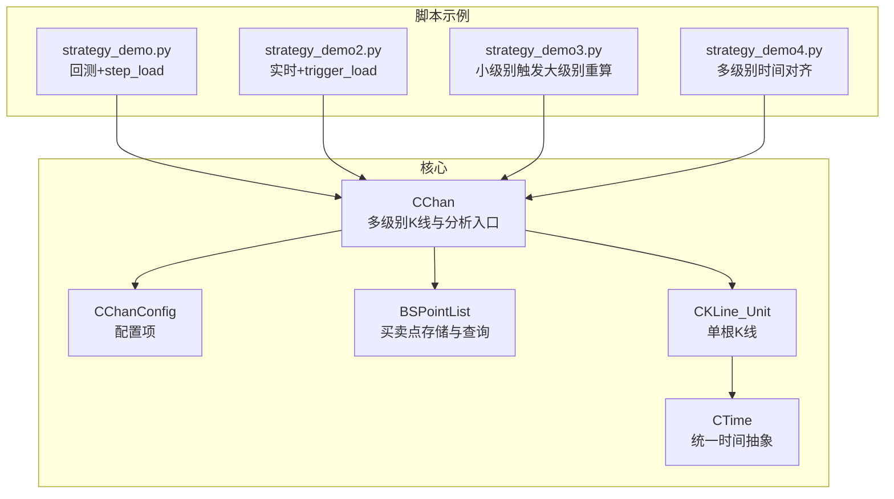
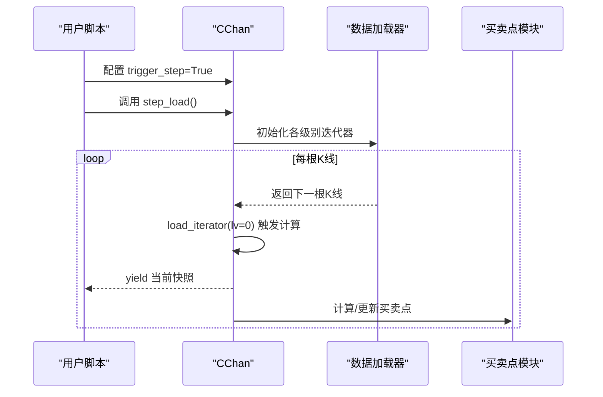
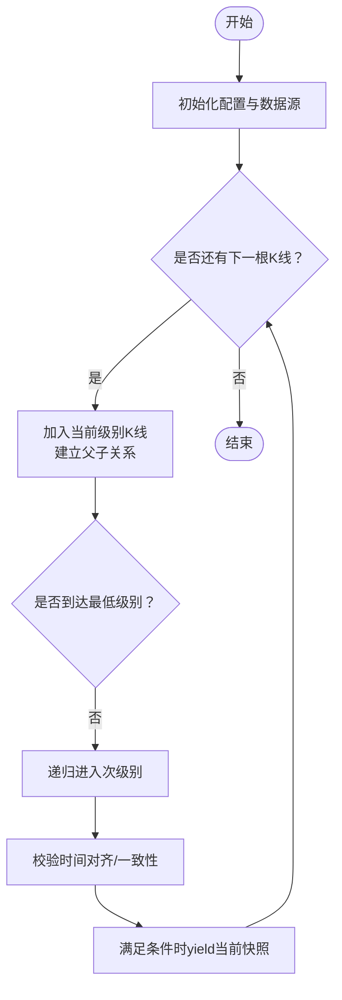
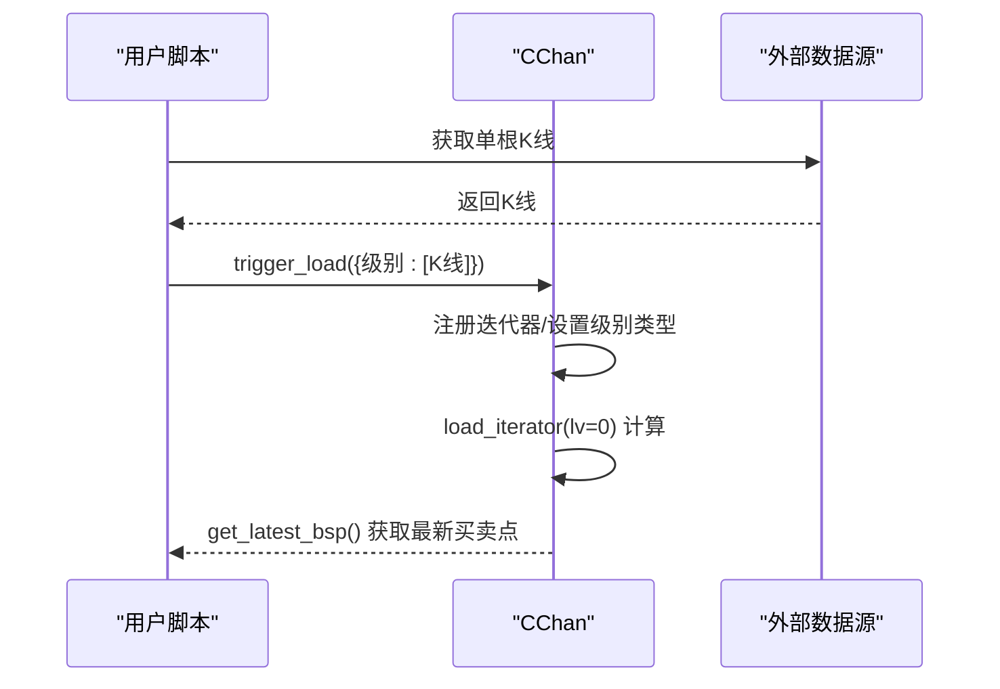
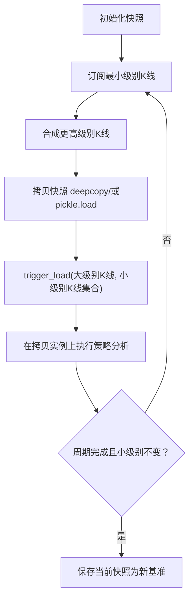
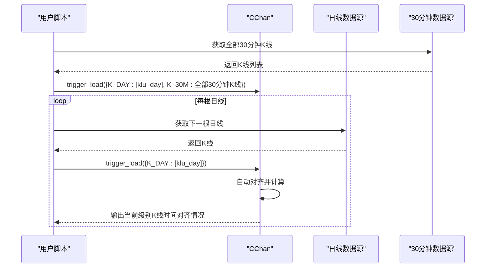
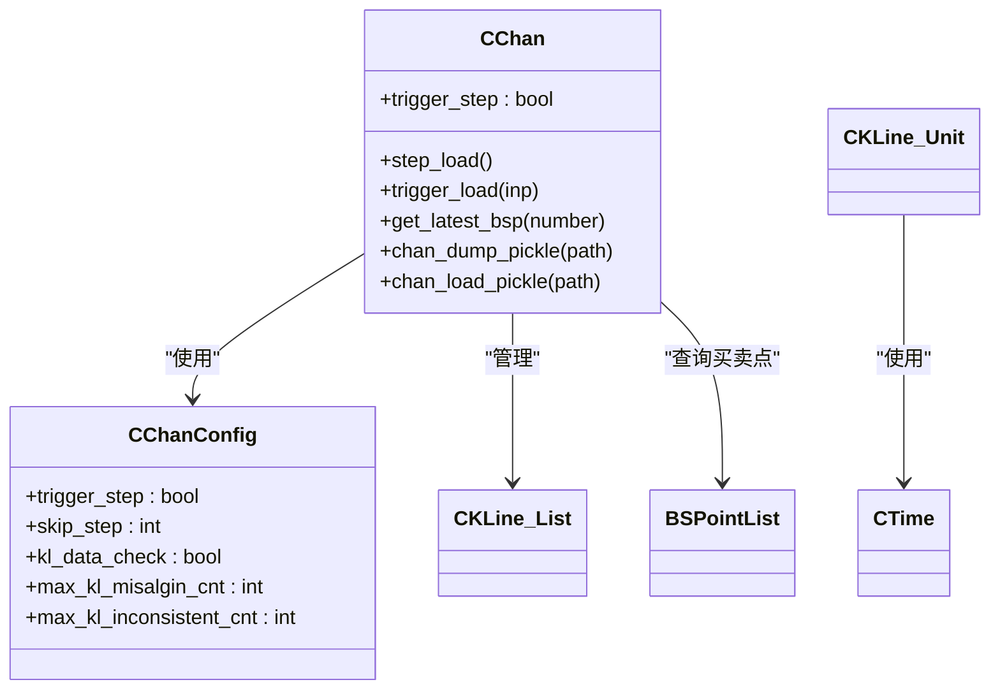

# 高级用法

<cite>
**本文引用的文件**
- [Chan.py](file://Chan.py)
- [ChanConfig.py](file://ChanConfig.py)
- [strategy_demo.py](file://Debug/strategy_demo.py)
- [strategy_demo2.py](file://Debug/strategy_demo2.py)
- [strategy_demo3.py](file://Debug/strategy_demo3.py)
- [strategy_demo4.py](file://Debug/strategy_demo4.py)
- [BSPointList.py](file://BuySellPoint/BSPointList.py)
- [KLine_Unit.py](file://KLine/KLine_Unit.py)
- [CTime.py](file://Common/CTime.py)
</cite>

## 目录
1. [简介](#简介)
2. [项目结构与核心组件](#项目结构与核心组件)
3. [核心组件](#核心组件)
4. [架构总览](#架构总览)
5. [详细组件分析](#详细组件分析)
6. [依赖关系分析](#依赖关系分析)
7. [性能与可扩展性](#性能与可扩展性)
8. [故障排查指南](#故障排查指南)
9. [结论](#结论)
10. [附录：示例与最佳实践](#附录示例与最佳实践)

## 简介
本篇“高级用法”聚焦于如何在缠论分析中使用“触发式回测”与“实时信号计算”的两种模式：
- 使用 trigger_step 模式配合 step_load 方法，按根K线增量生成分析快照，适合策略回测与可视化。
- 使用 trigger_load 方法从外部实时喂入K线，驱动内部缠论计算，适合实时信号流。
同时，针对“小级别更新导致大级别重算”的复杂场景，提供基于快照的管理思路（chan_dump_pickle/chan_load_pickle），并通过 Debug 目录下的 strategy_demo 系列脚本给出可直接运行的示例路径，帮助读者快速落地。

## 项目结构与核心组件
- 核心类与入口：CChan 是缠论主控制器，负责多级别K线加载、父子K线关系建立、中枢与线段计算、买卖点识别等；CChanConfig 提供配置项，包括 trigger_step、skip_step、K线一致性校验等。
- 实战脚本：Debug 下的 strategy_demo*.py 展示了从回测到实时、从小级别到多级别的典型用法。
- 买卖点：BSPointList 提供 get_latest_bsp 接口，支持按最新排序取买卖点。
- 数据单元：KLine_Unit 表示单根K线，包含时间、价格、父子关系、指标等。
- 时间工具：CTime 统一时间抽象，确保K线单调性与对齐。

图表来源
- [Chan.py](file://Chan.py#L1-L120)
- [ChanConfig.py](file://ChanConfig.py#L1-L120)
- [BSPointList.py](file://BuySellPoint/BSPointList.py#L376-L386)
- [KLine_Unit.py](file://KLine/KLine_Unit.py#L1-L155)
- [CTime.py](file://Common/CTime.py#L1-L45)
- [strategy_demo.py](file://Debug/strategy_demo.py#L1-L52)
- [strategy_demo2.py](file://Debug/strategy_demo2.py#L1-L59)
- [strategy_demo3.py](file://Debug/strategy_demo3.py#L1-L78)
- [strategy_demo4.py](file://Debug/strategy_demo4.py#L1-L54)

章节来源
- [Chan.py](file://Chan.py#L1-L120)
- [ChanConfig.py](file://ChanConfig.py#L1-L120)
- [strategy_demo.py](file://Debug/strategy_demo.py#L1-L52)
- [strategy_demo2.py](file://Debug/strategy_demo2.py#L1-L59)
- [strategy_demo3.py](file://Debug/strategy_demo3.py#L1-L78)
- [strategy_demo4.py](file://Debug/strategy_demo4.py#L1-L54)

## 核心组件
- CChan.trigger_step 与 step_load
  - 在配置中开启 trigger_step 后，CChan 会在每根K线到达时生成一次静态精算快照，并通过 step_load 迭代返回，便于逐根K线回测或可视化。
  - 关键点：do_init 清空历史状态，load_iterator 在最高级别（lv_idx=0）处遇到新K线即 yield 当前快照；可通过 skip_step 跳过初始不稳定阶段。
- CChan.trigger_load
  - 外部以 {级别: [K线列表]} 的形式喂入K线，内部自动建立迭代器、维护时间单调性与父子关系，并在必要时触发次级别对齐与校验。
  - 关键点：最高级别必须提供数据；若非 trigger_step 模式，会在全部计算完成后统一计算中枢与线段。
- 买卖点接口
  - get_latest_bsp 支持按最新排序取买卖点，number=0 取全部，number>0 取前若干个。
- 快照管理
  - chan_dump_pickle/chan_load_pickle 提供序列化与反序列化，便于保存/恢复分析状态；chan_pickle_restore 重建链表指针，确保对象图完整。

章节来源
- [Chan.py](file://Chan.py#L120-L170)
- [Chan.py](file://Chan.py#L132-L152)
- [Chan.py](file://Chan.py#L235-L269)
- [Chan.py](file://Chan.py#L310-L377)
- [BSPointList.py](file://BuySellPoint/BSPointList.py#L376-L386)

## 架构总览
下图展示了“触发式回测/实时”的两条主线流程，以及“多级别时间对齐”和“小级别触发大级别重算”的关键节点。

图表来源
- [Chan.py](file://Chan.py#L120-L170)
- [Chan.py](file://Chan.py#L193-L212)
- [Chan.py](file://Chan.py#L235-L269)
- [BSPointList.py](file://BuySellPoint/BSPointList.py#L376-L386)

## 详细组件分析

### 组件A：触发式回测（step_load）
- 目标：按根K线生成静态快照，适合策略回测与可视化。
- 关键流程：
  - 开启 trigger_step 后，CChan.do_init 清空历史状态，避免重复回测。
  - load_iterator 在最高级别（lv_idx=0）遇到新K线时，向上递归构建父子关系并触发次级别对齐；当 step=True 时，立即 yield 当前快照。
  - 可通过 skip_step 跳过前若干次快照，规避初期不稳定。
- 实战参考：strategy_demo.py 展示了如何遍历 step_load 的快照，提取最新买卖点并执行简单交易逻辑。

图表来源
- [Chan.py](file://Chan.py#L120-L170)
- [Chan.py](file://Chan.py#L235-L269)
- [strategy_demo.py](file://Debug/strategy_demo.py#L1-L52)

章节来源
- [Chan.py](file://Chan.py#L120-L170)
- [strategy_demo.py](file://Debug/strategy_demo.py#L1-L52)

### 组件B：实时信号计算（trigger_load）
- 目标：从外部实时喂入K线，驱动内部缠论计算，输出最新买卖点。
- 关键流程：
  - 外部以 {级别: [K线列表]} 形式调用 trigger_load，内部为每个级别注册迭代器。
  - load_iterator 保持时间单调性与父子关系，必要时触发次级别对齐与校验。
  - 非 trigger_step 模式下，全部计算完成后统一计算中枢与线段。
- 实战参考：strategy_demo2.py 展示了从数据源逐根K线喂入，调用 trigger_load 并读取最新买卖点。

图表来源
- [Chan.py](file://Chan.py#L132-L152)
- [Chan.py](file://Chan.py#L235-L269)
- [strategy_demo2.py](file://Debug/strategy_demo2.py#L1-L59)

章节来源
- [Chan.py](file://Chan.py#L132-L152)
- [strategy_demo2.py](file://Debug/strategy_demo2.py#L1-L59)

### 组件C：小级别触发大级别重算（快照管理）
- 场景：当小级别K线更新时，需要刷新大级别的中枢/线段/买卖点，但又不想每次都全量重算。
- 方案：
  - 使用 deepcopy 或 pickle 快照保存当前完整分析状态。
  - 小级别更新后，拷贝快照并在其上触发大级别K线，得到“局部重算”的结果。
  - 当某周期内小级别K线不再变化时，将当前快照作为新的基准快照，减少后续重算成本。
- 实战参考：strategy_demo3.py 展示了将最小级别K线合成更高级别K线后，对快照进行拷贝并触发大级别K线，随后在合适时机更新快照。

图表来源
- [Chan.py](file://Chan.py#L55-L83)
- [Chan.py](file://Chan.py#L310-L377)
- [strategy_demo3.py](file://Debug/strategy_demo3.py#L1-L78)

章节来源
- [Chan.py](file://Chan.py#L55-L83)
- [Chan.py](file://Chan.py#L310-L377)
- [strategy_demo3.py](file://Debug/strategy_demo3.py#L1-L78)

### 组件D：多级别时间对齐（trigger_load 多级别）
- 场景：同时喂入多个级别（如日线与30分钟线），需要自动对齐。
- 方案：在喂入第一根最大级别K线时，一次性将该最大级别之前的所有次级别K线都喂入；之后只需喂入最大级别K线，框架会自动根据最大级别K线的时间截取对应的次级别K线。
- 实战参考：strategy_demo4.py 展示了先一次性喂入全部30分钟K线，再逐根喂入日线，并打印当前各级别K线时间，验证对齐效果。

图表来源
- [Chan.py](file://Chan.py#L132-L152)
- [strategy_demo4.py](file://Debug/strategy_demo4.py#L1-L54)

章节来源
- [strategy_demo4.py](file://Debug/strategy_demo4.py#L1-L54)

## 依赖关系分析
- CChan 依赖：
  - 数据源工厂：根据配置选择具体数据源类（如 BaoStock、CSV、CCXT 或自定义）。
  - 多级别K线容器：CKLine_List，承载每级别的K线序列、中枢、线段、买卖点等。
  - 买卖点模块：BSPointList 提供买卖点存储与查询。
  - 时间工具：CTime 统一时间比较与单调性校验。
- 配置依赖：
  - CChanConfig 控制 trigger_step、skip_step、K线一致性检查阈值、买卖点算法参数等。

图表来源
- [Chan.py](file://Chan.py#L1-L120)
- [Chan.py](file://Chan.py#L288-L309)
- [ChanConfig.py](file://ChanConfig.py#L1-L120)
- [KLine_Unit.py](file://KLine/KLine_Unit.py#L1-L155)
- [BSPointList.py](file://BuySellPoint/BSPointList.py#L376-L386)

章节来源
- [Chan.py](file://Chan.py#L1-L120)
- [ChanConfig.py](file://ChanConfig.py#L1-L120)
- [KLine_Unit.py](file://KLine/KLine_Unit.py#L1-L155)
- [BSPointList.py](file://BuySellPoint/BSPointList.py#L376-L386)

## 性能与可扩展性
- 回放模式 vs 实时模式
  - 回放模式（trigger_step=True）逐根K线生成快照，适合离线分析与可视化；可通过 skip_step 避免早期不稳定。
  - 实时模式（trigger_step=False）在全部计算完成后统一计算中枢与线段，适合批量处理。
- 对齐与校验
  - 通过 CTime 单调性检查与次级别缺失校验，保障多级别K线一致性；可调阈值避免误报。
- 快照与序列化
  - deepcopy 适合内存内快照；pickle 适合持久化快照，结合 chan_dump_pickle/chan_load_pickle 实现“断点续算”与“小级别触发大级别重算”。

[本节为通用建议，无需列出具体文件来源]

## 故障排查指南
- K线时间不单调
  - 现象：抛出 K线时间错误异常。
  - 原因：数据源返回时间未严格递增或天级别与子级别时间理解不一致。
  - 处理：确认数据源时间字段与 CTime 的 auto 参数；必要时关闭 auto 并手动对齐。
- 次级别K线缺失
  - 现象：警告提示在次级别找不到K线，累计超过阈值后抛错。
  - 原因：多级别数据源时间未完全对齐。
  - 处理：采用 strategy_demo4 的“一次性喂入全部次级别K线”策略，或在 trigger_load 中按最大级别K线时间截取。
- 最高级别无数据
  - 现象：加载完成后最高级别K线为空。
  - 处理：检查数据源可用性与级别顺序；必要时启用自动跳过非法子级别。

章节来源
- [Chan.py](file://Chan.py#L249-L251)
- [Chan.py](file://Chan.py#L280-L287)
- [Chan.py](file://Chan.py#L209-L212)
- [CTime.py](file://Common/CTime.py#L1-L45)
- [strategy_demo4.py](file://Debug/strategy_demo4.py#L1-L54)

## 结论
- trigger_step + step_load 适合策略回测与可视化，逐根K线产出静态快照。
- trigger_load 适合实时信号流，外部喂入K线即可驱动内部计算。
- 针对“小级别触发大级别重算”，通过快照（deepcopy/pickle）与“一次性喂入次级别K线”的对齐策略，可显著降低重算成本并提升稳定性。
- Debug 下的 strategy_demo 系列脚本提供了可直接运行的参考路径，便于快速落地。

[本节为总结，无需列出具体文件来源]

## 附录：示例与最佳实践
- 回测策略（逐根K线）
  - 参考路径：[strategy_demo.py](file://Debug/strategy_demo.py#L1-L52)
  - 关键点：开启 trigger_step，遍历 step_load 快照，使用 get_latest_bsp 获取买卖点，按买卖点类型执行交易。
- 实时信号（外部喂K线）
  - 参考路径：[strategy_demo2.py](file://Debug/strategy_demo2.py#L1-L59)
  - 关键点：逐根K线从数据源获取，调用 trigger_load 喂入，随后读取最新买卖点。
- 小级别触发大级别重算
  - 参考路径：[strategy_demo3.py](file://Debug/strategy_demo3.py#L1-L78)
  - 关键点：合成更高级别K线后，拷贝快照并在其上触发大级别K线；周期结束后更新快照。
- 多级别时间对齐
  - 参考路径：[strategy_demo4.py](file://Debug/strategy_demo4.py#L1-L54)
  - 关键点：首根最大级别K线一次性喂入全部次级别K线，后续仅喂入最大级别K线，框架自动对齐。

章节来源
- [strategy_demo.py](file://Debug/strategy_demo.py#L1-L52)
- [strategy_demo2.py](file://Debug/strategy_demo2.py#L1-L59)
- [strategy_demo3.py](file://Debug/strategy_demo3.py#L1-L78)
- [strategy_demo4.py](file://Debug/strategy_demo4.py#L1-L54)