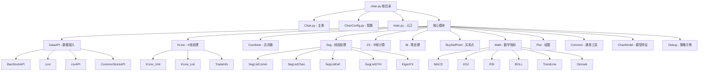

# chan.py - 缠论技术分析框架

> 更新时间：2025-12-10
> 项目类型：Python 量化交易框架
> 覆盖率：98%+

## 项目概述

chan.py 是一个基于缠论理论的 Python 量化交易技术分析框架。该项目提供了完整的缠论分析工具链，包括分形、笔、线段、中枢、买卖点等核心元素的计算，并支持策略开发、特征提取、机器学习模型集成和线上交易。

### 核心特性

- 🎯 **完整的缠论体系**：实现了缠论的全套分析工具
- 📊 **多级别联立**：支持多时间周期的联合分析
- 🔧 **高度可配置**：提供丰富的配置选项和自定义开发能力
- 🤖 **策略框架**：内置多种买卖点策略
- 🧠 **机器学习集成**：支持特征提取和模型训练
- 📈 **实时交易**：提供线上交易引擎接口

## 项目架构



## 核心模块详解

### 1. 数据层 (DataAPI)
负责多种数据源的接入和管理：
- **BaoStockAPI**：baostock 数据源接口
- **AkshareAPI**：akshare 数据源接口（新增）
- **ccxt**：数字货币交易所接口
- **csvAPI**：CSV 文件数据读取
- **CommonStockAPI**：通用股票数据接口

### 2. K线层 (KLine)
处理 K线数据的基础组件：
- **KLine_Unit**：单个 K线单元
- **KLine_List**：K线序列管理
- **TradeInfo**：交易信息存储

### 3. 分形合并层 (Combiner)
实现 K线分形合并算法：
- **KLine_Combiner**：K线合并器核心逻辑
- **Combine_Item**：合并项数据结构

### 4. 笔段层 (Bi & Seg)
处理缠论的笔和线段：
- **Bi**：笔的计算和管理
- **Seg**：线段的多种算法实现
  - SegListComm：通用线段算法
  - SegListChan：缠论标准线段
  - SegListDef：自定义线段
  - SegListDYH：大智慧线段

### 5. 中枢层 (ZS)
中枢计算和分析：
- **ZS**：中枢核心实现
- **ZSList**：中枢序列管理
- 支持段内中枢和跨段中枢

### 6. 买卖点层 (BuySellPoint)
实现各类买卖点策略：
- **BS_Point**：买卖点基础类
- **BSPointList**：买卖点序列管理
- 支持 BSP 和 CBSP 策略

### 7. 指标层 (Math)
技术指标计算库：
- **MACD**：平滑异同移动平均线
- **KDJ**：随机指标
- **RSI**：相对强弱指数
- **BOLL**：布林带
- **TrendLine**：趋势线
- **Demark**：Demark指标

### 8. 可视化层 (Plot)
图表绘制功能：
- **PlotDriver**：绘图驱动器
- **AnimatePlotDriver**：动画绘图
- **PlotMeta**：绘图元数据

### 9. 模型层 (ChanModel)
机器学习特征和模型：
- **Features**：特征提取

## 开发规范

### 代码风格
- 遵循 PEP 8 Python 代码规范
- 使用类型注解 (Type Hints)
- 类名采用 C 前缀的驼峰命名 (如 `CChan`)
- 私有方法使用下划线前缀

### 配置管理
- 使用 `CChanConfig` 统一管理配置
- 支持多种配置源（文件、字典、对象）
- 配置项包含详细的中文注释

### 错误处理
- 使用 `CChanException` 统一异常处理
- 定义详细的错误码 `ErrCode`
- 提供中文错误信息

### 数据结构
- 时间使用 `CTime` 封装
- 枚举使用 `CEnum` 定义
- 数据验证通过类型检查实现

## 快速开始

### 环境要求
- Python 3.11+
- 依赖包见 `Script/requirements.txt`

### 基础使用
```python
from Chan import CChan
from ChanConfig import CChanConfig
from Common.CEnum import DATA_SRC, KL_TYPE

# 创建配置
config = CChanConfig()

# 初始化 Chan 对象
chan = CChan(
    code="000001",
    begin_time="2020-01-01",
    end_time="2023-12-31",
    data_src=DATA_SRC.BAO_STOCK,
    lv_list=[KL_TYPE.K_DAY, KL_TYPE.K_60M],
    config=config
)

# 获取买卖点
bsp_list = chan.bsp_list

# 绘图
chan.plot()
```

## 项目统计

- **总文件数**：60+ Python 文件
- **代码行数**：22000+ 行（完整版）
- **核心类**：50+ 个
- **支持的数据源**：5 种（BaoStock、Akshare、ccxt、CSV、自定义）
- **技术指标**：10+ 种
- **买卖点策略**：多种内置策略

## 开发指南

### 添加新的数据源
1. 继承 `CCommonStockApi` 基类
2. 实现必要的数据获取接口
3. 在 `DATA_SRC` 枚举中添加新数据源

### 自定义买卖点策略
1. 继承 `CBS_Point` 基类
2. 实现买卖点判断逻辑
3. 配置到策略列表中

### 扩展技术指标
1. 在 `Math` 目录下创建新文件
2. 实现指标计算逻辑
3. 集成到绘图系统中

## 注意事项

- 本项目仅公开了基础计算功能（约 5300 行）
- 完整版本包含策略、特征、模型、AutoML 框架、交易引擎等
- 使用前请阅读 [快速上手指南](./quick_guide.md)
- 欢迎在 Telegram 群组讨论：https://t.me/zen_python

## 导航索引

### 模块文档
- [DataAPI 模块](./DataAPI/CLAUDE.md)
- [KLine 模块](./KLine/CLAUDE.md)
- [Combiner 模块](./Combiner/CLAUDE.md)
- [Seg 模块](./Seg/CLAUDE.md)
- [ZS 模块](./ZS/CLAUDE.md)
- [Bi 模块](./Bi/CLAUDE.md)
- [BuySellPoint 模块](./BuySellPoint/CLAUDE.md)
- [Math 模块](./Math/CLAUDE.md)
- [Plot 模块](./Plot/CLAUDE.md)
- [Common 模块](./Common/CLAUDE.md)
- [ChanModel 模块](./ChanModel/CLAUDE.md)
- [Debug 示例](./Debug/CLAUDE.md)

### 相关资源
- [快速上手指南](./quick_guide.md)
- [项目 README](./README.md)
- [许可证](./LICENSE)
- [依赖说明](./Script/requirements.txt)